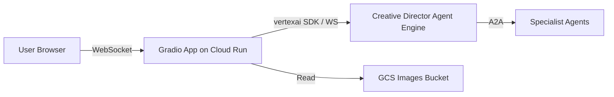

# Requirements

### Overview & Goals
Build a lightweight Gradio-based web frontend for the Creative Director agent. This frontend will serve as a chat entry point for testing prompts and visualizing the multi-agent creative process, supporting real-time streaming of agent responses.

### Scope
- **In Scope**:
  - New `gradio-ui/` directory with a Gradio application.
  - Streaming support via the `vertexai` SDK (or compatible WebSocket interface).
  - Local connection support to a running `adk web` instance.
  - Remote connection support to the deployed Vertex AI Reasoning Engine.
  - Image rendering support for GCS-hosted visual assets generated by the agents.
  - Deployment script for Google Cloud Run.
- **Out of Scope**:
  - Modifications to existing agents in `agents/`.
  - Authentication (as per current requirements, though Cloud Run can be configured for it).
  - Advanced prompt testing features (to be added in future iterations).

### Functional Requirements
- **Streaming Chat**: Users can send prompts to the Creative Director and see the response stream in real-time.
- **Visual Asset Display**: Images generated by the designer/critic agents (returned as GCS links) should be rendered within the chat interface.
- **Local/Remote Toggle**: The app should be configurable to connect to a local agent runtime (e.g., `localhost:8080`) or a deployed agent engine in Vertex AI.
- **Local Setup Instructions**: A README documenting how to start the Gradio app and connect it to the agents.

# Technical Design

### Current Implementation
- The project uses `google-adk` for building agents.
- The Creative Director agent is an orchestrator that coordinates specialists.
- `run_campaign.py` demonstrates programmatic interaction with the deployed agent using `vertexai.agent_engines.stream_query`.
- Agents are deployed either as Cloud Run services (specialists) or Vertex AI Reasoning Engines (Creative Director).

### Proposed Changes
1. **Gradio Application (`gradio-ui/app.py`)**:
   - Use `gradio.ChatInterface` for the core UI.
   - Use a generator function for streaming responses.
   - For local connections, it will interface with the `adk web` server (running on port 8080 by default).
   - For remote connections, it will use the `vertexai` SDK, mirroring the logic in `run_campaign.py`.
   - Implement logic to handle GCS signed URLs for image rendering.

2. **File Structure**:
   ```
   gradio-ui/
   ├── app.py             # Gradio application entry point
   ├── Dockerfile         # For Cloud Run deployment
   ├── pyproject.toml     # uv-managed dependencies
   └── README.md          # Setup and usage guide
   deploy/
   └── deploy_gradio.py   # New deployment script
   ```

3. **Deployment (`deploy/deploy_gradio.py`)**:
   - Follow the pattern of `deploy_all_specialists.py`.
   - Use `gcloud run deploy --source=.`.
   - Set environment variables: `PROJECT_ID`, `AGENT_ENGINE_ID`, `GCS_IMAGES_BUCKET`, `LOCATION`.

### Architecture Diagram


### Key Decisions
- **SDK for Communication**: Use the `vertexai` SDK for streaming, as it abstracts the underlying protocol and matches existing usage in `run_campaign.py`.
- **GCS Image Handling**: Gradio will receive GCS URIs and will need to resolve them (potentially via signed URLs) to display them in the frontend.
- **Separate Folder**: Keep the frontend decoupled from the agent logic to allow for independent scaling and feature additions.

# Testing

### Validation Approach
1. **Local Test**:
   - Start specialist agents and Creative Director locally (`uv run adk web agents`).
   - Run Gradio locally (`uv run python app.py`).
   - Verify that prompts result in streamed responses and images are displayed.
2. **Deployment Test**:
   - Run `python deploy/deploy_gradio.py`.
   - Access the Cloud Run URL.
   - Verify connection to the deployed `AGENT_ENGINE_ID`.

### Key Scenarios
- **Streaming Text**: Send a campaign brief and ensure text appears incrementally.
- **Image Generation**: Ensure that when the agent returns an image link, Gradio displays the actual image.
- **Error Handling**: Gracefully handle cases where the agent runtime is not reachable.

# Delivery Steps

### ✓ Step 1: Initialize Gradio UI folder structure and dependencies
A new `gradio-ui` directory with the basic structure for the Gradio application.
- Create `gradio-ui/` directory.
- Create `gradio-ui/pyproject.toml` with dependencies: `gradio`, `google-adk[a2a]`, `google-genai`, `vertexai`, `python-dotenv`.
- Create a basic `gradio-ui/README.md` with local startup instructions.

### ✓ Step 2: Implement Gradio chat interface with streaming support
A working Gradio chat interface that can connect to the agent locally or via Vertex AI.
- Implement `gradio-ui/app.py` using `gradio.ChatInterface`.
- Implement streaming logic using `vertexai.agent_engines.stream_query` for remote and a compatible client for local (connecting to `localhost:8080`).
- Add support for displaying images from GCS links returned by the agent.
- Ensure the app handles session IDs and user IDs as seen in `run_campaign.py`.

### ✓ Step 3: Add Cloud Run deployment script for Gradio frontend
A new deployment script in `deploy/` that follows existing project conventions.
- Create `deploy/deploy_gradio.py`.
- Implement deployment logic using `gcloud run deploy`.
- Configure the script to pass necessary environment variables (`PROJECT_ID`, `AGENT_ENGINE_ID`, `GCS_IMAGES_BUCKET`, etc.).
- Add a `Dockerfile` in `gradio-ui/` to containerize the Gradio app for Cloud Run.

### ✓ Step 4: Fix local connectivity and improve error handling
Address the connection refused error when running locally.
- Update `gradio-ui/app.py` to use `http://127.0.0.1:8000` as default local agent URL.
- Update `gradio-ui/README.md` with correct default port and host.
- Improve error messages in `app.py` for local connection failures.