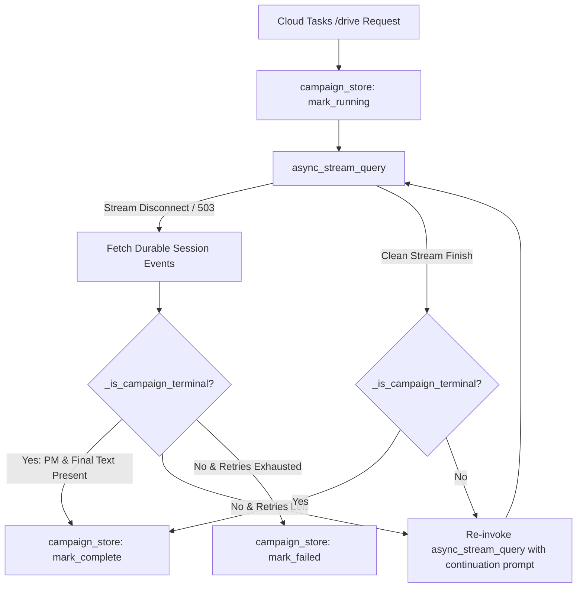

# Requirements

### Overview & Goals
During multi-agent campaign orchestration, the transcript submitted to the LLM judge truncated before Step 5 (Project Manager) executed, resulting in missing project schedule/timeline deliverables and rubric penalties under Code Quality/Documentation and MCP Integration. Investigation confirmed that transient stream disconnections during long-running tasks caused `campaign-driver`'s `_drain()` routine to prematurely determine that the campaign was complete server-side because event counts were static over a 5-second window.

The goal of this change is to fix the stream drain and continuation logic in `campaign-driver/main.py` so that in-flight campaigns are reliably driven to full completion (including the Project Manager deliverable and Notion schedule) even when transient stream drops occur.

### Scope
- **In Scope:**
  - Update `_drain()` in `campaign-driver/main.py` to inspect actual session event contents for terminal execution markers (e.g., `project_manager` tool execution and final summary) before concluding completion.
  - Fix the stream recovery behavior so that non-terminal sessions are re-invoked with continuation prompts rather than prematurely marked `complete` in Firestore.
  - Return accurate cumulative session event counts from `_drain()`.
  - Adjust retry timing and add structured logging for stream disconnections and continuation dispatches.
- **Out of Scope:**
  - Direct Notion MCP querying by the judge service (the judge will evaluate based on the complete transcript and tool responses).
  - Changes to Notion MCP server authentication or database schemas.

### User Stories
- **As a campaign user or evaluator**, I want every dispatched campaign to execute all planned specialist stages (Strategist, Copywriter, Designer, Critic, and Project Manager) without dropping early, so that the resulting transcript contains the complete project timeline and Notion deliverables.
- **As an LLM judge**, I want the full execution transcript with all tool responses to be available for scoring, so that ADK skills and MCP deliverables receive full credit.

### Functional Requirements
1. **Terminal State Verification:** `campaign-driver` must check whether a session has reached its natural conclusion (completion of Project Manager and orchestrator final message) before marking a session as complete after stream disconnections.
2. **Automatic Continuation:** If a stream drops or encounters a transient error (such as a 503) and the session is not terminal, `_drain()` must re-invoke `async_stream_query()` with a continuation prompt up to `MAX_DRAIN_RETRIES`.
3. **Accurate Event Count Reporting:** The event count written to `campaign_store.mark_complete()` must reflect the total durable event count from `sessions.events.list`.
4. **Resilient Polling & Backoff:** Stream drain retry checks must accommodate realistic specialist execution delays (10–30+ seconds for multimodal operations and MCP API calls).

# Technical Design

### Current Implementation
In `campaign-driver/main.py`, `_drain()` attempts to stream events using `agent_engine.async_stream_query()`:
```python
# campaign-driver/main.py:146-156
await asyncio.sleep(DRAIN_RETRY_BACKOFF_SECONDS) # 5s
count_before = await _session_event_count(client, session_name)
await asyncio.sleep(DRAIN_RETRY_BACKOFF_SECONDS) # 5s
count_after = await _session_event_count(client, session_name)
if count_after == count_before and count_after > 0:
    # Prematurely treats as complete!
    return count_after
```
Because long-running specialist agents (Designer image generation, Critic review, Notion MCP execution) frequently take longer than 5 seconds between events, `count_after == count_before` triggers false completion. The driver then calls `campaign_store.mark_complete()`, cutting off execution before `project_manager` runs.

### Key Decisions
1. **Content-Aware Terminal Inspection**: Rather than relying purely on an event-count delta over a few seconds, inspect session event parts to verify whether terminal conditions are met:
   - Tool response for `project_manager` present in event history, OR
   - Orchestrator final presentation message present.
2. **Aggressive Continuation on Incomplete Sessions**: If the stream disconnects and the session has NOT reached the terminal state, re-invoke `async_stream_query` with continuation instructions to drive remaining stages to completion.
3. **Cumulative Event Reporting**: Query `client.agent_engines.sessions.events.list` to report the true durable event count across retries.

### Proposed Changes

#### `campaign-driver/main.py`
- Add `_is_campaign_terminal(events: list) -> bool`:
  - Inspects event authors, function calls, function responses, and text content.
  - Returns `True` if `project_manager` function call/response is present or terminal presentation text is detected.
- Refactor `_drain()`:
  - When `async_stream_query()` completes normally, verify if the session reached terminal state. If so, return total event count.
  - When `async_stream_query()` catches an exception (or finishes a turn without reaching terminal state), list current session events.
  - If `_is_campaign_terminal(events)` is `True`, conclude drive and return `len(events)`.
  - If not terminal and `attempt < MAX_DRAIN_RETRIES`, wait backoff period and re-invoke `async_stream_query(message=continuation_prompt)`.
  - Add detailed log messages tracking each retry attempt, current step reached, and terminal status.

### Architecture Diagram


### File Structure
- Modified: `campaign-driver/main.py`
- Reference: `broker/judge_service.py`, `agents/creative_director/prompt.py`

### Risks & Mitigations
- **Risk:** Duplicate specialist execution if continuation message is sent while a specialist is currently running server-side.
  - **Mitigation:** The continuation prompt explicitly instructs: `"Continue the campaign from where you left off. Do not repeat any specialist calls that already returned a result above -- pick up with the next step."` ADK's ReAct runner checks prior conversation history and skips already-completed tool calls.
- **Risk:** Infinite retry loop on genuinely failing specialist.
  - **Mitigation:** Retries remain strictly bounded by `MAX_DRAIN_RETRIES` (default: 3). If retries exhaust without reaching terminal state, the campaign transitions to `failed` state with appropriate diagnostic logging.

# Testing

### Validation Approach
Verification will ensure that `_is_campaign_terminal` correctly identifies complete and incomplete campaign sessions, and that `_drain` successfully recovers and drives incomplete sessions through to the Project Manager step.

### Key Scenarios
1. **Normal Full Run**: Stream completes all 5 specialist steps without error; terminal verification succeeds immediately.
2. **Mid-Stream Disconnect during Designer/Critic**: Stream drops at step 3 or 4; driver inspects session events, detects incomplete state, sends continuation prompt, and executes `project_manager` to completion.
3. **Session Already Completed Server-Side**: Stream drops after all steps finish; driver inspects session events, detects `project_manager` execution and terminal text, and concludes without duplicate invocation.
4. **Judge Transcript Verification**: Verify that the formatted transcript in `broker/judge_service.py` includes the `project_manager` tool response and Notion metadata when evaluated.

### Edge Cases
- Session with empty event list on initial error.
- Stream error caused by invalid credentials or permanent 4xx error (aborts after retry bounds with clear failure status).

# Delivery Steps

### ✓ Step 1: Implement terminal verification and stream continuation in campaign driver
Strengthen session terminal state checking and stream recovery logic in `campaign-driver/main.py`.

- Define a helper function `_is_campaign_terminal(events)` in `campaign-driver/main.py` that inspects the raw session events from `client.agent_engines.sessions.events.list(name=session_name)` to check whether the workflow has actually completed (e.g., presence of `project_manager` tool call/response, Notion schedule metadata, or final campaign presentation text).
- Update the retry loop in `_drain()`: when `async_stream_query` disconnects or raises an exception, fetch the full session events to check `_is_campaign_terminal()`.
- If the campaign is already terminal, mark the drive complete and return the full session event count.
- If the campaign is not terminal, do not prematurely terminate on static event counts; instead, re-invoke `agent_engine.async_stream_query` with continuation messaging to proceed with the remaining specialist steps (such as `project_manager`).
- Update `_drain()` return value to always return the total durable event count from `_session_event_count(client, session_name)` across all attempts rather than only the stream chunk count.

### ✓ Step 2: Configure adaptive retry timing and structured telemetry
Configure robust retry backoff and timeout parameters in `campaign-driver/main.py` and deployment configurations.

- Increase default `DRAIN_RETRY_BACKOFF_SECONDS` or use an adaptive polling interval (e.g., 10-15s) to account for long-running specialist tool operations like image generation and Notion MCP calls.
- Ensure environment variable overrides (`CAMPAIGN_DRIVER_RETRY_BACKOFF_SECONDS`, `CAMPAIGN_DRIVER_MAX_DRAIN_RETRIES`) are respected and documented.
- Add structured logging during stream drops and continuation re-invocations to track session state, event counts, and retry reasons in Cloud Run logs.

### ✓ Step 3: Validate stream drain recovery and transcript completeness
Validate stream continuation and judge deliverable recognition through unit/integration checks.

- Verify `_is_campaign_terminal()` against sample session event histories (both truncated and fully completed traces).
- Test stream drain recovery behavior when transient errors occur before and after the Project Manager step.
- Validate that the final transcript formatting in `broker/judge_service.py` properly reflects the complete Project Manager output and Notion metadata for LLM-as-a-judge evaluation.