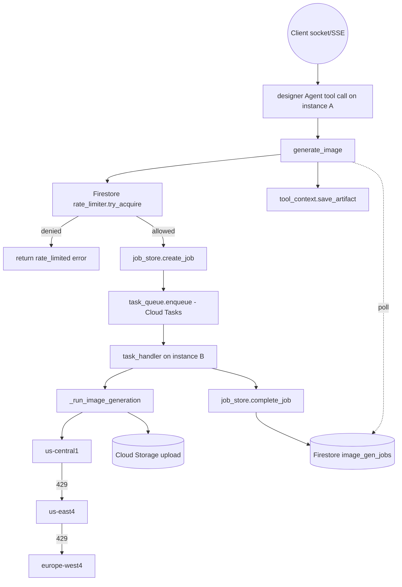

# Requirements

### Overview & Goals
The Designer specialist (`agents/designer/image_gen_tool.py`) currently calls the Vertex AI Gemini image model **synchronously, inline, in a single region (`location="global"`)**, with no per-user throttling. Under concurrent load (many chat sessions each triggering campaign generation, each producing several images) this can burn through the project's shared RPM quota, let one user's multiple tabs/sessions starve everyone else, and has no fallback when the single backend region returns `429`.

Goal: make the `generate_image` tool call resilient to this concurrency pattern by adding (a) a managed job queue + worker with a bounded dispatch rate, (b) a per-user rate limiter, and (c) multi-region failover — **scoped only to the image-generation call path**. General A2A traffic between the Creative Director and specialists is explicitly out of scope: it already scales via Cloud Run autoscaling + the existing streaming transport, and per the user's direction we're only adding a retry/reconnect UX for that path, not a queue.

After evaluating an in-process `asyncio.Queue`, Cloud Pub/Sub, and Redis/RQ against **Cloud Tasks + Firestore**, the project settled on **Cloud Tasks (job dispatch, rate/concurrency control, retries) + Firestore (per-user rate-limit counters and the job-result handoff)** — see *Key Decisions* in Technical Design for the full trade-off, including why a pure in-process or pure Pub/Sub design doesn't actually avoid needing a shared store once cross-instance correctness is required.

### Scope
**In Scope**
- Replacing the inline Vertex AI call in `generate_image` with a Cloud Tasks-backed job queue: the tool enqueues a task and awaits the result via a Firestore-backed job document, instead of calling the Vertex AI SDK on the request coroutine (`agents/designer/image_gen_tool.py`, `agents/designer/task_queue.py`, `agents/designer/job_store.py`).
- A dedicated internal HTTP handler (mounted on the Designer's existing Starlette/A2A app) that Cloud Tasks pushes to, which actually runs the generation and writes the result to Firestore.
- Per-user (per `user_id`) rate limiting backed by a Firestore transactional token bucket, correct across all Cloud Run instances (`agents/designer/rate_limiter.py`).
- Multi-region failover across explicit Vertex AI regions (`us-central1`, `us-east4`, `europe-west4`) replacing `location="global"`, retrying the next region immediately on `429`, executed inside the task handler.
- Provisioning the Cloud Tasks queue, Firestore database, and the IAM bindings they require, via `deploy/deploy_all_specialists.py`.
- A lightweight reconnect/backoff UX in `gradio-ui/app.py` for the general chat/A2A stream, so a transient Cloud Run cold-start/scale-up glitch shows a "Reconnecting to agent..." state and retries instead of failing hard.
- Documenting the new environment variables in `README.md`.

**Out of Scope**
- Introducing Redis or Celery (rejected: Cloud Tasks + Firestore give the same queueing/rate-limiting/retry guarantees without a self-managed cache/broker to size and scale).
- Using Pub/Sub as the dispatch mechanism (rejected: Pub/Sub is a notification bus, not a rate-controlled dispatcher — it would still need a hand-rolled worker pool behind it, reproducing the complexity Cloud Tasks solves via configuration).
- Queueing or rate-limiting any other specialist (`brand_strategist`, `copywriter`, `critic`, `project_manager`) or the orchestrator's A2A calls — those keep their existing synchronous-per-turn behavior and rely on Cloud Run autoscaling.
- Real-time push notification of job completion (e.g. Firestore listeners) — the tool polls the job document on a short interval instead; acceptable given expected image-generation latency is several seconds regardless.

### User Stories
- As a **campaign creator opening several chat tabs at once**, I want my own image requests throttled at the backend so I don't accidentally exhaust the shared Vertex AI quota for all users.
- As the **service operator**, I want image-generation calls to run through a bounded worker pool so a burst of concurrent tool calls never exceeds my configured RPM limit, regardless of how many ADK tool invocations arrive at once.
- As the **service operator**, I want a `429` from one Vertex AI region to trigger an immediate retry in a different region instead of failing the whole image concept.
- As a **UI user**, when the backend briefly can't be reached during an autoscale spike, I want to see "Reconnecting to agent..." and have it recover automatically rather than seeing a hard error.

### Functional Requirements
- `generate_image` must never call `client.models.generate_content` directly on the calling coroutine; it must enqueue a Cloud Tasks task and await the outcome by polling a Firestore job document.
- The Cloud Tasks queue's dispatch rate/concurrency (`max-dispatches-per-second`, `max-concurrent-dispatches`) must be configured to match the current Vertex AI RPM limit, entirely via queue configuration — no custom concurrency-limiting code.
- Before a task is enqueued, the caller's `user_id` (from `ToolContext.user_id`) must be checked against a per-user Firestore-backed token bucket, updated transactionally; if exhausted, `generate_image` returns a structured `{"status": "error", "error": "rate_limited..."}` response (never silently drops the request) so the Designer agent can surface it upstream per the existing "Strict All-or-Nothing Rule" in `agents/designer/agent.py`.
- Image generation must iterate over an ordered list of regions (`us-central1`, `us-east4`, `europe-west4` by default, configurable) **inside the Cloud Tasks handler**. On a `429`/`RESOURCE_EXHAUSTED` response from a region, immediately retry the same call against the next region without waiting for the existing exponential backoff. Existing backoff behavior for `500/503/504` is preserved *within* a region.
- If all regions are exhausted, the handler writes the existing structured error shape (`{"status": "error", "error": ...}`) to the job document, preserving current fatal-error classification (billing/404/403); `generate_image` returns exactly that shape once it observes the failed job.
- The Cloud Tasks push request must be authenticated: the handler verifies the OIDC identity token Cloud Tasks attaches, rejecting requests that don't come from the expected invoker service account.
- ADK artifact saving (`tool_context.save_artifact`) must still happen, but from the `generate_image` coroutine (which still has `tool_context`) after a successful poll, not from the handler (which has no `tool_context`) — it re-reads the just-uploaded GCS object's bytes for this purpose.
- `gradio-ui/app.py`'s connection logic (session check + `run_sse` POST in local mode, `agent_engines.get`/`stream_query` in remote mode) retries with backoff on connection errors, showing a "🔄 Reconnecting to agent..." bubble, up to a bounded number of attempts before surfacing a real error.

### Non-Functional Requirements
- Cloud Tasks and Firestore are the only new managed dependencies introduced; no Redis/Pub/Sub/Celery.
- Existing behavior (GCS upload, ADK artifact saving, safety/candidate validation, error classification) must be preserved unchanged.
- All new tunables (region list, queue dispatch/concurrency, rate-limit capacity/window, poll interval/timeout) must be environment-variable driven, consistent with the existing `.env`-based configuration pattern used throughout this repo.

# Technical Design

### Current Implementation
- `agents/designer/image_gen_tool.py::generate_image` is an `async def` ADK `FunctionTool` that: validates env config → builds `genai.Client(vertexai=True, project=..., location=os.environ.get("GOOGLE_CLOUD_LOCATION", "global"))` → calls `client.models.generate_content(...)` synchronously inline (single region, single attempt sequence) → validates candidates/safety → uploads to GCS → saves ADK artifact → returns a `{status, gcs_uri, concept_name}` dict.
- `agents/designer/retry.py` defines `HttpRetryOptions`/`GenerateContentConfig` used for the *text* model calls (3 attempts, exponential backoff, retries `429/500/503/504`). `image_gen_tool.py` inlines its own equivalent `retry_options` for the image call.
- `agents/designer/agent.py` wires `generate_image` as the only tool on the `designer` `Agent`, invoked once per visual concept during a single ADK turn served by the A2A/uvicorn server (`to_a2a`).
- `gradio-ui/app.py::stream_chat` connects directly (no retry) to either the local ADK server (`POST /run_sse`) or the remote Agent Engine (`agent_engines.get` + `stream_query`); any connection exception is caught and shown as a hard `❌ Error` bubble immediately.

### Key Decisions
1. **Cloud Tasks for job dispatch** (not an in-process `asyncio.Queue`, and not raw Pub/Sub) — confirmed via `google.adk.tools.ToolContext`/`ReadonlyContext.user_id` being a real, public attribute (verified against the installed `google-adk==1.31.1` in this repo), and via evaluating the alternatives with the user: an in-process queue avoids all cross-instance handoff problems but keeps everything custom-coded; Pub/Sub is a pure notification bus and still needs a hand-rolled worker pool behind it, reproducing the same complexity. Cloud Tasks is purpose-built for "rate/concurrency-controlled dispatch to an HTTP handler with configurable retries" — exactly this problem — so the RPM cap and retry policy become **queue configuration** (`max-dispatches-per-second`, `max-concurrent-dispatches`, `retryConfig`) instead of code.
2. **Firestore for the job-result handoff** — because a Cloud Tasks push may land on a *different* autoscaled Cloud Run instance than the one holding the ADK tool-call coroutine, there's no in-memory way to resurface the result to the waiting `generate_image` call. A `image_gen_jobs/{job_id}` document, written by the handler and polled by `generate_image`, bridges the two instances correctly regardless of where the handler runs.
3. **Firestore for per-user rate limiting too** — since Firestore is already a dependency for the job handoff, the per-user token bucket lives there as well (`image_gen_rate_limits/{user_id}`, updated via `firestore.AsyncClient.transaction()`), giving a genuinely cross-instance-correct guarantee (a user's tabs landing on different instances still share one bucket) instead of reusing a rejected in-memory approach or introducing a second new dependency (Redis) just for this.
4. **Region failover only on `429`/`RESOURCE_EXHAUSTED`, retaining backoff for `5xx`, executed inside the Cloud Tasks handler** — matches the issue's requirement to *immediately* try the next region on quota errors rather than waiting through a backoff window that would just fail again in the same region; living in the handler (not `generate_image`) because that's where the actual `generate_content` call now happens.
5. **ADK artifact save stays in `generate_image`, not the handler** — `tool_context.save_artifact` requires the `ToolContext` of the original invocation, which only exists in the coroutine that's polling, never in the decoupled Cloud Tasks handler; after a successful poll, `generate_image` re-downloads the just-uploaded GCS bytes and calls `save_artifact` itself.
6. **A2A/orchestrator traffic is left untouched** — per explicit user direction, no queueing is added outside the image-generation path; the only change elsewhere is a client-side reconnect/backoff wrapper in `gradio-ui/app.py`.

### Proposed Changes
**1. `agents/designer/rate_limiter.py` (new)**
- `async def try_acquire(user_id: str) -> bool` — opens a Firestore transaction on `image_gen_rate_limits/{user_id}`, refills tokens based on elapsed time since `last_refill_ts`, decrements a token if available and commits, otherwise leaves the doc untouched and returns `False`.
- Capacity/window from `IMAGE_GEN_RATE_LIMIT_CAPACITY` (default `3`) / `IMAGE_GEN_RATE_LIMIT_WINDOW_SECONDS` (default `60`).
- Module-level `firestore.AsyncClient` singleton, reused by `job_store.py`.

**2. `agents/designer/job_store.py` (new)**
- `async def create_job(job_kwargs: dict) -> str` — writes `image_gen_jobs/{job_id}` with `status="pending"` and the generation parameters, returns `job_id` (`uuid4`).
- `async def poll_job(job_id: str, timeout_s: float, interval_s: float) -> dict` — loops `asyncio.sleep(interval_s)` + `doc.get()` until `status != "pending"` or `timeout_s` elapses (returns a structured timeout error in the latter case).
- `async def complete_job(job_id: str, result: dict) -> None` — called by the handler to write the final `{status, gcs_uri, concept_name}` / `{status, error}` payload.

**3. `agents/designer/task_queue.py` (new)**
- `async def enqueue(job_id: str, job_kwargs: dict) -> None` — uses `google.cloud.tasks_v2.CloudTasksAsyncClient` to create a task on the configured queue (`GCP_TASKS_LOCATION`/`IMAGE_GEN_TASKS_QUEUE`), targeting an HTTP POST to this same service's internal handler URL, with an OIDC token (`IMAGE_GEN_TASKS_INVOKER_SA`) attached and `{job_id, **job_kwargs}` as the JSON body.

**4. `agents/designer/image_gen_tool.py` (refactor)**
- `generate_image(...)` becomes: resolve `user_id` from `tool_context.user_id` → `rate_limiter.try_acquire(user_id)` (deny → structured rate-limit error) → `job_store.create_job(job_kwargs)` → `task_queue.enqueue(job_id, job_kwargs)` → `job_store.poll_job(job_id, ...)` → on success, download the GCS object's bytes and call `tool_context.save_artifact(...)`, then return the job's result payload unchanged.
- `_run_image_generation(...)` keeps the existing validation → multi-region call → candidate/safety checks → GCS upload → structured return logic (minus the artifact save, which moves to `generate_image`), now called from the new task handler instead of directly from `generate_image`.
- Replace the single `location = os.environ.get("GOOGLE_CLOUD_LOCATION", "global")` with `REGIONS = os.environ.get("IMAGE_GEN_REGIONS", "us-central1,us-east4,europe-west4").split(",")`.
- New `_generate_with_region_failover(regions, ...)` helper: loops over `regions`, builds a `genai.Client(vertexai=True, project=project_id, location=region)` per attempt, calls `generate_content` with `retry_options` whose `http_status_codes` now excludes `429` (kept only for `500/503/504`); catches the `429`/`RESOURCE_EXHAUSTED` exception and continues to the next region; re-raises (to the existing fatal-error classifier) only after all regions are exhausted.

**5. `agents/designer/task_handler.py` (new)**
- A Starlette route function `async def handle_generate_image_task(request: Request) -> JSONResponse`: verifies the `Authorization: Bearer <OIDC token>` header via `google.oauth2.id_token.verify_oauth2_token` against the expected invoker service account and audience; on failure returns `401`. Parses `{job_id, **job_kwargs}` from the body, calls `_run_image_generation(...)`, writes the result via `job_store.complete_job(job_id, result)`, and returns `200` (or a `5xx` on unexpected failure so Cloud Tasks retries per the queue's `retryConfig`).
- Mounted in `agents/designer/agent.py`'s `__main__` block via `a2a_app.add_route("/internal/tasks/generate-image", handle_generate_image_task, methods=["POST"])` on the same Starlette app returned by `to_a2a(...)`, so it's served by the same Cloud Run service/port.

**6. `agents/designer/retry.py`**
- No behavioral change to the text-model config; optionally export the default region list constant here for reuse/testability if convenient.

**7. `deploy/deploy_all_specialists.py`**
- Add a one-time provisioning pass (mirroring the existing `grant_all_storage_and_iam_permissions` pattern): `gcloud tasks queues create image-generation --location=... --max-dispatches-per-second=... --max-concurrent-dispatches=... --max-attempts=... --min-backoff=... --max-backoff=...` (idempotent, ignore `ALREADY_EXISTS`); ensure a Firestore database exists (`gcloud firestore databases create --location=... --type=firestore-native`, ignore `ALREADY_EXISTS`); grant the Designer service account `roles/cloudtasks.enqueuer` and `roles/datastore.user`, and grant the Cloud Tasks invoker service account `roles/run.invoker` on the `designer` Cloud Run service.

**8. `gradio-ui/app.py`**
- Wrap the connection-establishing calls in `stream_chat` (local: session-check + `POST /run_sse`; remote: `Client(...)`, `agent_engines.get`) in a small retry helper with capped exponential backoff (e.g. 3 attempts, 1s/2s/4s), yielding `["🔄 Reconnecting to agent..."]` between attempts instead of immediately yielding a hard error; only surfaces the final `❌ Error` bubble after attempts are exhausted.

### Data Models / Contracts
```python

# rate_limiter.py

async def try_acquire(user_id: str) -> bool: ...

# job_store.py

async def create_job(job_kwargs: dict) -> str: ...              # returns job_id
async def poll_job(job_id: str, timeout_s: float, interval_s: float) -> dict: ...  # {status, gcs_uri, concept_name} / {status, error}
async def complete_job(job_id: str, result: dict) -> None: ...

# task_queue.py

async def enqueue(job_id: str, job_kwargs: dict) -> None: ...

# image_gen_tool.py

async def generate_image(concept_name: str, image_prompt: str, aspect_ratio: str, tool_context: ToolContext) -> dict: ...
async def _run_image_generation(concept_name, prompt_with_aspect, aspect_ratio, project_id, bucket_name, regions) -> dict: ...

# task_handler.py

async def handle_generate_image_task(request: Request) -> JSONResponse: ...
```

Firestore document shapes:
```python

# image_gen_rate_limits/{user_id}

{"tokens": float, "last_refill_ts": Timestamp}

# image_gen_jobs/{job_id}

{"status": "pending" | "success" | "error", "concept_name": str,
 "gcs_uri": str | None, "error": str | None,
 "created_at": Timestamp, "updated_at": Timestamp}
```

### Components
- **`generate_image` (modified)** — becomes a rate-limit gate + job-creation + enqueue + poll + artifact-save entry point instead of doing the generation work itself.
- **`task_queue.py` (new)** — thin wrapper around `CloudTasksAsyncClient`, owns task creation and OIDC token attachment.
- **`job_store.py` (new)** — owns the Firestore job-document lifecycle (create/poll/complete).
- **`rate_limiter.py` (new)** — owns the Firestore-backed per-user token bucket.
- **`task_handler.py` (new)** — the Cloud Tasks push target; owns OIDC verification and invoking `_run_image_generation`.
- **`_run_image_generation` (in `image_gen_tool.py`, modified)** — unchanged validation/GCS-upload logic, now with multi-region failover, invoked from the handler instead of directly from `generate_image`, and no longer performs the artifact save.
- **`stream_chat` in `gradio-ui/app.py` (modified)** — gains a reconnect/backoff wrapper around connection setup only; message streaming logic is untouched.

### Architecture Diagram


### Risks
- **Cross-instance push target**: the Cloud Tasks handler may run on a different instance than the one polling; mitigated by using Firestore as the single source of truth for job status rather than any in-memory correlation.
- **OIDC verification correctness**: the handler must correctly validate the Cloud Tasks invoker's identity token (issuer, audience, service account email) to avoid an unauthenticated caller triggering paid Vertex AI generations on the public `--allow-unauthenticated` Cloud Run service; this is implemented explicitly in `task_handler.py` rather than relying solely on Cloud Run IAM.
- **Cloud Tasks retries can re-invoke the handler for the same job** (e.g. on a `5xx` or handler timeout) — `_run_image_generation` must remain safe to re-run, and `complete_job` should be idempotent (last-write-wins is acceptable since retries re-attempt the same deterministic work).
- **Poll latency**: `generate_image` waits on a polling loop rather than being notified instantly; mitigated by keeping `IMAGE_GEN_JOB_POLL_INTERVAL_SECONDS` short (e.g. `1`) relative to expected multi-second image-generation latency, and bounding it with `IMAGE_GEN_JOB_TIMEOUT_SECONDS`.
- **Local development**: Cloud Tasks and Firestore both require a real GCP project (no lightweight official emulator equivalent to the previous in-process design); `task_queue.py`/`job_store.py` should be structured so a future local-dev fallback (e.g. an in-process shim) could be swapped in without touching `generate_image`'s call sites, though building that fallback is not part of this plan.
- **Region failover changes retry semantics**: removing `429` from the in-region `HttpRetryOptions` means a region-local transient quota blip no longer benefits from the SDK's own backoff before failover; mitigated by keeping backoff for `500/503/504`, which are the truly transient (non-quota) error classes.

# Testing

### Validation Approach
Since there's no existing test suite in this repo (`pyproject.toml` has no test dependencies), validation will rely on targeted manual/script-level checks plus code review against the ADK tool contract, using the Firestore/Cloud Tasks emulators (`gcloud emulators firestore start`, `gcloud beta emulators tasks start` where available) or mocked clients via `uv run python -c ...` smoke scripts, to stay consistent with the project's current lack of automated tests.

### Key Scenarios
- A single `generate_image` call still returns the same `{"status": "success", "gcs_uri": ..., "concept_name": ...}` shape as before when nothing fails, after round-tripping through `create_job` → `enqueue` → handler → `complete_job` → `poll_job`.
- The task handler rejects a request whose `Authorization` header doesn't verify as the expected Cloud Tasks invoker service account, returning `401` without running any generation logic.
- A user issuing more requests than `IMAGE_GEN_RATE_LIMIT_CAPACITY` within the configured window receives the structured rate-limit error on the excess calls (verified against the Firestore transaction logic directly), while a different `user_id` is unaffected.
- Simulating a `429` from the first region in `IMAGE_GEN_REGIONS` inside `_run_image_generation` causes an immediate call against the second region with no extra backoff delay, and success there returns normally.
- `gradio-ui/app.py` shows "🔄 Reconnecting to agent..." and eventually succeeds when a connection attempt fails once then succeeds, and shows the existing `❌ Error` bubble only after all retry attempts are exhausted.

### Edge Cases
- All configured regions return `429` — the handler must write the existing structured fatal error to the job document, and `generate_image` must surface it, not raise an unhandled exception.
- `poll_job` never observes a non-`"pending"` status before `IMAGE_GEN_JOB_TIMEOUT_SECONDS` elapses (e.g. the handler crashed without writing a result) — `generate_image` must return a structured timeout error rather than hanging indefinitely.
- Cloud Tasks retries the same task after a transient handler failure — `complete_job` must not leave the job document in an inconsistent state on the second attempt.

# Delivery Steps

### ✓ Step 1: Implement Firestore-backed per-user rate limiting for image generation
generate_image rejects excess requests from a single user before they ever reach the generation path, using a Firestore transactional token bucket that's correct across all Cloud Run instances.
- Add the `google-cloud-firestore` dependency to `pyproject.toml`.
- Add `agents/designer/rate_limiter.py` with `async def try_acquire(user_id: str) -> bool`, backed by a `firestore.AsyncClient` transaction on `image_gen_rate_limits/{user_id}` (refill/capacity from `IMAGE_GEN_RATE_LIMIT_CAPACITY` / `IMAGE_GEN_RATE_LIMIT_WINDOW_SECONDS` env vars, default 3 per 60s).
- In `agents/designer/image_gen_tool.py`, wire `generate_image` to call `rate_limiter.try_acquire(tool_context.user_id)` first and return a structured `{"status": "error", "error": "rate_limited..."}` response when denied, without touching the existing generation logic yet.

### ✓ Step 2: Add the Firestore job store and Cloud Tasks queue client
The building blocks for decoupling generation from the request coroutine exist as standalone, independently testable modules.
- Add the `google-cloud-tasks` dependency to `pyproject.toml`.
- Add `agents/designer/job_store.py` with `create_job`, `poll_job`, and `complete_job`, backed by `image_gen_jobs/{job_id}` Firestore documents (`status`, `gcs_uri`/`error`, timestamps).
- Add `agents/designer/task_queue.py` with `async def enqueue(job_id, job_kwargs)` using `CloudTasksAsyncClient` to create a task targeting an internal handler URL with an OIDC token attached, reading queue name/location and invoker service account from env vars (`GCP_TASKS_LOCATION`, `IMAGE_GEN_TASKS_QUEUE`, `IMAGE_GEN_TASKS_INVOKER_SA`).

### ✓ Step 3: Wire generate_image through the queue and add the Cloud Tasks handler
generate_image never calls Vertex AI directly on the request coroutine; it enqueues a Cloud Tasks job and awaits the result via Firestore, while a new authenticated handler does the actual generation.
- Add `agents/designer/task_handler.py` with `handle_generate_image_task`, verifying the Cloud Tasks OIDC token, invoking `_run_image_generation(...)`, and writing the result via `job_store.complete_job`.
- Mount it in `agents/designer/agent.py`'s `__main__` block via `a2a_app.add_route("/internal/tasks/generate-image", handle_generate_image_task, methods=["POST"])`.
- Refactor `agents/designer/image_gen_tool.py`: extract the existing validation/generation/GCS-upload logic (everything after the rate-limit check, minus artifact saving) into `_run_image_generation(...)`; make `generate_image` call `job_store.create_job` → `task_queue.enqueue` → `job_store.poll_job`, then on success download the GCS bytes and call `tool_context.save_artifact(...)` before returning the result.
- Ensure `poll_job` always returns a structured timeout error if the handler never completes the job within `IMAGE_GEN_JOB_TIMEOUT_SECONDS`, so no request hangs indefinitely.

### ✓ Step 4: Add multi-region failover for Vertex AI image calls
A 429 from one Vertex AI region immediately triggers a retry against the next configured region instead of failing the whole concept.
- In `agents/designer/image_gen_tool.py`, replace the single `location = os.environ.get("GOOGLE_CLOUD_LOCATION", "global")` with an ordered list from `IMAGE_GEN_REGIONS` (default `us-central1,us-east4,europe-west4`).
- Add `_generate_with_region_failover(regions, ...)` that constructs a fresh `genai.Client(vertexai=True, project=..., location=region)` per region attempt, calls `generate_content` with `retry_options` no longer including `429` (keeping backoff only for `500/503/504`), catches `429`/`RESOURCE_EXHAUSTED` and moves to the next region, and re-raises for the existing fatal-error classifier only once all regions are exhausted.
- Call this helper from `_run_image_generation` (now invoked from `task_handler.py`) in place of the current single-region `client.models.generate_content` call, preserving all downstream candidate/safety/upload logic unchanged.

### ✓ Step 5: Provision Cloud Tasks/Firestore infra and add client-side reconnect/backoff
The Designer service has the GCP resources and IAM bindings it needs at deploy time, and the Gradio UI recovers gracefully from transient autoscale-spike glitches on the general A2A stream.
- In `deploy/deploy_all_specialists.py`, add idempotent provisioning: create the Cloud Tasks queue (`gcloud tasks queues create image-generation ...` with rate/concurrency/retry flags) and ensure a Firestore database exists, then grant the Designer service account `roles/cloudtasks.enqueuer` + `roles/datastore.user` and grant the Cloud Tasks invoker service account `roles/run.invoker` on the `designer` service.
- In `gradio-ui/app.py::stream_chat`, wrap the connection-establishing calls (local: session-check + initial `POST /run_sse`; remote: `Client(...)` construction and `agent_engines.get`) in a small retry helper with capped exponential backoff (e.g. 3 attempts, 1s/2s/4s), yielding `"🔄 Reconnecting to agent..."` between failed attempts and only surfacing the existing `❌ Error` bubble after attempts are exhausted.
- Update `README.md`'s environment configuration table with the new `IMAGE_GEN_REGIONS`, `GCP_TASKS_LOCATION`, `IMAGE_GEN_TASKS_QUEUE`, `IMAGE_GEN_TASKS_INVOKER_SA`, `IMAGE_GEN_RATE_LIMIT_CAPACITY`, `IMAGE_GEN_RATE_LIMIT_WINDOW_SECONDS`, `IMAGE_GEN_JOB_POLL_INTERVAL_SECONDS`, and `IMAGE_GEN_JOB_TIMEOUT_SECONDS` variables.