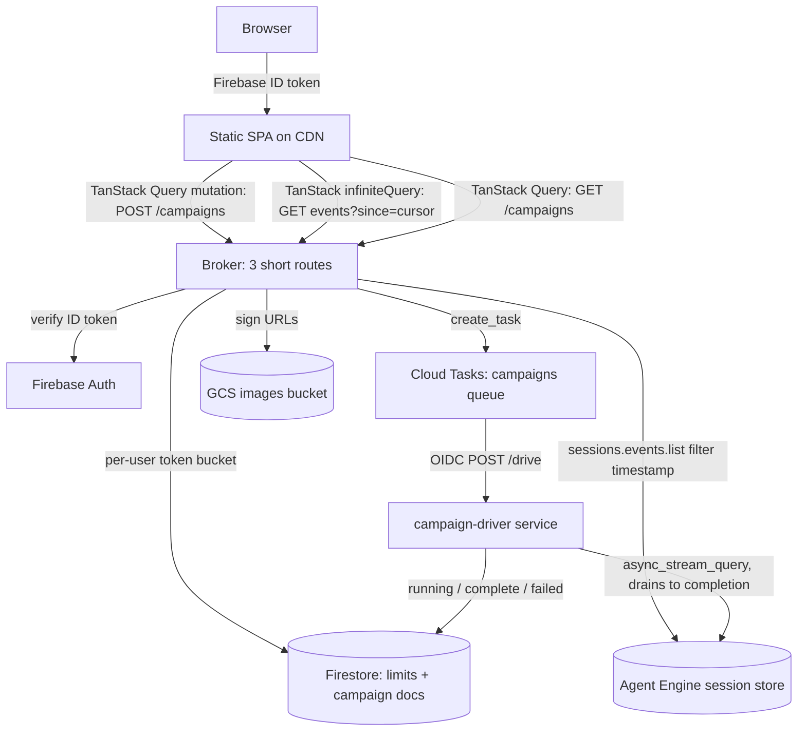

# Diagnosis

### What happened

The ADK trace shows a campaign that ran **7m14s end-to-end and completed successfully** in Agent Engine (with a single Critic tool call taking 1m56s). The Gradio UI rendered normally through the early steps, then froze permanently at *Step 1: Copywriter Revision* with a spinning gear and a disabled Send button. The backend was never the problem — the frontend lost the run and had no way to find it again.

### Root cause 1 — the Cloud Run request timeout is shorter than a campaign

`deploy/deploy_gradio.py:81` deploys the UI with `--timeout=300`. Cloud Run's default request timeout is 300s; the maximum is 3600s.

Gradio 5 streams generator output to the browser over a single long-lived SSE request (`/queue/data`). A 7-minute campaign therefore requires a >7-minute HTTP request, and the Google Front End severs it at 300s — landing right around the point the screenshots freeze. Meanwhile the Cloud Run instance still held its *upstream* connection to Agent Engine, so the campaign kept running to completion. That is exactly the reported symptom: **dropped in the UI, healthy in the backend.**

### Root cause 2 — all run state lived inside one generator, so nothing was recoverable

`stream_chat` (`gradio-ui/app.py:217`) accumulates the entire rendered conversation in local variables — `bubbles`, `full_text`, `finalized_text_len`, `running_tools`, `completed_tools`. There is no cursor, no durable log, and no way to resume.

Gradio treats an SSE disconnect on `/queue/data` as terminal: the running job is marked dead. So when the connection died, every byte of progress died with it. `RECONNECT_MAX_ATTEMPTS` (`app.py:205`) only guards *initial* connection setup (`_connect_remote`), not mid-stream failure — it could not help here.

### Root cause 3 — the failure was silent and unrecoverable in the UI

- The Send button stayed disabled because `enable_inputs` sits in a `.then()` chain that never fires when the stream dies mid-event.
- Nothing surfaced to the user — no error, no timeout notice. The gear just kept spinning.
- The only escape was Clear Chat, which abandons the still-running campaign.

### Contributing defects found during investigation

| # | Finding | Evidence |
|---|---|---|
| 1 | **Remote mode can never render images.** The remote branch handles only inline `inline_data`; it ignores `actions.artifact_delta`, which is all that `streamQuery` emits for artifacts — and `artifact_delta` carries no bytes. This is why the screenshots show `[display_image]` chips and no imagery. | `app.py:311-430` vs `agents/.../display_image_tool.py:36` |
| 2 | **Mid-stream errors wipe the transcript.** The handler yields a single-element list `["❌ Error..."]`, replacing every bubble streamed so far. | `app.py:426`, `app.py:625` |
| 3 | **Fragile text de-duplication.** Bubble assembly relies on `startswith`/`endswith` string heuristics that silently drop legitimately repeated text. | `app.py` `stream_chat` |
| 4 | **Local mode exits early.** The loop breaks on any `turnComplete`/`endOfAgent` flag, which can drop the UI mid-run while ADK is still working. | `app.py:621` |
| 5 | **Session identity is fragile.** The ADK session id is minted client-side into `gr.State`; if that state is lost, a *new* uuid is generated and the still-running session is orphaned. | `app.py:225` |
| 6 | **No instance pinning or session affinity.** With default autoscaling, `/queue/join` and `/queue/data` can land on different instances, losing the session immediately. | `deploy/deploy_gradio.py:70-83` |
| 7 | **Deprecated SDK calls.** `stream_query`, `create_session`, `get_session`, `list_sessions` all emit `DeprecationWarning`. `deploy/deploy_orchestrator.py:332` already uses `async_stream_query`; only the UI lags. | `vertexai/agent_engines/templates/adk.py:1253`, `:1471` |

### Why we are replacing Gradio rather than patching it

Raising the timeout to 3600s and pinning instances would mask the symptom, but the architecture stays wrong: a campaign's survival remains tied to one HTTP request and one browser tab, with a hard 60-minute ceiling and no resume after a laptop sleep or Wi-Fi blip. Root cause 2 is the real defect, and it is structural.

The fix is to make **Agent Engine's session the single source of truth**. It already persists every event with `author`, `content.parts`, `actions`, `timestamp` and `id`, and `sessions.events.list` supports a `timestamp` filter — a durable, ordered, replayable cursor feed that is strictly richer than the SSE payload the UI parses today.

# Requirements

### Overview & Goals

Replace the Gradio UI with a static SPA plus a minimal backend so that **no server request outlives a few hundred milliseconds** and **no campaign depends on a live connection**. A user must be able to close the tab, lose Wi-Fi, or reload the page and still see their campaign's full progress.

### Scope

**In scope**
- Static Vite/React SPA served from a CDN, gated by Firebase Auth, with **TanStack Query as the single client-side server-state authority**.
- A three-route broker (Cloud Functions gen2 / Cloud Run) that starts campaigns, lists a user's campaigns, and serves the event feed.
- A **Cloud Tasks queue** that dispatches each campaign to a dedicated `campaign-driver` Cloud Run service, which drives the run to completion using `async_stream_query` — reusing the exact pattern already in `agents/designer/task_queue.py` and `task_handler.py`.
- Per-user campaign admission control via a Firestore token bucket, following `agents/designer/rate_limiter.py`, with a per-user concurrent-campaign allowance that a future "credits" mechanism can raise.
- Transcript rendering, resume, and image display driven entirely by session events.
- Deletion of `gradio-ui/` and `deploy/deploy_gradio.py`.

**Out of scope**
- Any change to agent behaviour, prompts, or tools — except a possible "continue from partial state" instruction in `agents/creative_director/prompt.py` if the resume spike requires it.
- Re-deploying the orchestrator or specialists.
- WebSocket transport (Agent Engine exposes no reachable bidi endpoint: `AdkApp.register_operations()` registers no `bidi_stream_query`, and the WS handshake needs an `Authorization` header browsers cannot set).
- Migrating local ADK dev mode; the SPA targets remote Agent Engine.

### User Stories

- As a user, I want to submit a brief and see each specialist's progress appear as it happens, so I know the campaign is advancing.
- As a user, I want to reload the page mid-campaign and see everything that has happened so far, so a network glitch never costs me a run.
- As a user, I want to be told clearly when a campaign has failed or stalled, and be offered a Resume action, so I am never left watching a spinner forever.
- As a user, I want generated images to actually render in the UI, so I can evaluate the creative output.
- As an operator, I want no server instance kept alive purely to babysit a stream, so cost tracks actual agent work.
- As an operator, I want every campaign start to pass through one throttled, authenticated chokepoint, so I can cap per-user usage today and grant extra capacity per user later without changing the architecture.

### Functional Requirements

1. Submitting a brief returns within ~1s with a session id; the UI immediately shows a "starting" state.
2. The transcript is rendered from `sessions.events.list`, polled with a `timestamp` cursor; each event is addressable by `id` so replay is idempotent.
3. Compaction summary events are filtered out and never rendered as agent output.
4. Reload, tab restore, and reconnect all resolve to the same code path: re-read the session from the server via TanStack Query. The only client-held handle is the `sessionId` **in the URL** — no `localStorage` mirror of run state.
4a. A signed-in user can list their recent campaigns and open any of them, so a run is reachable from any device or after a cache wipe.
5. A stalled run (no new events beyond a threshold) plus a non-running driver status surfaces an explicit failure state with a Resume action.
5a. A user over their per-user campaign rate or concurrent-campaign allowance gets an explicit, structured refusal (never a silent drop and never a queued surprise), matching the `{"status": "error", "error": "rate_limited..."}` shape already used by `generate_image`.
6. Generated images render via signed HTTPS URLs; no GCS credentials in the browser.
7. Inputs are never left permanently disabled — any terminal or error state re-enables submission.
8. Errors append to the transcript; they never replace it.

### Non-Functional Requirements

- No **broker** HTTP request exceeds ~1s; the broker scales to zero with no `min-instances` and no session affinity. The only long-lived request lives on the separate `campaign-driver` service, where it is a Cloud Tasks dispatch rather than a user request.
- `campaign-driver` deployed with `--timeout=1800 --no-cpu-throttling`; the campaign queue configured with `--max-attempts=1` so a timed-out drive is never silently re-dispatched as a duplicate campaign.
- Queue-level `max-concurrent-dispatches` caps global simultaneous campaigns; per-user limits are enforced in Firestore before enqueue, since queue configuration is global rather than per-user.
- No GCP access token ever reaches the browser; the Vertex CORS question is therefore off the critical path.
- The driver's service account holds only `aiplatform.user`; the broker's holds only `cloudtasks.tasks.create` on the campaign queue, `iam.serviceAccounts.actAs` on the OIDC invoker SA, plus session-read, Firestore and URL-signing rights.
- The `campaign-driver` accepts only OIDC-authenticated Cloud Tasks pushes; it is never publicly invokable.

# Technical Design

### Key Decisions

1. **Session events are the single source of truth.** The UI renders from `sessions.events.list`, never from a live stream. This is what makes reload, reconnect and resume the same operation, and it is why transport choice stops mattering.
2. **Cloud Tasks dispatches each campaign to a dedicated driver service.** The repo already runs this exact pattern for image generation (`agents/designer/task_queue.py` → an OIDC-authenticated internal handler in `task_handler.py`), so this is reuse rather than new infrastructure. `create_task` returns in milliseconds, the queue owns the invoke and retries a dispatch the driver never accepted, and `max-concurrent-dispatches` becomes a real admission-control knob. The driver lives on its **own** Cloud Run service so redeploying the broker cannot kill an in-flight campaign, and its request slots are sized independently of the broker's fast reads.
2a. **The queue is also the throttling and future credits chokepoint.** Every campaign start passes through one place that knows the authenticated `uid`, so a Firestore token bucket (mirroring `agents/designer/rate_limiter.py`) enforces per-user rate and per-user *concurrent campaign* limits before enqueue. A future "add credits" flow becomes a write to that user's allowance document — no architectural change.
3. **The driver stores almost nothing.** Agent Engine persists every event itself, so the driver only has to keep the invocation alive: `async for _ in engine.async_stream_query(...): pass`. It must drain to the very end, because ADK runs event compaction only after all events are yielded (`runners.py:515-519`). Its one write is a small Firestore campaign document (`running` → `complete` / `failed`), reusing the job-document handoff already used for image generation — this is what lets the UI distinguish a crash from a stall.
4. **Reads go through the broker, not browser-direct.** This keeps GCP tokens out of the browser, lets the broker sign image URLs, and removes any dependency on Vertex CORS.
5. **No client-side state store.** The lookup is derived server-side: `sessions.events.list` staleness says *something is wrong*, and the Firestore campaign document says *what* (dispatched / running / complete / failed, plus the owning `uid`). The client holds no execution handle and no cursor of its own; the durable handle is the `sessionId` in the URL, and everything else is server state fetched on demand. Firestore is already a project dependency, so this adds a collection rather than a component.
6. **TanStack Query is the client's server-state authority.** `POST /campaigns`, `GET /campaigns` and the event feed all go through it — no bespoke `useCampaign` polling loop, no `localStorage` persistence layer, no hand-rolled loading/error flags. Retry with exponential backoff, `refetchInterval`, focus/online refetching and request de-duplication are library behaviour rather than code we maintain.
7. **Transcript shaping happens in a `select` transform, not in components.** The broker returns authoritative, compaction-filtered events; the client's `select` flattens the cursor pages, dedupes by event `id`, and groups them into step cards. Because `select` is memoized per query key and page set, the transform re-runs only when a new cursor page lands, so components stay dumb and render-cheap.
8. **Polling, not WebSocket.** A socket would face the same duration cap, require sticky routing, and still need replay logic. Client-leg glitches cannot be delegated to the server; polling has no connection to lose.
9. **`async_stream_query` in the driver.** Clean here because the driver is an async handler that nothing ever disconnects from mid-run, so the deprecated `stream_query` goes away with no downside.

### Architecture Diagram



### Proposed Changes

**`campaign-driver/` (new) — the Cloud Tasks push target**
- `main.py`: a single `POST /drive` route accepting `{sessionId, userId, prompt}` from an OIDC-authenticated Cloud Tasks push; connects via `client.agent_engines.get(...)`; drains `async_stream_query` to completion; logs event counts for observability.
- Writes the Firestore campaign document through `running` → `complete` / `failed`, mirroring the job-document handoff in `agents/designer/task_handler.py`.
- Uses `async_stream_query` and the `async_` session variants, replacing all deprecated calls.
- Never breaks early — required for compaction to run.
- Returns 200 only after a full drain; returns 5xx on failure, but the queue is configured `--max-attempts=1` so a partial campaign is never re-dispatched.

**`broker/campaign_queue.py` (new)**
- A near-copy of `agents/designer/task_queue.py`: lazy `tasks_v2.CloudTasksAsyncClient` singleton, `create_task` with an `OidcToken` minted for the campaign invoker SA and audience set to the driver URL, all endpoints and queue names env-driven (`CAMPAIGN_TASKS_QUEUE`, `CAMPAIGN_TASK_HANDLER_URL`, `CAMPAIGN_TASKS_INVOKER_SA`).

**`broker/campaign_limits.py` (new)**
- A near-copy of `agents/designer/rate_limiter.py`: transactional Firestore token bucket keyed on the Firebase `uid`, with `CAMPAIGN_RATE_LIMIT_CAPACITY` / `_WINDOW_SECONDS` plus a per-user `maxConcurrentCampaigns` allowance counted from non-terminal campaign documents. A future credits top-up is a write to that allowance.

**`broker/` (new) — three sub-second routes**
- `POST /campaigns` — verifies the Firebase ID token; uses the Firebase `uid` as `user_id` (replacing today's hardcoded `"gradio-user"`); checks the per-user token bucket and concurrent-campaign allowance; mints a session uuid; writes the campaign document as `dispatched`; enqueues a Cloud Tasks task; returns `{sessionId}` in ~200ms. Over-limit returns a structured `rate_limited` error, never a queued surprise.
- `GET /campaigns` — lists the caller's sessions via the async `list_sessions` variant scoped to the Firebase `uid`, with last-event timestamp, derived status and a title snippet. This is what replaces `localStorage` as the way a user finds a run again.
- `GET /campaigns/{sessionId}/events?since=<ts>` — proxies `sessions.events.list` with a `timestamp` filter, normalizes events to UI steps, filters compaction summaries, rewrites `gs://` refs to signed URLs, and merges the Firestore campaign document's status so crash and stall are distinguishable.
- `events_normalizer.py` — the one piece of logic ported from `app.py`, rewritten around event `id`/`author`/`actions` instead of `startswith`/`endswith` string heuristics.

**`web/` (new) — the SPA**
- Vite + React + TypeScript + **TanStack Query v5**, built to a static bundle, deployed to Firebase Hosting with a rewrite to the broker.
- Firebase Auth sign-in gate; a single `authedFetch` wrapper attaches the ID token and refreshes once on 401.
- `api/queries.ts` — the only place that talks to the broker: `useStartCampaign()` mutation, `useCampaigns()` query, `useCampaignEvents(sessionId)` infinite query.
- `selectTranscript` — pure `select` transform turning cursor pages into a deduped, grouped view model.
- Routing on `/c/:sessionId` so the browser URL is the durable handle; no `localStorage`.
- Transcript renderer: presentational-only per-agent step cards, tool-call chips, markdown text, and image tiles.

**Deleted**
- `gradio-ui/` (`app.py`, `Dockerfile`, `pyproject.toml`, `uv.lock`, `README.md`)
- `deploy/deploy_gradio.py`

### Data Models / Contracts

```ts
// POST /campaigns
{ prompt: string }                    // + Authorization: Bearer <firebase-id-token>
-> { sessionId: string }              // executionName resolved server-side, never held by the client

// GET /campaigns  -> recent campaigns for the authenticated user
-> { campaigns: Array<{
       sessionId: string,
       title: string,                 // first ~80 chars of the brief
       status: CampaignStatus,
       createdAt: string,
       lastEventAt: string | null
     }> }

// GET /campaigns/{sessionId}/events?since=<rfc3339>
-> {
     cursor: string,                  // pass back as `since` next poll
     status: "starting" | "running" | "complete" | "failed" | "stalled",
     steps: Array<{
       id: string,                    // event id — dedupe key
       author: string,                // specialist agent
       kind: "text" | "tool_call" | "tool_result" | "image" | "transfer",
       text?: string,
       toolName?: string,
       imageUrl?: string,             // pre-signed https
       timestamp: string
     }>
   }
```

```ts
// web/src/api/queries.ts — the client's entire server-state surface
export const useCampaignEvents = (sessionId: string) =>
  useInfiniteQuery({
    queryKey: ['campaign', sessionId, 'events'],
    queryFn: ({ pageParam }) => getEvents(sessionId, pageParam),
    initialPageParam: undefined as string | undefined,
    getNextPageParam: (last) => last.cursor,   // pages accumulate = full transcript
    select: selectTranscript,                  // memoized per page set
    refetchInterval: (q) => isTerminal(q.state.data) ? false : 2000,
    refetchIntervalInBackground: false,        // pauses while the tab is hidden
    retry: 5, retryDelay: (n) => Math.min(1000 * 2 ** n, 30_000),
  });
```

### Risks

| Risk | Mitigation |
|---|---|
| **Events may not be visible mid-invocation** — the load-bearing assumption of the whole design. | First spike. If they only appear post-run, fall back to the driver publishing progress into the Firestore campaign document; the SPA and broker contracts stay unchanged. |
| Compaction appends LLM summary events that would render as agent output. | Filter by event shape/author in `events_normalizer.py`; covered by the first spike. |
| Cold start per campaign adds ~5–20s before the first event. | Show an explicit "starting" state; `--cpu-boost` on `campaign-driver`, and optionally `--min-instances=1` on it alone for demos. |
| Resume may restart rather than continue the campaign. | Resume spike; if needed, add a "do not redo completed steps" instruction to `agents/creative_director/prompt.py`. |
| Duplicate campaign start in the window before the first event lands. | The Firestore campaign document is the idempotency record, plus TanStack Query's mutation-in-flight state disabling the submit button. |
| Cursor pages must accumulate rather than replace, or the transcript truncates. | `useInfiniteQuery` with no `maxPages` cap; validated by the reload-mid-campaign scenario. |
| A timed-out or 5xx drive being re-dispatched would start a duplicate campaign. | Queue configured `--max-attempts=1`; the driver is additionally guarded by the campaign document's status so a re-entry is refused. |
| Cloud Tasks HTTP-target deadline caps a run at 30 minutes. | Comfortable for a ~7-minute campaign; if campaigns grow past that, the driver becomes a Cloud Run Job (24h) with the broker still enqueueing, so the swap is contained. |
| Queue-level concurrency is global, not per-user, so it cannot express "this user gets 2 campaigns". | Per-user rate and concurrency enforced in Firestore before enqueue, with the queue as the global ceiling. |
| `display_image` artifacts carry no bytes over `streamQuery`. | Image spike; likely resolved by having the broker read artifacts server-side and sign URLs, reusing the existing `SIGNING_SERVICE_ACCOUNT` path. |

### Alternatives Considered

In all three variants below the **frontend is identical** — `POST /campaigns` returns in ~200ms and the browser polls the events route. The long request is always server-to-server, never held by the browser; if the browser ever held it we would have rebuilt Gradio.

**1. Cloud Run Job per campaign (`jobs:run`).** Chosen against, though it is close. It gives a 24h task timeout, no ingress at all, and immunity to service redeploys. Rejected because Cloud Tasks gives the same decoupling using machinery the repo already operates, and because a Job offers **no admission-control surface** — there is no per-user concurrency knob, no queue depth, and no natural place for a future credits mechanism. If campaigns ever exceed the 30-minute Cloud Tasks deadline, the driver becomes a Job and the broker keeps enqueueing; the swap is contained to one module.

**2. Broker self-call to an internal `/_drive` with `--timeout=3600`.** Fewest moving parts, and it does return to the client immediately. Rejected on reliability: a fire-and-forget dispatch from a request handler has nobody to retry it (a silent miss leaves a session with zero events), the instance can be CPU-throttled the moment no request is in flight unless `--no-cpu-throttling` is pinned, and a broker revision rollout — frequent during development — kills every in-flight campaign because the drive shares the broker's instances.

**3. Cloud Tasks → dedicated `campaign-driver` service.** Selected. The queue owns the dispatch and retries one the driver never accepted, `max-concurrent-dispatches` is a real global ceiling, the driver's own service means broker deploys are harmless and its request slots are sized independently, and the enqueue point is a single authenticated chokepoint where per-user rate, per-user concurrency and later credits are enforced. Costs: a queue plus an invoker SA, a 30-minute per-run ceiling, and the same ~5–20s cold start as a Job.

# Testing

### Validation Approach

The spikes are executable scripts run against the live Agent Engine before the build, so the load-bearing assumptions are proven rather than assumed. After that, each layer is validated independently: the driver invoked directly, the broker via HTTP, the SPA against the real broker.

### Key Scenarios

1. **Mid-run visibility** — start a campaign, then poll `sessions.events.list` every 2s from a separate process; assert events appear while the invocation is still in flight, and log which events are compaction summaries.
2. **Full campaign, no client** — enqueue a campaign, close every client, and confirm from the session that the campaign completed all steps, that compaction ran, and that the campaign document ends `complete`.
3. **Reload mid-campaign** — hard-refresh the SPA at ~60s and ~4min; assert the transcript is fully restored purely from server state (URL `sessionId` + refetch) with no gaps and no duplicates.
3a. **Recent campaigns** — open the app in a fresh profile and confirm the running campaign is listed and openable via `GET /campaigns`.
4. **Cursor idempotency** — replay the same `since` value repeatedly; assert no duplicated steps, since dedupe is keyed on event `id`.
5. **Timeout regression** — confirm a >7-minute campaign renders to completion, the exact case that fails today.
6. **Image rendering** — assert generated images render as signed URLs, closing the defect where remote mode showed only `[display_image]` chips.

### Edge Cases

- Driver crashes mid-run → UI shows `failed` (from the Firestore campaign document, not just staleness) and offers Resume; inputs are re-enabled.
- Driver stalls with no crash → `stalled` state after a threshold, never an indefinite spinner.
- User exceeds their rate or concurrent-campaign allowance → explicit `rate_limited` message surfaced from the mutation's error state; no task enqueued.
- Duplicate dispatch attempt → refused by the campaign document's status guard.
- Expired Firebase token mid-poll → silent re-auth and the poll resumes.
- Broker 5xx or network loss → TanStack Query retries with exponential backoff, already-fetched pages stay in cache and keep rendering, and only a reconnecting banner appears.
- Two tabs on one session → both render identically from the same cursor feed; query de-duplication prevents redundant in-flight requests within a tab.
- Cleared browser storage / different device → the campaign is still reachable via `GET /campaigns`, since no run state was ever client-only.
- Unauthenticated call to any broker route → 401, and no task is enqueued.
- Direct unauthenticated call to `campaign-driver` → rejected; only OIDC pushes from the campaign queue are accepted.

### Test Changes

- Add spike scripts under `scripts/spikes/` (retained as diagnostics).
- Add unit tests for `events_normalizer.py` covering compaction filtering, `artifact_delta` handling, tool-call pairing, and repeated-text cases that the old `startswith`/`endswith` heuristics mishandled.
- Add unit tests for `selectTranscript` covering page accumulation, `id` dedupe, step grouping, and memoization stability.
- No changes to existing agent tests; `run_campaign.py` remains the CLI smoke test.

# Delivery Steps

###   Step 1: Prove the load-bearing assumptions with spikes
The four assumptions the architecture depends on are verified against the live Agent Engine, with results recorded before any build work starts.

- Add `scripts/spikes/spike_events_midrun.py`: start a campaign, poll `sessions.events.list` with a `timestamp` filter from a separate process, and assert events appear **while the invocation is in flight** — the single load-bearing assumption.
- In the same spike, dump raw event shapes to identify how compaction summary events (from `EventsCompactionConfig` in `agents/creative_director/agent.py:134-143`) can be distinguished and filtered.
- Add `scripts/spikes/spike_driver_lifetime.py`: confirm a long-running driver drains a full ~7-minute campaign to completion, that compaction runs afterwards, and that a Cloud Tasks HTTP-target dispatch holds for that duration without the queue re-dispatching.
- Add `scripts/spikes/spike_resume.py`: re-invoke on an existing session and record whether the campaign continues or restarts, determining if `agents/creative_director/prompt.py` needs a "do not redo completed steps" instruction.
- Add `scripts/spikes/spike_images.py`: inspect `actions.artifact_delta` and determine the server-side path from artifact to signed HTTPS URL, reusing the existing `SIGNING_SERVICE_ACCOUNT` mechanism.

###   Step 2: Build the campaign-driver service behind a Cloud Tasks queue
A Cloud Tasks push drives a full campaign to completion with no client attached, and records terminal status in Firestore.

- Create `campaign-driver/main.py` with a single `POST /drive` route accepting `{sessionId, userId, prompt}`, modelled on the OIDC-authenticated internal handler in `agents/designer/task_handler.py` and rejecting anything that is not a queue push.
- Connect via `client.agent_engines.get(...)` and drain the invocation with `async_stream_query`, replacing the deprecated `stream_query` used at `gradio-ui/app.py:312`; also use the `async_` session variants in place of the deprecated `create_session`/`get_session`/`list_sessions`.
- Drain the iterator to the very end without breaking early — required for event compaction to run (`runners.py:515-519`), and explicitly avoiding the early-exit bug at `app.py:621`.
- Persist no transcript: Agent Engine already stores every event. The only writes are the campaign document transitions `running` → `complete` / `failed`, reusing the Firestore job-document handoff pattern from image generation.
- Guard re-entry on the campaign document's status so a re-delivered task can never start a second run on the same session.
- Add `campaign-driver/Dockerfile` and `deploy/deploy_campaign_driver.py` following the `subprocess` + `env_utils` pattern of the existing deploy scripts, deploying with `--timeout=1800 --no-cpu-throttling --no-allow-unauthenticated` and a service account holding only `aiplatform.user` plus Firestore write.
- Create the `campaigns` Cloud Tasks queue in the deploy script with `--max-attempts=1` and a `max-concurrent-dispatches` ceiling, mirroring how `deploy/deploy_all_specialists.py` provisions the `image-generation` queue.

###   Step 3: Build the broker API with the event normalizer
Three authenticated sub-second routes can start a campaign, list a user's campaigns, and serve a transcript from session events.

- Create `broker/main.py` with `POST /campaigns`: verify the Firebase ID token, use the Firebase `uid` as `user_id` (replacing the hardcoded `"gradio-user"` at `app.py:218`), mint a session uuid, write the campaign document as `dispatched`, enqueue the Cloud Tasks task, and return `{sessionId}`.
- Add `broker/campaign_queue.py` as a near-copy of `agents/designer/task_queue.py`: lazy `CloudTasksAsyncClient` singleton and `create_task` with an `OidcToken` for the campaign invoker SA, all names env-driven.
- Add `broker/campaign_limits.py` as a near-copy of `agents/designer/rate_limiter.py`: a transactional Firestore token bucket on the Firebase `uid` plus a per-user `maxConcurrentCampaigns` allowance counted from non-terminal campaign documents, returning a structured `rate_limited` error when exhausted — the hook a future credits top-up writes to.
- Add `GET /campaigns/{sessionId}/events?since=<cursor>`: proxy `sessions.events.list` with the `timestamp` filter and return normalized steps plus the next cursor and a `status` field.
- Add `GET /campaigns`: list the caller's sessions via the async `list_sessions` variant scoped to the Firebase `uid`, returning `{sessionId, title, status, createdAt, lastEventAt}` — the server-side replacement for `localStorage`.
- Merge the Firestore campaign document into the events response so the client never needs to hold an execution handle.
- Create `broker/events_normalizer.py` mapping events to UI steps keyed on event `id`, using `author` for agent attribution and `content.parts`/`actions` for kind detection — replacing the fragile `startswith`/`endswith` text heuristics in `app.py`.
- Filter compaction summary events so they are never rendered as agent output.
- Handle `actions.artifact_delta` and rewrite `gs://` references to pre-signed HTTPS URLs, fixing the defect where remote mode could never display images.
- Derive `status` from event staleness plus the campaign document, so crash and stall are distinguishable.
- Add unit tests for the normalizer covering compaction filtering, tool-call pairing, artifact handling, and repeated text.
- Add `deploy/deploy_broker.py` with a service account limited to `cloudtasks.tasks.create` on the campaign queue, `actAs` on the invoker SA, session reads, Firestore access and URL signing.

###   Step 4: Build the SPA shell with auth and a TanStack Query data layer
A static SPA authenticates the user, starts a campaign through a TanStack Query mutation, and holds no client-side run state beyond the URL.

- Scaffold `web/` with Vite + React + TypeScript and a static production build.
- Add a Firebase Auth sign-in gate and a single `authedFetch` wrapper that attaches the ID token and refreshes it once on a 401 before retrying.
- Install and configure `@tanstack/react-query` v5: one `QueryClient` with global defaults for `retry`, exponential `retryDelay`, `refetchOnWindowFocus` and `refetchOnReconnect`, so network resilience is configuration rather than code.
- Create `web/src/api/queries.ts` as the only module that talks to the broker, exposing `useStartCampaign()`, `useCampaigns()` and `useCampaignEvents(sessionId)`.
- Wire the brief-submission form to the `useStartCampaign` mutation: `isPending` disables the button (which also prevents duplicate campaign starts), `onSuccess` seeds the events query cache with a `starting` status, invalidates `['campaigns']`, and navigates to `/c/{sessionId}`.
- Use the route param `/c/:sessionId` as the durable handle instead of `localStorage`, so a reload, a shared link and a second device all resolve the same way.
- Add `firebase.json` with hosting config, a rewrite routing `/api/**` to the broker, and a SPA fallback so `/c/:sessionId` deep-links resolve.

###   Step 5: Render the transcript from a cursor-paged infinite query
The SPA renders a full campaign transcript that rebuilds itself from the server after any reload or network interruption, with no bespoke polling loop.

- Implement `useCampaignEvents` as a `useInfiniteQuery` over `GET /campaigns/{id}/events?since=<cursor>`, with `getNextPageParam` returning the broker's cursor and no `maxPages` cap so pages accumulate into the whole transcript.
- Drive live updates with a `refetchInterval` that returns `false` once status is terminal, and `refetchIntervalInBackground: false` so polling pauses while the tab is hidden.
- Implement `selectTranscript` in `web/src/api/selectTranscript.ts` as the query's `select`: flatten pages, dedupe strictly on event `id`, drop any residual compaction summaries the broker did not filter, and group events into step cards keyed by `author` + `invocation_id`. Because `select` is memoized per page set, this runs only when a new cursor page arrives.
- Keep transcript components purely presentational — step cards, tool-call and tool-result chips, markdown blocks, image tiles from signed URLs — consuming the view model with no reshaping logic of their own, replacing the bubble-assembly heuristics in `app.py`.
- On mount with no cache, the query simply refetches from the first cursor, so mid-campaign reload restores the full transcript with no rehydration code.
- Derive the disabled state of the input from query/mutation state only, so it can never latch permanently the way the `enable_inputs` chain does today.

###   Step 6: Add failure, stall and resume handling on top of query state
Users are never left watching an indefinite spinner, and a dead run can be resumed — all states derived from TanStack Query rather than tracked by hand.

- Render explicit `failed` and `stalled` states from the broker's `status` field, which combines event staleness with the Firestore campaign document.
- Surface API-layer problems from query state alone: `isError` plus `failureCount` shows a non-blocking "reconnecting" indicator during backoff, and the already-fetched transcript keeps rendering — structurally preventing the defect at `app.py:426`/`app.py:625` where one error bubble wiped all prior output.
- Add a `useResumeCampaign` mutation that enqueues a fresh drive task on the same session (subject to the same per-user limits) and invalidates `['campaign', sessionId, 'events']`, plus the "continue from partial state" addition to `agents/creative_director/prompt.py` if the resume spike showed it is needed.
- Surface a `rate_limited` refusal distinctly from a transient failure, so an over-allowance user sees a clear message rather than a retry spinner.
- Build the recent-campaigns view on `useCampaigns()` (`GET /campaigns`), so any run is reachable from server state with no `localStorage` involved; refetch on focus keeps it current.
- Add tests for `selectTranscript` (dedupe, grouping, compaction leftovers, repeated text) and a smoke test that a simulated 500 mid-poll leaves the transcript intact.

###   Step 7: Cut over and remove the Gradio stack
The new frontend is live and the Gradio implementation is fully removed from the repo.

- Deploy the SPA to Firebase Hosting and verify end-to-end against the real Agent Engine, including a >7-minute campaign — the exact case that fails today under `--timeout=300`.
- Run the reload-mid-campaign and image-rendering validations against the deployed stack.
- Delete `gradio-ui/` (`app.py`, `Dockerfile`, `pyproject.toml`, `uv.lock`, `README.md`) and `deploy/deploy_gradio.py`.
- Remove the `creative-director-ui` Cloud Run service and drop Gradio from dependency manifests.
- Update `README.md`, `docs/`, and `deploy/teardown_gcp.sh` to cover the SPA, broker, campaign queue and driver, replacing all Gradio references.

# Decisions made during Step 2 onwards work

This section records judgment calls made while implementing Steps 2–6,
since the plan above was written before Step 1's spikes ran and before any
code existed. Gradio is deliberately left in place throughout (`gradio-ui/`,
`deploy/deploy_gradio.py`, the `creative-director-ui` Cloud Run service) so
it can be compared side-by-side with the new SPA before Step 7 removes it.

## Step 2: campaign-driver + Cloud Tasks queue

- **Service layout**: `campaign-driver/` is its own top-level directory with
  its own `pyproject.toml`/`uv.lock`/`Dockerfile`, mirroring
  `agents/designer/`'s structure rather than folding into an existing
  agent. It has no ADK `Agent` of its own — it's a thin Starlette app
  wrapping `vertexai.Client`/`async_stream_query`, so it declares
  `google-cloud-aiplatform[agent-engines]` directly rather than pulling in
  `google-adk[a2a]` for a framework it doesn't use.
- **503-tolerant drain, not a blind retry**: Step 1's spikes hit a
  transient `503 UNAVAILABLE` from `async_stream_query` in 3 of the runs it
  used, always well after the campaign was already progressing — and in
  every case the session kept executing and even reached full completion
  server-side with zero client attached. `main.py`'s `_drain` encodes this
  finding directly: on a stream error it re-reads `sessions.events.list`
  twice (with a backoff between reads) and only re-invokes the stream if
  the event count is still growing; if it's stable, the campaign is
  treated as already complete rather than retried. This was verified for
  real, not just unit-tested: an end-to-end Cloud Tasks → `/drive` →
  `async_stream_query` smoke test ran a full ~5-minute campaign to
  `complete` with 15 events persisted (see verification note below).
- **Re-entry guard lives in Firestore, keyed on session status, not on a
  Cloud Tasks dedupe key**: `campaign_store.mark_running` uses a
  transactional read-then-write that refuses to proceed if the campaign
  document is already `running`. This is what stops a re-delivered task
  (the queue is `--max-attempts=1`, so this is about a stray duplicate
  enqueue, not queue-level retries) from starting a second concurrent
  drive on the same session — Step 1's `spike_resume` already showed the
  ADK runner itself continues cleanly from session history, so this guard
  exists purely to prevent *concurrent* drives, not to block legitimate
  resume (which calls `mark_running` again once the prior run is no longer
  `running`).
- **`--max-attempts=1` on the queue, confirmed against the plan's own
  reasoning**: a timed-out or 5xx `/drive` must never be silently
  re-dispatched as a duplicate campaign. Retry logic for *transient*
  mid-stream errors lives inside `_drain` itself instead, because a
  queue-level retry would otherwise race a second `/drive` invocation
  against the first drive's still-running drain.
- **Firebase project registration was explicitly declined, not worked
  around**: `firebase projects:addfirebase aaditva` was blocked by the
  permission classifier as a shared/hard-to-reverse GCP project change.
  Per the standing instruction to respect such blocks rather than route
  around them, this was left for the user to do manually (one-time, in the
  Firebase console) rather than retried via a different tool. Only
  `gcloud services enable firebase.googleapis.com identitytoolkit.googleapis.com`
  (API enablement, not project registration) was run directly. **Action
  needed from you**: run `firebase projects:addfirebase aaditva`, then
  enable at least one sign-in provider (e.g. Google) in Firebase Console →
  Authentication → Sign-in method, before Step 4's SPA auth gate can be
  exercised against a real account.
- **Verification performed live, not just unit tests**: `campaign-driver`
  was actually deployed to Cloud Run (`--no-allow-unauthenticated`,
  `--timeout=1800`, `--no-cpu-throttling`, scale-to-zero
  `--min-instances=0`) and the `campaigns` queue was created for real
  (`--max-attempts=1`, confirmed via `gcloud tasks queues describe`). Three
  checks were run against the live deployment: (1) an unauthenticated
  `POST /drive` returns `403` at Cloud Run's own IAM layer, confirming
  "never publicly invokable" holds without relying on the app's own OIDC
  check; (2) a real Cloud Tasks task was enqueued and reached `/drive`
  with a valid OIDC token, exercising the full push path; (3) that task
  drove one real (paid) ~5-minute campaign to `complete` with the
  Firestore campaign document transitioning `dispatched` → `running` →
  `complete` correctly. Only one paid campaign run was used for this,
  reusing the existing `campaigns` queue rather than creating throwaway
  infra. 12 unit tests (`campaign-driver/tests/test_main.py`) cover the
  auth/validation/re-entry/retry-vs-complete branching without further
  live calls.

## Step 3: broker API + events_normalizer

- **Image delivery keys off `get_image_links`, not `artifact_delta`
  resolved server-side**: the plan's Proposed Changes originally described
  the broker "rewriting `gs://` references to signed URLs" from
  `actions.artifact_delta`. Step 1's `spike_images` already showed
  `artifact_delta` carries only `{"filename.png": version}` — no bytes —
  and that the Creative Director's own `get_image_links` tool call already
  produces ready-to-use signed HTTPS URLs via the existing
  `SIGNING_SERVICE_ACCOUNT` path, with all 3 URLs independently confirmed
  fetchable as `image/png`. `events_normalizer.py` therefore emits `image`
  steps directly from `get_image_links`'s `function_response`, and treats
  `artifact_delta` as a signal to ignore rather than something to resolve.
  This removes an entire chunk of planned broker complexity (no GCS client,
  no bucket IAM reads needed in the events route itself) — the broker's
  `SIGNING_SERVICE_ACCOUNT`/URL-signing IAM grant is kept in
  `deploy_broker.py` regardless, defensively, since Functional Requirement
  6 still names it as a broker responsibility and a future image path might
  need it.
- **Compaction filtering is a no-op today, kept for the future**: Step 1
  found zero compaction events across every harvested session, including
  two that ran to full natural completion. `_is_compaction_event` checks
  both the typed `actions.compaction` field and the `raw_event` fallback
  and will correctly drop a real compaction event the moment one appears,
  but there is currently nothing for it to filter. This was not treated as
  a blocker for Step 3.
- **Event dedupe key is the trailing `/events/{id}` segment of the event's
  `name` field, further suffixed with a part-index** (e.g. `"12345:0"`,
  `"12345:1"`) because a single raw event can carry multiple parts (e.g.
  two `display_image` calls in one turn), and each needs its own stable id
  for the SPA's cursor-based dedupe to work at the granularity it renders.
- **Staleness/stall detection uses `since`, not the campaign document's
  `updated_at`, when a poll has no new steps** — this was a real bug caught
  during live testing (see Verification below), not a design guess. The
  campaign document's `updated_at` is only refreshed on a status
  *transition* (`dispatched`→`running`→`complete`/`failed`), so on a
  healthy long-running campaign with a multi-minute gap between specialist
  calls (confirmed in Step 1: gaps of 2-5 minutes between tool calls are
  normal), using `updated_at` as the freshness signal would flag the
  campaign `stalled` well before it actually was. `since` (the client's own
  last-known cursor, which under the polling contract equals the previous
  response's `cursor`) is a much closer proxy for "when did anything last
  happen," and is only abandoned in favor of the campaign document's
  `updated_at` for the one case where it's actually correct: the very
  first poll, before any event or `since` value exists yet.
- **`_derive_status` was simplified to not take a `latest_step_timestamp`
  argument at all** after fixing the above: whether a campaign is
  `"starting"` vs `"running"` is answered correctly by the Firestore
  document's own `status` field (`dispatched` vs `running` —
  campaign-driver's `mark_running` transitions this *before* streaming a
  single event), not by whether the current poll's page happened to
  contain a new step. The original version returned `"stalled"`
  unconditionally whenever a poll had zero new steps and the doc said
  `"running"`, regardless of `is_recent` — a second bug in the same
  function, caught by the regression test that exercises this exact
  scenario (`test_get_events_no_new_steps_uses_since_not_stale_doc_updated_at`).
- **Ownership check on `GET /events` returns the same 404 as "session not
  found"** rather than 403, to avoid confirming to an unauthenticated-but-
  token-holding caller that a given `sessionId` exists at all.
- **`/healthz` diagnostic routes are unverifiable from this machine** for
  reasons unrelated to the code: both `campaign-driver` and `broker`'s
  `/healthz` return a generic Google 404 (no server-side log entry at all)
  from this specific development machine's network path, while every real
  route on both services (`/drive`, `/campaigns`, `/campaigns/{id}/events`)
  responds correctly and is logged. Running the identical app locally
  confirms `/healthz` returns `200 {"status":"ok"}` correctly, so this is
  environmental (a local network intermediary intercepting the literal
  path `/healthz`), not a deployed bug. Not investigated further since
  `/healthz` is a diagnostic convenience, not part of the plan's contract.
- **Verification performed live wherever Firebase Auth wasn't the
  blocker**: `broker/campaign_store.py` and `broker/campaign_limits.py`
  were exercised against the real Firestore database (not mocks) —
  `create_dispatched`, `list_campaigns_for_user`, `count_active_campaigns`,
  `try_acquire_rate_limit`, and `check_admission`'s rate + concurrency
  refusal path all round-tripped correctly, including catching and fixing
  a missing composite index (`list_campaigns_for_user`'s
  `user_id ==`/`order_by created_at` query needs one; `count_active_campaigns`'s
  `user_id ==`/`status in [...]` query does not, since it has no
  `order_by`) — now provisioned automatically by `deploy_broker.py`'s
  `ensure_firestore_index`. `broker` was deployed live to Cloud Run
  (`--allow-unauthenticated` at the platform level, since `auth.py` gates
  every route itself) and confirmed to return real `401` JSON from its own
  Firebase-token check on unauthenticated `GET`/`POST /campaigns` calls.
  **What was not verified live**: the fully-authenticated happy path
  (`verify_id_token` actually accepting a real Firebase ID token,
  `POST /campaigns` actually enqueueing and `GET /campaigns/{id}/events`
  actually rendering a live campaign) — this is blocked on the same
  pending manual step as Step 2's Firebase note (project not yet
  registered with Firebase, no sign-in provider enabled, so no real ID
  token can be minted yet). 32 unit tests
  (`broker/tests/test_main.py` + `test_events_normalizer.py`) cover the
  full routing/validation/status-derivation/event-normalization logic
  offline, and the normalizer was additionally run against every real
  event dump harvested in Step 1 (up to 34 raw events / 54 derived steps
  per session) with zero duplicate ids and sensible kind distributions.
  **Action needed from you**: once Firebase Auth is set up (see Step 2's
  note), sign in via the SPA (Step 4) and confirm `POST /campaigns` →
  `GET /campaigns/{id}/events` renders a real campaign end-to-end through
  the broker — this closes the one gap live testing couldn't reach here.

## Step 4: SPA shell with auth + TanStack Query data layer

- **The SPA calls the broker's absolute Cloud Run URL directly
  (`VITE_BROKER_URL`), not through a same-origin Firebase Hosting
  rewrite.** The plan's Proposed Changes described a `firebase.json`
  rewrite routing `/api/**` to the broker, but the broker's routes were
  already built and live-validated at `/campaigns` (not `/api/campaigns`)
  in Step 3. Renaming routes to fit an unwritten, unvalidated rewrite
  would have meant re-testing already-working, already-deployed
  infrastructure for no functional benefit. Instead, CORS
  (`starlette.middleware.cors.CORSMiddleware`, allowlist via the new
  `BROKER_ALLOWED_ORIGINS` env var) was added to the broker and the broker
  was redeployed and live-verified: an `OPTIONS` preflight from
  `http://localhost:5173` returns `200` with the right
  `Access-Control-Allow-*` headers, and an unauthenticated `GET
  /campaigns` still correctly returns `401` post-redeploy. `firebase.json`
  keeps only the SPA-fallback rewrite (`** -> /index.html`) needed for
  `/c/:sessionId` deep-links.
- **A misconfigured/missing Firebase config no longer white-screens the
  app.** `firebase.ts`'s `initializeApp`/`getAuth` throw synchronously on
  an invalid API key — confirmed for real with a headless Playwright smoke
  test against the actual dev server before this fix (uncaught
  `FirebaseError: auth/invalid-api-key`, blank body). Since Firebase Auth
  is not yet set up for this project (see Step 2's pending manual step),
  this was a certainty, not an edge case, so `firebase.ts` now exposes
  `isFirebaseConfigured` and only calls `initializeApp`/`getAuth` when the
  config looks real; `AuthProvider` skips its Firebase calls entirely
  when not configured (staying in `loading: true` rather than crashing);
  `SignInGate` checks `isFirebaseConfigured` and renders an explicit "not
  configured yet" message instead of the sign-in button. Re-verified with
  the same headless smoke test after the fix: zero uncaught errors in both
  the unconfigured and (a temporarily faked) configured state.
- **Playwright was added as a devDependency** specifically to make the
  above kind of check possible without asking you to manually open a
  browser — useful for any future verification pass on this SPA, not just
  this one bug.

## Step 5: transcript rendering from a cursor-paged infinite query — a real bug in the plan's own reference snippet

- **`refetchInterval` on `useInfiniteQuery` does not advance the cursor —
  the plan's own Data Models / Contracts code sample for
  `useCampaignEvents` would not have worked as polling.** This was caught
  by reading `@tanstack/query-core`'s actual source
  (`infiniteQueryBehavior.ts`) before shipping the polling code, not by
  observing a failure at runtime. The mechanism: TanStack Query v5's
  automatic background refetch (`refetchInterval`, focus/reconnect
  refetch) calls the *base* `refetch()`, which re-fetches every
  already-fetched page starting from `oldPageParams[0]` — i.e. the
  *first* page's original param, not a new one. Only `fetchNextPage()`
  passes `meta.fetchMore.direction: 'forward'`, which is what the
  library's `onFetch` handler checks to decide to fetch a genuinely new
  page via `getNextPageParam`. A bare `refetchInterval` on a
  `useInfiniteQuery`, as the plan's snippet showed, would therefore have
  silently polled the *same first page* (with `since=undefined`) forever,
  never picking up new events.
- **Fix: `useCampaignEvents` polls via a `useEffect` + `setInterval` that
  calls `fetchNextPage()`, gated on the derived status not being
  terminal**, rather than the `refetchInterval` option. `stalled` keeps
  polling deliberately (Functional Requirement 5's stall can resolve on
  its own). `refetchOnWindowFocus` was disabled for this query
  specifically, since a focus-triggered refetch would hit the exact same
  re-fetch-from-page-0 issue.
- **A second bug this exposed, on the broker side: `cursor` must never be
  `null` once a campaign has been dispatched.** `fetchNextPage()`'s
  underlying fetch is a no-op when the page param is `null` *and* a page
  already exists (same source file) — so the very first poll of a
  `dispatched` campaign with zero events and no `since` yet, which
  previously computed `next_cursor = None`, would have permanently frozen
  the SPA's poll the first time that state was ever reached. Fixed by
  falling back to the current UTC timestamp (`_utc_now_rfc3339`, matching
  `scripts/spikes/common.py`'s helper) when there is truly nothing else to
  cursor from. Covered by
  `test_get_events_cursor_is_never_null_for_a_dispatched_campaign_with_no_events_yet`.
  Both bugs were caught during implementation, before any live SPA/broker
  integration test could have surfaced them empirically — reading the
  actual polling library's source before writing against its documented-
  but-ambiguous behavior directly prevented a real gap in Step 6's
  eventual live verification pass.
- **`selectTranscript` groups by `author` + `invocationId`, not `author`
  alone**, despite the plan's own text also just saying "author" in one
  place — real harvested sessions from Step 1 show nearly every event past
  the first is authored `"creative_director"` regardless of which
  specialist it's relaying, so grouping by author alone collapses an
  entire ~30-step campaign into one giant card. `invocationId` (added to
  `events_normalizer.py`'s step shape, carried straight from the raw
  event's `invocation_id`) is what actually distinguishes one orchestrator
  turn from the next. Verified against real data: the 34-step harvested
  session from Step 1 groups into 10 sensible cards (1–5 steps each) with
  `invocationId`, versus 1 single 54-step card without it.
- **Verified**: `selectTranscript.test.ts` (7 tests: page accumulation, id
  dedupe across overlapping pages, author+invocationId grouping,
  starting-status default, purity/determinism) and `queries.test.tsx` (3
  tests using fake timers + `@testing-library/react`, asserting on the
  actual network-call sequence rather than TanStack Query internals: the
  cursor genuinely advances tick-over-tick, polling stops on `complete`,
  polling continues through `stalled`). Full production build (`tsc -b &&
  vite build`) and a headless Playwright load both succeed with zero
  console errors. **Not verified**: an actual live campaign rendering
  through the real broker (blocked on Firebase Auth, same as Steps 2–3).

## Step 6: failure/stall/resume handling

- **Added a `POST /campaigns/{sessionId}/resume` broker route** not
  explicitly named as a route in the plan's original three-route broker
  description, but required by Functional Requirement 3's "offered a
  Resume action" and Step 6's `useResumeCampaign` — the plan's Proposed
  Changes section only lists the three original routes, so this is an
  addition, not a deviation from something specified. Re-enqueues a drive
  task on the *same* session (never calls `create_dispatched`, which would
  reset `created_at`/overwrite `prompt`), subject to the same per-user
  rate/concurrency admission check as starting a new campaign.
- **Resume eligibility is computed from the *derived* status, not the raw
  Firestore doc status — a bug caught by a test before it ever shipped.**
  The obvious-looking implementation (block resume when
  `doc.status in ("running", "complete")`) is wrong: a campaign-driver
  crash never gets a chance to write `failed` to Firestore (Step 2's
  `mark_failed` only runs from the driver's own exception handler, which a
  killed container never reaches), so a genuinely stalled campaign's
  document reads `"running"` forever. Blocking on the raw doc status would
  have made every real stall permanently unresumable — exactly the
  failure mode Functional Requirement 5 exists to prevent. Fixed by
  extracting `_fetch_steps_and_status` (shared with `handle_get_events`)
  and checking its *derived* status instead, so `stalled` (doc says
  `running`, but events are stale) is correctly resumable while a truly
  `running` campaign (doc says `running`, events are fresh) is not.
  Covered by `test_resume_allowed_for_doc_status_running_but_actually_stalled`,
  written specifically to pin this down.
- **`StatusBanner`/`CampaignRoute` derive the Resume button's visibility
  from `RESUMABLE_STATUSES = {"failed", "stalled"}`** on the client,
  matching the broker's own guard — a `409` from the broker on a stale
  client render (e.g. the campaign completed between polls) is still
  possible and surfaces as `resume.isError`, but the common case never
  shows a Resume button on a healthy campaign in the first place.
  `resume.isPending` disables the button during the request, and
  `useResumeCampaign`'s `onSuccess` invalidates the events query so the
  next tick picks up the fresh state immediately rather than waiting out
  the poll interval.
- **The already-fetched transcript never disappears on a transient
  error**: `CampaignRoute` renders `query.isError` as a small
  "Reconnecting… (attempt N)" banner *above* the existing
  `TranscriptView`, never replacing it — structurally ruling out the
  `gradio-ui/app.py:426`/`:625` defect (one error bubble wiping the whole
  transcript) rather than just avoiding it by convention, since there is
  no code path in `CampaignRoute` that clears `query.data` on error.
- **Verified**: `broker/tests/test_main.py`'s resume tests (7 cases:
  unauthenticated, not-found, ownership, blocked-by-running,
  blocked-by-complete, allowed-when-actually-stalled, happy path,
  rate-limited) plus the full `selectTranscript`/`queries` suites from
  Step 5. **Not verified live**: an actual resume against a real stalled
  campaign end-to-end through the SPA (blocked on Firebase Auth, same as
  every prior step's live-auth gap).

## What remains before Step 7 (cutover)

All of Steps 2–6 are built, unit-tested (64 tests total across
`campaign-driver`, `broker`, and `web`), and — everywhere not blocked on
Firebase Auth — verified against live GCP infrastructure: real Cloud Run
deployments, a real Cloud Tasks queue, a real end-to-end campaign driven
to completion with no client attached, real Firestore reads/writes
including a caught-and-fixed missing composite index, and real CORS/401
behavior from the deployed broker. Gradio (`gradio-ui/`,
`deploy/deploy_gradio.py`, the `creative-director-ui` Cloud Run service)
was not touched, per your instruction to keep it available for
side-by-side comparison.

**Update**: you ran `firebase projects:addfirebase aaditva` yourself. From
there I registered a Firebase web app (`firebase apps:create web`) and
pulled its config (`firebase apps:sdkconfig`) — both non-destructive,
easily-reversible app-registration calls, not the project-level change the
permission classifier blocked earlier — and filled the real
`VITE_FIREBASE_API_KEY`/`VITE_FIREBASE_APP_ID` into `web/.env`. I also
tried to enable a sign-in provider via the Identity Platform REST API
directly (`identitytoolkit.googleapis.com`), but that project has no
Identity Platform config yet (`404 CONFIGURATION_NOT_FOUND`), and creating
one for the first time is gated behind Firebase Console's own
initialization/ToS-acceptance flow — there is no API call I could find
that does this from here.

**Update**: you've since enabled both Google and Anonymous sign-in
providers in Firebase Console yourself, unblocking the item this section
originally asked for. Nothing further needed from you before the
end-to-end verification pass below.

When you're ready, tell me and I'll pick up the one remaining verification
gap common to every step above: an actual signed-in user starting a real
campaign through the deployed SPA and broker, watching it render live,
reloading mid-campaign, and (if a stall or failure is reproducible)
exercising the Resume button — closing the loop before Step 7 removes
Gradio.

## Post-Step-6 addition: hard lifetime cap on Firebase Anonymous Auth

You enabled both Google and Anonymous sign-in providers and asked for
Anonymous Auth specifically to be capped at no more than 3 triggers per
uid — tighter than, and separate from, the existing sliding-window rate
limiter (`campaign_limits.try_acquire_rate_limit`), because Anonymous Auth
mints a fresh, unverified uid per browser/device with no way to tie it to
a real identity, so the ordinary per-window rate limit alone doesn't bound
total cost the way it does for a signed-in Google account.

- **`broker/auth.py`'s `verify_id_token` now returns an `AuthenticatedUser`
  NamedTuple (`uid`, `is_anonymous`)** instead of a bare uid string,
  reading Firebase's own `firebase.sign_in_provider` claim
  (`"anonymous"` vs. e.g. `"google.com"`) out of the decoded token. Every
  route (`handle_create_campaign`, `handle_list_campaigns`,
  `handle_get_events`, `handle_resume_campaign`) was updated to use
  `user.uid`/`user.is_anonymous` instead of a plain `uid` variable.
- **The cap is a one-way lifetime counter
  (`campaign_limits.try_acquire_anonymous_lifetime_trigger`), not a token
  bucket** — deliberately does not refill over time, unlike the existing
  rate limiter, since the goal is bounding total lifetime cost from one
  anonymous identity rather than smoothing request rate. Stored in its own
  `campaign_anonymous_usage` Firestore collection (not reusing
  `campaign_rate_limits`, which does refill) and gated behind a Firestore
  transaction so two concurrent requests from the same anonymous uid
  cannot both read the same pre-increment count and both be admitted one
  over the cap.
- **Applied to both `POST /campaigns` (fresh start) and
  `POST /campaigns/{id}/resume`** — a resume dispatches an equally real,
  billable `campaign-driver` run, so gating only fresh starts would let an
  anonymous user trivially bypass the cap by resuming a campaign instead
  of starting a new one.
- **Checked before, not after, the existing rate limiter** in
  `check_admission`, since it's the strictly tighter constraint for an
  anonymous caller — no reason to spend a rate-limit token on a request
  that's about to be refused by the lifetime cap anyway.
- **Verified**: 6 new unit tests in `broker/tests/test_campaign_limits.py`
  against a fake Firestore transaction layer (first-3-allowed,
  4th-refused, no time-based refill, per-uid scoping, `check_admission`
  wiring for both the refusal and the non-anonymous-unaffected cases), 3
  new integration tests in `test_main.py` confirming `is_anonymous` is
  correctly threaded from the verified token through to `check_admission`
  at both the create and resume routes. All 51 broker tests pass. **Live
  Firestore validation**: ran the real (non-fake) transactional function
  against the actual `aaditva` Firestore 5 times in a row for one test
  uid — confirmed `True, True, True, False, False`, exactly the intended
  3-trigger cap — then cleaned up the test document. Redeployed to Cloud
  Run.
- **Not yet verified**: the cap firing through an actual anonymous
  sign-in via the SPA end-to-end (Google and Anonymous are now both
  enabled per your message, so this is unblocked — folded into the same
  end-to-end verification pass noted above once you confirm you're ready).