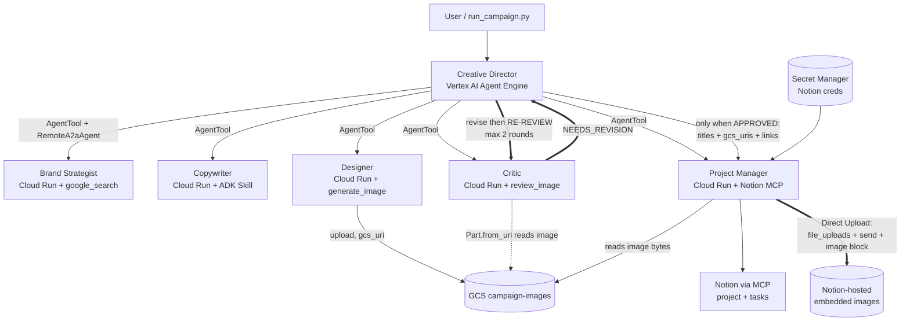

# Requirements

### Overview & Goals

Prepare this repository to be graded against **Multi-Agent Creative Studio — Capstone Grading Rubric** (`Grading Rubric.html`). Three outcomes:

1. A **root `README.md`** documenting setup, local runs, deployment, per-agent verification, and teardown — using this repo's real layout (top level = repo root, agents in `agents/`, deploy scripts in `deploy/`).
2. A **`EVALUATION.md`** self-assessment scoring all 7 rubric criteria with concrete file/command evidence.
3. The **code fixes** that raise the score, applied *before* the final graded run, plus one **live end-to-end campaign run** captured as demo evidence.

### The rubric (extracted from the HTML)

Each criterion scores 25 / 50 / 75 / 100; final = weighted average.

 # | Criterion | Weight |
---|---|---|
 1 | Multi-Agent Orchestration & Workflow | 20% |
 2 | Quality Gate & Revision Loop | 20% |
 3 | A2A Communication & Distributed Architecture | 15% |
 4 | Multimodal Image Generation (Designer) | 15% |
 5 | ADK Skills & MCP Integration | 10% |
 6 | Reliability & Verification | 10% |
 7 | Deployment, Code Quality & Documentation | 10% |

### Scope

**In scope**
- `EVALUATION.md` — per-criterion evidence, honest score, gap list.
- Root `README.md` — setup → credentials/IAM → local (per-agent) → agent-card check → deploy → agent-card re-check → verify → campaign → teardown → demo, mirroring the 16-section codelab flow but with this repo's paths.
- **Per-agent local run instructions** with the codelab's port assignment, e.g. `PORT=8082 uv run agents/brand_strategist/agent.py` from the repo root.
- **Agent-card validation, twice**: locally the card `url` must be `http://localhost:<port>`; after deployment the same check must show the `https://…run.app` service URL.
- **Credentials & IAM setup**: API enablement, ADC, service-account bindings and GCS bucket permissions (Designer writes, everyone else reads; single shared SA ⇒ object admin).
- **`run_campaign.py` CLI**: keep the hard-coded brief as the default, add `--prompt` / `--prompt-file` so campaign flows can be exercised without a GUI.
- **Notion image embedding**: the Project Manager must embed the generated images *into* the Notion project page (Notion-hosted image blocks) with the Designer's human-readable titles — never a bulleted list of raw signed URLs.
- Criterion-2 fix: close the revision loop so revised work is **re-reviewed** before planning.
- Criterion-6 fix: retry/backoff on `agents/critic/image_review_tool.py`.
- Criterion-4/6 fix: Designer instruction must pass the required `aspect_ratio` argument, provide human-readable titles, and implement robust all-or-nothing image generation with error classification (immediate fail on billing/credits/model-not-found; 2 exponential-backoff retries on rate limits/transient errors; no silent partial images).
- Criterion-1/7 cleanup: dead code in `agents/creative_director/agent.py`, `deploy/teardown_gcp.sh` image-bucket flag, env-var naming consistency, `python3` → `uv run python` in script usage docstrings.
- One full deployed campaign run as demo evidence (revision loop firing).

**Out of scope**
- `gradio-ui/` — partially implemented, local-only, not wired to Agent Engine. Explicitly excluded from rubric evidence; the README will mention it only as an experimental extra.
- Any new agent, new rubric criterion, or CI setup.

### Precedence: the rubric is king
The **Grading Rubric is the single authority**. The codelab was only this project's starting point — it is a *reference for commands and terminology*, never a target. Where the two conflict, the rubric wins and the plan says so explicitly:

 Conflict | Codelab says | We do | Why |
---|---|---|---|
 Revision loop | one revision pass, then continue | revise → **re-review** → repeat (cap 2) | criterion 2 (20%) demands "looping until approved" and "only an approved campaign advances to planning" |
 Images bucket at teardown | always deleted | kept by default (`--delete-images` opts in) | criterion 7 wants a demo of a full run — the images *are* the evidence |
 GCS IAM | Designer `objectCreator` only | + bucket read for Critic/orchestrator, + `serviceAccountTokenCreator` | criteria 4 & 6 — the Critic must actually read the image and links must be signed |
 Agent-card check | `curl` the five cards | scripted assertion on the advertised `url`, run twice | criterion 3 "independently reachable and inspectable" + criterion 6 "verified hands-on" |
 Campaign run | fixed brief, optional | CLI brief, used to force a `NEEDS_REVISION` run | criteria 2 & 6 need both verdict types demonstrated |

Anything in the codelab that earns no rubric points (Cloud Shell specifics, `sed` one-liners, the `# TODO` scaffolding narrative) is deliberately **not** carried over.

### Conventions (per your instruction)
- Always `uv run …`, never bare `python`/`python3` — the venv and `uv.lock` live at the repo root.
- Never `python3` in docs or script docstrings; use `python` under `uv run`.
- Source env before gcloud/bash steps: `set -a; source .env; set +a`.

### Functional Requirements

- `README.md` must let a grader go from clone → deployed campaign with **no undocumented step**, and every command must be copy-pasteable from the repo root.
- `EVALUATION.md` must cite a file path, command, or output for every criterion score — no unsupported claims.
- After the fixes, a `NEEDS_REVISION` verdict from the Critic must trigger a revision **and** a re-review, and only an approved (or explicitly cap-exhausted) campaign reaches the Project Manager.
- The teardown script must support keeping the campaign-images bucket (default) or deleting it via an explicit flag — a deliberate deviation from the codelab, which always deletes it.
- Each of the five specialists must be startable individually from the repo root on a documented, non-colliding port (8082–8086, matching the codelab), and its agent card must be fetchable at `/.well-known/agent.json`.
- The agent-card check must be runnable in two modes — **local** (expect `http://localhost:<port>`) and **deployed** (expect the Cloud Run `https://…run.app` URL recorded in `.env`) — and must fail loudly if a deployed card still advertises `localhost`.
- `run_campaign.py` must run unchanged with no arguments (default brief) and accept an arbitrary brief via `--prompt` or `--prompt-file`.
- The README must document every credential and IAM binding required for a *fresh* project, not just the ones the deploy scripts happen to create.
- The Notion project page must present each campaign image as **an embedded image block captioned with the Designer's title**, or — only if embedding fails — as a **titled link**. A bare, expiring signed URL rendered as its own anchor text is never acceptable output.
- The Designer must never silently return a partial set of images or return with a blank part when one or more fail to generate. Image generation must validate response candidate parts (detecting empty parts, blank byte streams, safety blocks, or missing inline data) and follow strict error classification: fatal errors (API billing, quota/credits exhausted, model not found, safety blocks) fail immediately without retrying; transient errors (rate limits 429, timeouts, 500/503/504) retry 2 times with exponential backoff. If any image fails after retries, the Designer must return a clear error rather than continuing with blank parts or missing images.
- Every generated image must carry a human-readable title authored by the Designer, and that title must travel intact Designer → Creative Director → Project Manager → Notion.

# Rubric Assessment

### Criterion-by-criterion findings from the code

#### 1. Multi-Agent Orchestration & Workflow — 20%
**Currently ≈ Good/Excellent.** `agents/creative_director/agent.py` builds one `AgentTool(agent=RemoteA2aAgent(...))` per specialist — the exact agent-as-tool pattern the rubric names. `prompt.py` defines the ordered pipeline (Strategist → Copywriter → Designer → Critic → PM), demands contextual enrichment on every hand-off, and generation limits are configured on the orchestrator (`max_output_tokens=20000`, `temperature=0.2`, `timeout=120_000`), plus `EventsCompactionConfig` for long runs.

*Gaps:* unreachable dead code after `return agent, app` (lines 148–151); the "enforces the Critic's verdict before advancing to planning" clause is not satisfied (see #2).

#### 2. Quality Gate & Revision Loop — 20%  ← biggest scoring risk
**Currently ≈ Satisfactory/Good.** `agents/critic/agent.py` mandates the exact `POSTS REVIEW / VISUALS REVIEW / OVERALL ASSESSMENT` format with 1–10 scores and `APPROVED`/`NEEDS_REVISION`, and requires `review_image` per `gcs_uri` (real multimodal inspection via `Part.from_uri`, not text scoring) — all rubric-Excellent behaviour.

*Gap:* `prompt.py` "REVISION WORKFLOW" step 5 says **"Proceed to Project Manager"** immediately after the revision, and step "Revision Limits" caps at 1 round with *no re-check*. The rubric requires: re-run the specialist **"then re-reviews — looping until approved"**, and **"only an approved campaign advances to planning"**. The loop never closes.

#### 3. A2A Communication & Distributed Architecture — 15%
**Currently ≈ Excellent.** All five specialists expose `to_a2a(root_agent, host=PUBLIC_HOST, port=PUBLIC_PORT, protocol=PROTOCOL)` with a card at `/.well-known/agent.json`; `deploy/deploy_all_specialists.py` sets `PUBLIC_HOST`/`PUBLIC_PORT`/`PROTOCOL=https` per Cloud Run service. The orchestrator reads every URL from env (`COPYWRITER_AGENT_URL`, …) and registers a specialist only if its URL is set — zero hardcoded URLs, no duplicated specialist logic. Needs only *documented evidence* (A2A Inspector / `curl` of each card).

#### 4. Multimodal Image Generation (Designer) — 15%
**Currently ≈ Good.** `agents/designer/image_gen_tool.py` calls `GEMINI_IMAGE_MODEL` directly (not as an agent), injects the aspect ratio into the prompt exactly as the rubric describes, uploads to `GCS_IMAGES_BUCKET`, returns `gcs_uri` (never raw bytes), and also saves an ADK artifact for inline `adk web` rendering.

*Gaps:*
1. `aspect_ratio` is a **required** tool parameter, but `agents/designer/agent.py`'s instruction never mentions it (it only says "Instagram dimensions: 1080x1080 or 1080x1350"). The model must guess the argument → malformed calls / inconsistent aspect handling, which is precisely the rubric's "Good" downgrade wording.
2. Error resilience and partial generation: `agents/designer/agent.py` currently instructs the model: *"If `generate_image` returns an error, include the error message and continue with remaining captions."* This leads to partial visual sets where 1 or 2 images are generated and others are missing.
3. Retry & error classification: `image_gen_tool.py` needs explicit error classification — fatal errors (billing, credits exhausted, model not found) must fail immediately; transient errors (429 rate limits, timeouts, 500/503/504) must retry 2 times with exponential backoff.

#### 5. ADK Skills & MCP Integration — 10%
**Currently ≈ Excellent.** `agents/copywriter/agent.py` uses `load_skill_from_dir(..."skills/instagram-copywriting")` + `SkillToolset`, with `SKILL.md`, `references/caption-formulas.md`, `references/platform-guide.md`, `assets/brand-voice-examples.md` present. `agents/project_manager/agent.py` wires `McpToolset` over stdio `notion-mcp-server` (Node installed in its Dockerfile), degrades gracefully to a text-only timeline when Notion env vars are absent, and `handle_notion_error` is a real `after_tool_callback` that rewrites Notion 400/404s into recovery hints. Needs evidence only.

*Gap (new):* the Notion page body is a weak deliverable. `get_system_instruction()` says only *"add them to the Notion project page body as a bulleted list under a 'Generated Images' heading"*, and the links it receives are **1-hour V4 signed URLs** from `agents/creative_director/get_image_links_tool.py`. The graded artefact is therefore a list of unreadable `storage.googleapis.com/...?X-Goog-Signature=...` anchors that are **already dead** by the time a grader opens the page — the campaign's most visible output looks broken. There is also no human-readable image title anywhere in the chain: `image_gen_tool.py` derives blob names from `concept_name` (`caption1_concept_a-1a2b3c4d.png`).

#### 6. Reliability & Verification — 10%
**Currently ≈ Good.** Every agent passes `GENERATE_CONTENT_CONFIG` with `HttpRetryOptions(attempts=3, exp_base=2, initial_delay=5, [429,500,503,504])`, and `agents/creative_director/retry.py` uses `attempts=5` — satisfying "the orchestrator is given more attempts than the specialists". `brand_strategist/agent.py` is explicitly research-only and injects the current year into search guidance.

*Gaps:* `agents/critic/image_review_tool.py` builds its `GenerateContentConfig` with **no `http_options`/retry/timeout** — the one model call in the system a single 429 can sink. No recorded verification evidence.

#### 7. Deployment, Code Quality & Documentation — 10%  ← largest absolute loss
**Currently ≈ Satisfactory.** Deployment itself is strong: a Dockerfile per specialist, `deploy/deploy_all_specialists.py` pushes all five to Cloud Run and writes the URLs back into `.env` via `deploy/env_utils.py`, `deploy/deploy_orchestrator.py` deploys the Creative Director to Agent Engine and writes `AGENT_ENGINE_ID`/`AGENT_ENGINE_RESOURCE_NAME` back; Notion creds go to **Secret Manager** with IAM grants; models/region/bucket are all env-driven.

*Gaps:* **there is no root `README.md` at all**, and no demo of a full run — the two things this criterion is mostly about. Also `deploy/teardown_gcp.sh` reads `GCP_PROJECT_ID`/`GCP_REGION` while `.env.example` defines `GOOGLE_CLOUD_PROJECT`/`CLOUD_RUN_REGION`, and its bucket loop has a commented-out entry inside a `for … \` line continuation (fragile — becomes a flag).

### Additional gaps found in this pass

**Agent-card `url` correctness (criterion 3).** Every specialist's `__main__` resolves `PUBLIC_HOST` (default `localhost`), `PUBLIC_PORT` (default `PORT`) and `PROTOCOL` (default `http`) and passes them to `to_a2a(...)` — the codelab calls this the "dual configuration pattern" (listen on `HOST:PORT`, advertise `PUBLIC_HOST:PUBLIC_PORT`). So the card's advertised `url` is *only* correct if `deploy_all_specialists.py`'s `--update-env-vars` step succeeded. That step warns and continues on failure (*"Warning: Could not update A2A config"*), in which case the deployed card keeps advertising `http://localhost:8080` and `RemoteA2aAgent` resolution silently breaks. The codelab explicitly warns: *"If that card is wrong — bad URL, missing capabilities — the orchestrator silently fails."* Worth a check, not an assumption.

**Local port collisions.** `brand_strategist` defaults to `PORT=8082` (matching the codelab), but `copywriter`, `designer`, `critic` and `project_manager` **all** default to `8080` — only one can run at a time without an explicit `PORT`. The codelab runs them on 8082–8086 in five terminals; the README must state that mapping.

**Incomplete GCS IAM (criteria 4 & 6).** `deploy/grant_designer_gcs_access()` grants only `roles/storage.objectCreator`, and only to the Designer service — exactly what the codelab does. But this repo goes further than the codelab in two ways that need more permissions:
- `agents/critic/image_review_tool.py` reads the image back via `Part.from_uri(gs://…)` → needs **read**.
- `agents/creative_director/get_image_links_tool.py` signs V4 URLs through the IAM SignBlob API → needs **read** on the bucket *and* `roles/iam.serviceAccountTokenCreator` on the signing SA.
Since all Cloud Run services default to the Compute Engine default SA (the fallback in `grant_designer_gcs_access`, and the value written to `SIGNING_SERVICE_ACCOUNT` by `deploy_orchestrator.py`), a single `roles/storage.objectAdmin` grant covers write+read; with separate SAs the split is Designer=`objectCreator`, others=`objectViewer`.

**`run_campaign.py` is a fixed script, not a tool.** The brief is a module-level string (lines 29–38) and everything runs at import time — no `main()`, no `argparse`, no guard when `AGENT_ENGINE_ID` is unset. The codelab treats it as an optional one-shot; for rubric evidence we need to drive several different briefs (including one that forces `NEEDS_REVISION`) without editing the file.

### Note on the codelab
The GitHub Pages mirror `https://ani-in.github.io/Multi-Agent-Creative-Studio/` is dead — `/`, `/#0` and `/index.html` all return **404** (the `#0` fragment is client-side and never reaches the server, so it cannot change the result). The published codelab is live at **`https://codelabs.developers.google.com/ai-creative-studio-adk-a2a`** and its 16 sections (“1. Overview” … “15. Clean Up”, “16. Summary”) were read for this plan; the parity table is in the **Codelab Parity** tab. Path translation is applied throughout: codelab `~/ai-creative-studio/workshop/starter` → this repo root; agents → `agents/`; `python3` → `uv run`.

# Codelab Parity

### Status of this tab
**Reference only — the rubric outranks everything here.** This tab exists so no *useful* command from our starting point is lost and so every divergence is a conscious decision rather than an oversight. Where a codelab step earns no rubric credit we skip it; where the rubric demands more than the codelab does, we go further.

### Source
**`https://codelabs.developers.google.com/ai-creative-studio-adk-a2a`** — 16 sections. The starter repo behind it is `Saoussen-CH/mas-a2a-gcp` (`workshop/starter`), which is the ancestor of this repository. Everything below is what the codelab actually instructs, translated to this repo.

### Section map and what it contributes to our README

 Codelab section | Key commands (codelab) | Our equivalent |
---|---|---|
 1. Overview | — | README "What this is" + architecture diagram; six agents (orchestrator + 5 specialists) |
 2. Set Up Your Environment | `gcloud config list`; `export PROJECT_ID=$(gcloud config get-value project)`; `export REGION=us-central1`; `gcloud services enable aiplatform apphub run cloudbuild artifactregistry generativelanguage iam cloudresourcemanager storage secretmanager`; `gcloud auth application-default login`; `cp .env.example .env` + `sed` project id; `gcloud storage buckets create gs://${PROJECT_ID}-campaign-images --location=us-central1` | README Prerequisites + Configuration + bucket creation (we add `--uniform-bucket-level-access`) |
 3–8. Build each agent (Strategist → Copywriter → Designer → Critic → PM, incl. Notion MCP setup and retry tuning) | `uv run adk web agents --allow_origins='*'`, per-agent try-out prompts | README "Run locally" → `adk web` section + per-agent smoke prompts, reused as the verification checklist |
 9. A2A servers (dual config) | `PORT=8082 uv run agents/brand_strategist/agent.py` … five terminals, ports **8082–8086** | README per-agent standalone run table |
 10. A2A Inspector | `./setup_inspector.sh`; `cd ~/a2a-inspector && bash scripts/run.sh`; Web Preview port **5001** | README optional inspector section (upstream tool, not vendored here) |
 11. Creative Director locally | `sed` the five `*_AGENT_URL` to `http://localhost:808x` in `.env`, then `uv run adk web agents` | README "point the orchestrator at local specialists" |
 12. Deploy specialists | `uv run deploy/deploy_all_specialists.py`; `source .env` + echo the five URLs; **verify agent cards** at `/.well-known/agent.json`; Designer SA gets `roles/storage.objectCreator`; Notion creds → Secret Manager | README Deploy + our `verify_agent_cards.py` (stronger: asserts the URL flipped away from localhost) |
 13. Deploy orchestrator | `source .env`; `uv run deploy/deploy_orchestrator.py --action deploy` | README Deploy step 2 |
 14. Test the deployed system | Agent Engine **Playground**, then **Traces** (one span per A2A call, inputs/outputs, latency, tokens); optional `uv run run_campaign.py` | README "Run a campaign" + Observability; our `--prompt`/`--prompt-file` extends this |
 15. Clean Up | `bash deploy/teardown_gcp.sh`; verify with `gcloud run services list --region=us-central1` and `gcloud storage buckets list` | README Teardown — with our `--keep-images` default |
 16. Summary | — | `EVALUATION.md` conclusion |

### Deliberate deviations from the codelab (each documented in the README)

0. **Rubric over codelab, always** — every deviation below exists because a rubric criterion asks for more than, or something different from, the codelab.
1. **Paths** — codelab works in `~/ai-creative-studio/workshop/starter`; here the repo root *is* the working directory and agents live in `agents/`. No `cd` prefixes.
2. **`uv run` everywhere** — no `python3`. The codelab already uses `uv run deploy/…`; we normalise the few remaining `python3` mentions in this repo's docstrings.
3. **Teardown keeps the images bucket by default** (`--delete-images` to opt in) — the codelab always deletes it, but the generated images are our demo evidence.
4. **Agent-card verification is a script**, not a prose `curl` list, and it runs in both local and deployed modes with an assertion on the advertised `url`.
5. **Broader IAM** — the codelab grants only the Designer `objectCreator`; we also grant bucket read to the Critic/orchestrator path and `serviceAccountTokenCreator` for signed URLs, because this repo's Critic reads images back and the orchestrator signs links.
6. **`run_campaign.py` takes a brief** — the codelab's fixed script becomes a small CLI.
7. **`gradio-ui/`** — not in the codelab, local-only, explicitly excluded from rubric evidence.

# Technical Design

### Current Implementation

```
.
├── agents/
│   ├── creative_director/   agent.py (AgentTool+RemoteA2aAgent), prompt.py, retry.py,
│   │                        display_image_tool.py, get_image_links_tool.py   → Agent Engine
│   ├── brand_strategist/    agent.py (google_search), Dockerfile             → Cloud Run
│   ├── copywriter/          agent.py (+ skills/instagram-copywriting/), Dockerfile
│   ├── designer/            agent.py, image_gen_tool.py, Dockerfile
│   ├── critic/              agent.py, image_review_tool.py, Dockerfile
│   └── project_manager/     agent.py (Notion MCP), Dockerfile
├── deploy/  deploy_all_specialists.py, deploy_orchestrator.py, env_utils.py, teardown_gcp.sh
├── gradio-ui/               (out of rubric scope)
├── run_campaign.py          deployed end-to-end smoke run
└── .env.example
```

### Key Decisions

1. **Prompt-level re-review loop** (your choice) — close the quality gate inside `agents/creative_director/prompt.py` rather than introducing an ADK `LoopAgent`. Preserves the LLM-driven agent-as-tool delegation that criterion 1 rewards, and keeps the diff to one file.
2. **Separate `EVALUATION.md`** — `README.md` stays a clean operator guide; rubric evidence lives in its own doc the grader can read side-by-side with the rubric.
3. **Fix everything found** (your choice), but the teardown campaign-images bucket becomes an explicit **flag** rather than a commented line — default keeps generated images (they are demo evidence).
4. **Baseline first, then fix** — `EVALUATION.md` records the pre-fix score, then the post-fix score, so the improvement is itself documented.
5. **Agent-card validation as a script, not a prose checklist** — `deploy/verify_agent_cards.py`, so the same command produces both the local and the deployed evidence and a wrong `url` fails loudly instead of being eyeballed.
6. **Broaden the GCS/IAM grants in the deploy script, not only in the README** — the permission model must be reproducible by re-running deployment, with the README documenting the equivalent manual `gcloud` commands.
7. **`run_campaign.py` keeps its current no-argument behaviour** — the existing brief becomes `DEFAULT_CAMPAIGN_BRIEF`, so nothing that already works changes.
8. **Codelab section order is the README's spine** — the operator flow follows the codelab's 16 sections (setup → build/local → A2A → inspect → deploy → verify → test → clean up) so a grader familiar with the codelab can follow it, with our deviations called out inline.

9. **Notion-hosted image embeds via the Direct Upload API, not external URLs** — a new `attach_campaign_images` FunctionTool on the Project Manager downloads each image from GCS and pushes the bytes through Notion's `POST /v1/file_uploads` → `POST /v1/file_uploads/{id}/send` → `PATCH /v1/blocks/{page_id}/children` (`image.file_upload.id`) flow. The image then lives in Notion's own storage, so it never expires with the signed URL. `mode=external_url` (Notion fetches the signed URL itself) is the first fallback and a **titled** link block the last — never a bare URL.
10. **A custom tool alongside the MCP toolset, not instead of it** — Notion project/task writes stay MCP-driven (criterion 5), but the multi-step binary upload is deterministic Python: the MCP server exposes no upload endpoint, and asking the LLM to drive a multipart upload through generic API calls would be fragile.

### Proposed Changes

**`agents/creative_director/prompt.py` — close the loop (criterion 2, 20%)**
- Rewrite "Step 5" of the revision workflow: after a revision, **re-call the `critic` tool** with the revised copy and/or the new `gcs_uri` values plus the previous verdict, and only then decide.
- Replace "Maximum 1 revision round → proceed to PM regardless" with: **up to 2 revision rounds**, each followed by a re-review; advance to PM when `All Approved: YES`, or when the cap is exhausted — in which case the orchestrator must state explicitly that the cap was reached and report the final scores.
- Route by verdict as today (posts → `copywriter`, visuals → `designer`, both → both), and pass the **re-approved** artifacts to the PM.
- Update the two "Complete Workflow Examples" so Example 1 shows revise → re-review → APPROVED → PM (this doubles as the demo script).

**`agents/creative_director/agent.py`**
- Delete the unreachable block after `return agent, app` (dead `App` construction, lines 148–151).

**`agents/critic/image_review_tool.py` (criterion 6)**
- Import the shared `RETRY_CONFIG` from `critic/retry.py` and pass `http_options=types.HttpOptions(retry_options=RETRY_CONFIG, timeout=120_000)` into the tool's `GenerateContentConfig`, alongside the existing `response_schema` / `response_mime_type`.

**`agents/designer/image_gen_tool.py` & `agents/designer/agent.py` (criteria 4 & 6) — aspect ratio, titles, error classification & all-or-nothing generation**
- In `image_gen_tool.py`:
  - Configure transient retries: `types.HttpRetryOptions(attempts=3, exp_base=2, initial_delay=5, http_status_codes=[429, 500, 503, 504])` (giving 2 retries with exponential backoff on rate limits and transient server errors).
  - Add error classification: detect fatal errors (billing disabled/unconfigured, quota/credits exhausted, model not found/404, invalid argument, safety block finish reasons) and return immediate structured error responses without retrying.
  - Guard against blank parts: explicitly check response candidate parts for empty content, missing `inline_data`, zero-length byte buffers (`len(image_bytes) == 0`), or non-IMAGE modalities, and return an explicit error instead of returning a blank part or empty payload.
  - Return clear diagnostic error messages for GCS bucket issues or missing credentials.
- In `agents/designer/agent.py`:
  - Extend the tool-call instruction to require the third argument: `generate_image(concept_name=..., image_prompt=..., aspect_ratio="1:1" | "4:5")`, and tie it to the `Format:` line (1080x1080 → `1:1`, 1080x1350 → `4:5`).
  - Add a mandatory `Title:` line to the per-concept output format — a short, presentation-ready name (e.g. `Post 1 — Sunrise Yoga Flat Lay`), explicitly distinct from the snake_case `concept_name` used for the blob path. This is the string that becomes the Notion caption / link text.
  - **Remove partial failure and blank part masking:** replace "If `generate_image` returns an error, include the error message and continue with remaining captions" with strict all-or-error behavior. If any image generation fails or returns a blank part, the Designer must report an overall image generation failure and never emit blank parts or incomplete visuals.

**`agents/project_manager/notion_image_tool.py` (new) — real embeds in Notion**
```python
def attach_campaign_images(page_id: str, images: list[dict]) -> dict:
    """images: [{"title": "Post 1 - Sunrise Yoga Flat Lay",
                 "gcs_uri": "gs://bucket/campaign-images/....png",
                 "url": "<optional signed https URL>"}]
    Returns {"status": ..., "embedded": n, "linked": n, "failed": [...]}
    """
```
Per image, in strict order of preference:
1. **Embed (preferred)** — download the blob with `google-cloud-storage`, `POST /v1/file_uploads` `{mode: single_part, filename, content_type}`, `POST /v1/file_uploads/{id}/send` (multipart), then one `PATCH /v1/blocks/{page_id}/children` appending a `heading_2` "Generated Images" (once) plus an `image` block per file (`{"type": "file_upload", "file_upload": {"id": ...}}`) whose `caption` rich_text is the Designer's title.
2. **Notion-side fetch** — if the GCS read fails (403/404), `POST /v1/file_uploads` with `{mode: "external_url", external_url: <signed url>, filename}` and poll `GET /v1/file_uploads/{id}` until `status == "uploaded"` before attaching.
3. **Titled link, last resort** — a `paragraph` block whose rich_text is the *title* carrying `link.url`, so the page reads `Post 1 — Sunrise Yoga Flat Lay`, never a raw signature blob. The tool records this so the agent can report it honestly.

Implementation notes: `requests` is already available transitively (via `google-cloud-storage`) — **no new dependency and no Dockerfile change**; `NOTION_TOKEN` read from env exactly as the MCP toolset does; `Notion-Version` from `NOTION_API_VERSION` (default `2022-06-28`); an upload must be attached within **1 hour**, so upload and attach happen inside the same call; bounded retry/backoff on 429/5xx to match criterion 6; one PATCH per call (≤100 blocks); optionally set the first image as the page `cover`.

**`agents/project_manager/agent.py`**
- Register `FunctionTool(func=attach_campaign_images)` alongside `notion_toolset` (Notion-configured branch only).
- Replace the "add them to the Notion project page body as a bulleted list" paragraph with explicit rules: capture the created project page's `id`, then call `attach_campaign_images(page_id=..., images=[...])` **once** with every image; **never** write a signed URL into page text or a bulleted list; report in **Notion Status** how many images were embedded, how many degraded to titled links, and why.

**`agents/creative_director/prompt.py` + `get_image_links_tool.py` — carry titles through**
- STEP 5 hands the Project Manager a structured `Generated Images` block with `title` + `gcs_uri` + signed `url` per image (today: links only), so the PM can embed from GCS and still has a fallback URL.
- `get_image_links(gcs_uris, titles=None)` returns `{"title": ...}` next to `{"concept", "url"}`, keeping the filename-derived concept as the fallback title.
- The final user-facing summary keeps rendering `[Title](url)`, now using the Designer's title rather than `caption1_concept_a`.

**`deploy/teardown_gcp.sh` (criterion 7)**
- Add `--delete-images` / `--keep-images` (default **keep**); build the bucket list conditionally instead of embedding a commented entry inside the `for … \` continuation, and reflect the choice in the pre-confirmation summary.
- Align env resolution with `.env.example`: `GOOGLE_CLOUD_PROJECT` → `GCP_PROJECT_ID` → `PROJECT_ID`, and `CLOUD_RUN_REGION` → `GCP_REGION` → `LOCATION` (same precedence as `deploy/env_utils.py`), including inside the embedded Python heredoc.

**Usage docstrings** in `deploy/deploy_orchestrator.py` (and any other `python3 …` occurrence) → `uv run deploy/deploy_orchestrator.py --action deploy` (the form the codelab uses).

**`run_campaign.py` — parameterised brief**
- Move the current brief into a `DEFAULT_CAMPAIGN_BRIEF` constant and wrap execution in `main()` under `if __name__ == "__main__":`.
- `argparse` options: `--prompt/-p` (inline brief), `--prompt-file/-f` (read from file), `--user-id` (default `workshop-user`), `--session-id` (reuse an existing session), `--quiet` (suppress the session banner).
- Precedence: `--prompt` > `--prompt-file` > `DEFAULT_CAMPAIGN_BRIEF`; error out if both are given.
- Fail fast with an actionable message when `AGENT_ENGINE_ID` / project resolution is missing (today it builds `…/reasoningEngines/None` and fails deep inside the client).

```bash
uv run run_campaign.py                                  # default EcoFlow brief
uv run run_campaign.py --prompt "Create an Instagram campaign for …"
uv run run_campaign.py --prompt-file docs/demo/briefs/revision-trigger.txt
```

**`deploy/verify_agent_cards.py` (new, criterion 3)**
- `--local` mode: probe `http://localhost:<port>/.well-known/agent.json` on the codelab's ports (8082–8086); assert each card's `url` host is `localhost` and the port matches.
- `--deployed` mode (default): read `STRATEGIST_AGENT_URL`, `COPYWRITER_AGENT_URL`, `DESIGNER_AGENT_URL`, `CRITIC_AGENT_URL`, `PM_AGENT_URL` from `.env`; assert each card's `url` is `https://` and **equals the Cloud Run service URL** — failing explicitly when it still says `localhost`, which is the silent failure mode of the warn-only `--update-env-vars` step.
- Print each card's `name`, `description` and skill ids in both modes; exit non-zero on any mismatch so it works as a post-deploy gate.

**`deploy/deploy_all_specialists.py` — complete the GCS/IAM grants**
- Extend `grant_designer_gcs_access` into a bucket-permission pass that runs once after all five services are deployed: collect each service's `spec.template.spec.serviceAccountName` (same Compute Engine default SA fallback as today).
- Grant `roles/storage.objectAdmin` once when all services share one SA; otherwise `objectCreator` for the Designer and `objectViewer` for the rest.
- Also grant the orchestrator/signing SA `roles/storage.objectViewer` on the bucket and `roles/iam.serviceAccountTokenCreator` on itself, as required by the IAM SignBlob path in `get_image_links_tool.py`.
- Keep failures non-fatal but print the exact `gcloud` command to run manually (identical to the README).

### New files

```
README.md                      root operator guide
EVALUATION.md                  rubric self-assessment + evidence
deploy/verify_agent_cards.py   local + deployed agent-card validation
agents/project_manager/notion_image_tool.py   Notion Direct Upload image embedding
docs/demo/                     transcript + screenshots from the graded run
docs/demo/briefs/              reusable briefs for --prompt-file runs
```

### README.md outline

1. **What this is** — 1 orchestrator on Agent Engine + 5 A2A specialists on Cloud Run; architecture diagram; rubric criteria map.
2. **Prerequisites** — `uv`, `gcloud`, Python ≥3.11, a GCP project with billing; `gcloud services enable aiplatform run storage secretmanager artifactregistry`; `gcloud auth application-default login`.
3. **Configuration** — `cp .env.example .env`, table of every variable (incl. the `GOOGLE_CLOUD_LOCATION=global` vs `CLOUD_RUN_REGION` distinction that `deploy/env_utils.py` deliberately keeps separate), which values are auto-populated by the deploy scripts, and creating `GCS_IMAGES_BUCKET`.
4. **Credentials, service accounts & bucket permissions** — the IAM section below.
5. **Run locally** — `set -a; source .env; set +a`, then either `uv run adk web agents` (UI for all agents, `--allow_origins='*'` as in the codelab) **or** each specialist standalone as its own A2A server:

 Agent | Command (from repo root) | Card |
---|---|---|
 Brand Strategist | `PORT=8082 uv run agents/brand_strategist/agent.py` | `http://localhost:8082/.well-known/agent.json` |
 Copywriter | `PORT=8083 uv run agents/copywriter/agent.py` | `…:8083` |
 Designer | `PORT=8084 uv run agents/designer/agent.py` | `…:8084` |
 Critic | `PORT=8085 uv run agents/critic/agent.py` | `…:8085` |
 Project Manager | `PORT=8086 uv run agents/project_manager/agent.py` | `…:8086` |

   Notes to include: ports match the codelab; four of the five default to `8080` in code, so `PORT` is **mandatory** when running more than one; running the file directly works because each agent falls back to `from retry import …` when not imported as a package; `PUBLIC_HOST`/`PUBLIC_PORT`/`PROTOCOL` control what the card advertises (the dual-configuration pattern); point the orchestrator at local specialists by setting `*_AGENT_URL=http://localhost:<port>` in `.env`, then `uv run adk web agents` and pick `creative_director`.
6. **Validate agent cards (local)** — `uv run python deploy/verify_agent_cards.py --local`, the raw `curl http://localhost:8082/.well-known/agent.json` equivalent, and the optional A2A Inspector (upstream `a2a-inspector`, UI on port 5001) with a note on what it shows.
7. **Deploy** — `uv run deploy/deploy_all_specialists.py`, then `uv run deploy/deploy_orchestrator.py --action deploy`, or the one-shot `--auto-deploy-specialists`; note the URLs/IDs written back into `.env` and the `source .env; echo $STRATEGIST_AGENT_URL …` confirmation from the codelab.
8. **Validate agent cards (deployed)** — re-run `uv run python deploy/verify_agent_cards.py` and confirm every card's `url` now points at the `https://…run.app` service, not `localhost`; `gcloud run services list --region=$CLOUD_RUN_REGION` shows five services.
9. **Verify** — the per-agent checklist below.
10. **Run a campaign** — `uv run run_campaign.py` (default brief), `--prompt "…"` / `--prompt-file …` for other flows, plus the Agent Engine **Playground** path and `deploy_orchestrator.py --action test`.
11. **Observability** — telemetry env vars, the Agent Engine **Traces** view (one span per A2A call with inputs/outputs, latency and token usage), Cloud Trace/Logging links, `LoggingPlugin`.
12. **Teardown** — `bash deploy/teardown_gcp.sh`, the new image-bucket flag, and the codelab's verification commands (`gcloud run services list`, `gcloud storage buckets list`).
13. **Notion (optional)** — integration creation, the three env vars, database-ID extraction, Secret Manager wiring, graceful no-Notion fallback, **and how campaign images are embedded**: Direct Upload into Notion storage with the Designer's title as caption, the `external_url` and titled-link fallbacks, the PM service account's bucket-read requirement, and a screenshot of the finished project page.
14. **Troubleshooting** — deployed card still says `localhost`; `403` on GCS write from the Designer; Critic returning `NOT_REVIEWED` from a read denial; unsigned image links from a missing `iam.serviceAccountTokenCreator`; `reasoningEngines/None` from an unset `AGENT_ENGINE_ID`.
15. **Repo layout** + a short note that `gradio-ui/` is an experimental local-only UI, not part of the graded system.

### Credentials & IAM (README section, and enforced by the deploy script)

**Operator (you) — one-time project setup** (codelab's API list, plus `iamcredentials` for signed URLs)
```bash
gcloud auth login
gcloud auth application-default login
gcloud config set project $GOOGLE_CLOUD_PROJECT
gcloud services enable aiplatform.googleapis.com run.googleapis.com \
  cloudbuild.googleapis.com artifactregistry.googleapis.com storage.googleapis.com \
  secretmanager.googleapis.com iam.googleapis.com iamcredentials.googleapis.com \
  cloudresourcemanager.googleapis.com
gcloud storage buckets create gs://$GCS_IMAGES_BUCKET \
  --location=$CLOUD_RUN_REGION --uniform-bucket-level-access
```
Operator roles needed to run the deploy scripts: `roles/run.admin`, `roles/iam.serviceAccountUser`, `roles/storage.admin`, `roles/aiplatform.user`, `roles/artifactregistry.writer`, `roles/secretmanager.admin`.

**Runtime service accounts.** All five Cloud Run services and the Agent Engine deployment run as the project's Compute Engine default SA — `${PROJECT_NUMBER}-compute@developer.gserviceaccount.com` (the fallback in `grant_designer_gcs_access`, and the value written to `SIGNING_SERVICE_ACCOUNT` by `deploy_orchestrator.py`).

 Principal | Needs | Why |
---|---|---|
 Designer SA | `roles/storage.objectCreator` on the bucket | `image_gen_tool.py` uploads the generated PNG (the only grant the codelab makes) |
 Critic SA | `roles/storage.objectViewer` on the bucket | `image_review_tool.py` reads it back via `Part.from_uri` |
 Orchestrator / Agent Engine SA | `roles/storage.objectViewer` on the bucket | `get_image_links_tool.py` resolves blobs before signing |
 Signing SA (`SIGNING_SERVICE_ACCOUNT`) | `roles/iam.serviceAccountTokenCreator` **on itself** | V4 signed URLs via IAM SignBlob (no private key) |
 Project Manager SA | `roles/secretmanager.secretAccessor` on the 3 Notion secrets | already granted by `grant_pm_secret_access` |
 All agents | `roles/aiplatform.user` | Gemini text + image calls |

**Shared-SA shortcut** (the default in this repo) — one object-admin grant instead of the split above:
```bash
SA=$(gcloud projects describe $GOOGLE_CLOUD_PROJECT --format='value(projectNumber)')-compute@developer.gserviceaccount.com
gcloud storage buckets add-iam-policy-binding gs://$GCS_IMAGES_BUCKET \
  --member=serviceAccount:$SA --role=roles/storage.objectAdmin
gcloud iam service-accounts add-iam-policy-binding $SA \
  --member=serviceAccount:$SA --role=roles/iam.serviceAccountTokenCreator
gcloud projects add-iam-policy-binding $GOOGLE_CLOUD_PROJECT \
  --member=serviceAccount:$SA --role=roles/aiplatform.user
```
When running **locally** with user ADC there is no `service_account_email` on the credentials, so signed URLs need `SIGNING_SERVICE_ACCOUNT` set in `.env` **and** `roles/iam.serviceAccountTokenCreator` for *your* user on that SA — otherwise `get_image_links` falls back to unsigned `storage.googleapis.com` links that only work on a public bucket. Documented explicitly, since `.env.example` already hints at it.

### Verification checklist (README + EVALUATION evidence)

 Target | Command / check | Rubric |
---|---|---|
 Agent cards (local) | `uv run python deploy/verify_agent_cards.py --local` → five cards reachable, `url` = `http://localhost:<8082–8086>` | 3 |
 Agent cards (deployed) | `uv run python deploy/verify_agent_cards.py` → every `url` is the `https://…run.app` service URL, none `localhost`; A2A Inspector | 3 |
 Bucket IAM | Designer write succeeds, Critic read succeeds, `get_image_links` returns `"signed": true` | 4, 6 |
 Campaign CLI | `uv run run_campaign.py --prompt "…"` overrides the default brief; the no-arg run still uses it | 1, 7 |
 Cloud Run services | `gcloud run services list --region=$CLOUD_RUN_REGION` → 5 services | 3, 7 |
 Strategist | all four sections present, current-year searches, no copy written | 1, 6 |
 Copywriter | 3 captions matching the Skill's formulas/format | 5 |
 Designer | `gcloud storage ls gs://$GCS_IMAGES_BUCKET/campaign-images/` → real images; `gcs_uri` returned | 4 |
 Critic | both verdict types reproduced; `review_image` invoked per image | 2 |
 Revision loop | fires ≥1 round **and re-reviews** before PM | 2 |
 PM | timeline always returned; Notion project + tasks created when configured | 5 |
 Notion images | project page shows **embedded** images (Notion-hosted `file_upload`) captioned with the Designer's titles; page contains **no** raw `X-Goog-Signature` anchor; images still render after the 1-hour signed-URL expiry | 4, 5 |
 Orchestrator | `uv run run_campaign.py` → all five sections + image links | 1 |
 Traces | Agent Engine Traces shows one span per A2A specialist call | 1, 6 |
 Teardown | `gcloud run services list` empty; images kept unless `--delete-images` | 7 |

### Architecture Diagram



### Risks

- **Prompt-level loop is model-dependent.** Mitigation: explicit numbered re-review step, a hard round cap, and a mandatory closing statement of the final verdict — then prove it in the live run and paste the transcript into `docs/demo/`.
- **Live run costs money and can hit 429s.** Mitigation: retries already tuned (orchestrator 5, specialists 3, image gen 5×30s) and the new retry on `review_image`; keep the run to a single brief.
- **A deliberately low-quality brief may be needed** to force `NEEDS_REVISION` for the demo; note it as such in the demo doc so it does not read as a real quality failure.
- **Rubric wording says "all six agents"** (orchestrator + 5 specialists) — the README diagram and `EVALUATION.md` will count them explicitly to avoid a grader thinking one is missing.

- **Notion file uploads are a newer API surface.** Mitigation: the three-tier fallback (bytes upload → `external_url` import → titled link) means the page is never left with a bare signed URL, and the tool reports which tier it used so `EVALUATION.md` can state it honestly; `Notion-Version` is env-overridable if the workspace requires a different version.
- **The Project Manager service account has no bucket read today.** Mitigation: the IAM pass grants it `objectViewer` (or the shared-SA `objectAdmin`); without it the tool silently drops to the `external_url` tier — so the checklist asserts `embedded > 0`, not merely "images appeared".
- **A Notion file upload expires if not attached within an hour.** Mitigation: upload and `PATCH` happen inside one tool call; no cross-turn state.

# Score Improvements

### Highest-value moves, in order (do these *before* the graded run)

**1. Write the root `README.md` — criterion 7 (10%)**
The single largest guaranteed gain. Criterion 7 explicitly requires "a clear README covers setup, local and deployed runs, verification, and teardown" plus "a short demo of a full campaign run". Today there is no root README at all, which reads as Satisfactory/Needs-Improvement despite genuinely strong deployment machinery. Writing it plus capturing one demo run moves this criterion to Excellent.

**2. Close the revision loop — criterion 2 (20%)**
The rubric's Excellent wording is unambiguous: re-run the specialist "**then re-reviews — looping until approved**", and "**only an approved campaign advances to planning**". `prompt.py` currently goes straight to the PM after one revision. Everything else in this criterion (exact verdict format, `review_image` per image, real multimodal inspection) is already Excellent — this one prompt change is the difference between ~75 and ~100 on the joint-heaviest criterion.

**3. Retry-wrap `image_review_tool` — criterion 6 (10%)**
It is the only Gemini call in the repo without `HttpRetryOptions`, and criterion 6 opens with "Model and tool calls are wrapped with automatic retries and backoff". A one-line fix that also removes a genuine flake source during the graded run.

**4. Make the Designer pass `aspect_ratio` — criterion 4 (15%)**
`aspect_ratio` is a required parameter of `generate_image` that the Designer's instruction never mentions. The rubric's Good tier is literally "inconsistent aspect-ratio handling"; naming the argument in the instruction removes the downgrade.

**5. Capture verification evidence — criterion 6 (10%)**
Criterion 6 demands each agent be "verified hands-on (Strategist sections present, Designer images landing in the bucket, Critic returning both verdict types, the revision loop firing at least once)". Run the checklist and paste outputs into `EVALUATION.md`; unverified-but-working scores as Good, not Excellent.

**6. Demonstrate A2A inspectability — criterion 3 (15%)**
The wiring is already Excellent; it just needs proof. `curl` each of the five `/.well-known/agent.json` endpoints and note the A2A Inspector step in the README.

**7. Prove the deployed agent cards are correct — criterion 3 (15%)**
The rubric's Excellent tier requires each service to be "independently reachable and inspectable", and the codelab itself warns that a wrong card makes the orchestrator *silently* fail. `deploy_all_specialists.py`'s A2A-config update only warns on failure, so a deployed card can still advertise `http://localhost:8080`. Running `verify_agent_cards.py` in both modes turns this from an assumption into evidence — and catches the failure before the graded run.

**8. Close the GCS permission gaps — criteria 4 & 6 (25% combined)**
Only the Designer is granted bucket access today, and only `objectCreator`. The Critic's multimodal read and the orchestrator's signed-URL generation both degrade silently (`NOT_REVIEWED` treated as approved; unsigned links) — which reads to a grader as a broken quality gate and broken image delivery rather than as a permissions issue. Fixing the grants protects two heavyweight criteria.

**9. Make `run_campaign.py` accept a brief — criteria 1, 2 & 7**
The cheapest way to produce the evidence the rubric asks for: one brief that passes cleanly, one deliberately weak brief that forces `NEEDS_REVISION` and exercises the re-review loop — without editing the script between runs.

**10. Make the Notion page presentable — criteria 5 & 7**
The Notion project page is the most likely artefact a grader actually opens, and today it ends in a bulleted list of 1-hour signed URLs that are dead on arrival. Embedding the images with the Designer's titles turns the MCP integration from "it wrote some rows" into a finished, self-evident deliverable — and it also protects criterion 4, since a grader who cannot see the images has no proof the Designer produced any.

**11. Housekeeping — criteria 1 & 7**
Remove the dead code after `return agent, app` in `creative_director/agent.py`, align `teardown_gcp.sh` env names with `.env.example`, replace the commented-out bucket line with the `--delete-images` flag, and normalise `python3` → `uv run python` in usage docstrings. Small weight, but "code is modular and organized" and "deployment works end-to-end" are graded by eye.

### Cheap wins worth including while writing the docs
- State in the README exactly where each rubric criterion is implemented (file + line-level pointer) — makes the grader's job trivial and reduces the chance of a criterion being missed.
- Show the orchestrator's tuned generation limits (`max_output_tokens`, `temperature`, 120s timeout, `EventsCompactionConfig`) in the README — criterion 1 asks for "generation limits and timeouts configured on the orchestrator" and it is easy to overlook in code.
- Call out the retry tiering (orchestrator 5 attempts vs specialists 3) explicitly — criterion 6 asks for exactly that asymmetry.
- Note the graceful degradation paths (no Notion → text timeline; no `gcs_uri` → `NOT_REVIEWED` treated as approved; no Notion upload → titled link) as deliberate design, not gaps.
- Include one screenshot of the finished Notion project page with the embedded, captioned images — it is the single clearest piece of evidence for criteria 4 and 5 at once.

### Explicitly not attempted
- Wiring `gradio-ui/` to the remote Agent Engine — out of scope per your instruction; it will be labelled experimental so a grader does not mistake it for a broken deliverable.

# Delivery Steps

### ✓ Step 1: Baseline rubric self-assessment in EVALUATION.md
`EVALUATION.md` exists at the repo root with all 7 rubric criteria scored against current code, each score backed by a file path or command.

- Create `EVALUATION.md` with the criteria table (Orchestration 20%, Quality Gate 20%, A2A 15%, Image Gen 15%, Skills/MCP 10%, Reliability 10%, Deployment/Docs 10%) and the 25/50/75/100 scale.
- For each criterion, record the **pre-fix** score with concrete evidence: `AgentTool(RemoteA2aAgent)` construction in `agents/creative_director/agent.py`, verdict format in `agents/critic/agent.py`, `to_a2a` + agent cards per specialist, `image_gen_tool.py` GCS upload returning `gcs_uri`, `load_skill_from_dir` in `agents/copywriter/agent.py`, `McpToolset` + `handle_notion_error` in `agents/project_manager/agent.py`, retry tiering (`creative_director/retry.py` attempts=5 vs specialists attempts=3).
- List the identified gaps per criterion: no root README, revision loop never re-reviews, `image_review_tool.py` missing retry options, Designer instruction omitting `aspect_ratio`, no human-readable image titles, the Notion page receiving a bulleted list of expiring signed URLs instead of embedded images, dead code in `creative_director/agent.py`, teardown env-var mismatch.
- Add an "Evidence" placeholder section per criterion to be filled from the live verification run in the final stage.
- Open with a short "how this document is scored" note stating that the **rubric is the sole authority** and the codelab (`codelabs.developers.google.com/ai-creative-studio-adk-a2a`) is only the project's starting point, listing the deliberate divergences and the rubric criterion that justifies each.

### ✓ Step 2: Parameterise run_campaign.py with a CLI brief
`uv run run_campaign.py` still runs the existing brief unchanged, and any brief can be supplied via `--prompt` or `--prompt-file`.

- Move the current module-level brief string in `run_campaign.py` into a `DEFAULT_CAMPAIGN_BRIEF` constant so no-argument behaviour is identical to today.
- Wrap session creation and the `stream_query` loop in a `main()` function guarded by `if __name__ == "__main__":`, replacing the current import-time execution.
- Add `argparse` options: `--prompt/-p`, `--prompt-file/-f`, `--user-id` (default `workshop-user`), `--session-id`, `--quiet`; error if both `--prompt` and `--prompt-file` are supplied.
- Resolve the brief as `--prompt` > `--prompt-file` > `DEFAULT_CAMPAIGN_BRIEF`, and fail fast with an actionable message when `AGENT_ENGINE_ID` or the project/location cannot be resolved (today it silently builds `…/reasoningEngines/None`).
- Update the module docstring usage line to `uv run run_campaign.py [--prompt … | --prompt-file …]`.
- Create `docs/demo/briefs/` with two reusable briefs: a clean one and a deliberately weak one intended to trigger `NEEDS_REVISION`.

### ✓ Step 3: Agent-card validation, complete IAM/bucket permissions, and deploy/teardown cleanup
One command proves all five agent cards advertise the correct `url` in both modes, every runtime principal has exactly the bucket access its tools need, and teardown keeps the generated images by default.

- Create `deploy/verify_agent_cards.py` with `--local` and `--deployed` (default) modes, fetching `/.well-known/agent.json` for all five specialists.
- `--local`: probe the codelab's ports (brand_strategist 8082, copywriter 8083, designer 8084, critic 8085, project_manager 8086) and assert each card's `url` host is `localhost` with the matching port.
- `--deployed`: read `STRATEGIST_AGENT_URL`, `COPYWRITER_AGENT_URL`, `DESIGNER_AGENT_URL`, `CRITIC_AGENT_URL`, `PM_AGENT_URL` from `.env` and assert each card's `url` equals that `https://…run.app` service URL — failing explicitly when it still says `localhost`, the silent failure mode of the warn-only `--update-env-vars` step in `deploy_all_specialists.py`.
- Print each card's `name`, `description` and skill ids, and exit non-zero on any mismatch so the script doubles as a post-deploy gate.
- Note in the help text that `PUBLIC_HOST`/`PUBLIC_PORT`/`PROTOCOL` are what `to_a2a(...)` bakes into the card and that the deploy script sets them per Cloud Run service.

**Permissions and script cleanup (same step):**

- Extend the `grant_designer_gcs_access` step in `deploy/deploy_all_specialists.py` into a bucket-permission pass that runs after all five services are deployed, collecting each service's `spec.template.spec.serviceAccountName` (keeping the Compute Engine default SA fallback).
- Grant `roles/storage.objectAdmin` once when all services share a single SA; otherwise `roles/storage.objectCreator` for the Designer and `roles/storage.objectViewer` for the Critic, Copywriter, Strategist and Project Manager — the Project Manager's read is now load-bearing, since it downloads image bytes to upload them into Notion.
- Grant the signing/orchestrator SA `roles/storage.objectViewer` on `GCS_IMAGES_BUCKET` and `roles/iam.serviceAccountTokenCreator` on itself, as required by the IAM SignBlob path in `agents/creative_director/get_image_links_tool.py`.
- Keep failures non-fatal but print the exact `gcloud` command to run manually, matching the README verbatim.
- Document in the README the operator roles and API enablement (codelab list plus `iamcredentials`), bucket creation with uniform bucket-level access, the per-principal permission table, the shared-SA shortcut, and the local-ADC caveat that signed URLs need `SIGNING_SERVICE_ACCOUNT` plus token-creator on your own user.
- Add `--delete-images` / `--keep-images` (default **keep**) to `deploy/teardown_gcp.sh`, building the bucket list conditionally instead of leaving a commented-out entry inside the `for … \` line continuation, and reflect the choice in the pre-confirmation summary — the images are rubric evidence, so the codelab's always-delete behaviour is deliberately overridden.
- Align teardown env resolution with `.env.example` and `deploy/env_utils.py`: `GOOGLE_CLOUD_PROJECT` → `GCP_PROJECT_ID` → `PROJECT_ID`, and `CLOUD_RUN_REGION` → `GCP_REGION` → `LOCATION`, including inside the embedded Python heredoc that deletes the Agent Engine.
- Replace `python3 …` invocations in the usage docstrings and printed hints of `deploy/deploy_orchestrator.py` (and any other occurrence) with `uv run deploy/deploy_orchestrator.py …`.

### ✓ Step 4: Author the root README.md
A grader can go from clone to a deployed campaign run using only `README.md`, with every command in `uv run` form and `.env` sourced where needed.

- Create `README.md` covering, in order: what the system is (orchestrator on Agent Engine + 5 A2A specialists on Cloud Run) with a Mermaid architecture diagram; prerequisites (`uv`, `gcloud`, Python ≥3.11, `gcloud services enable aiplatform run storage secretmanager artifactregistry`, `gcloud auth application-default login`).
- Document configuration: `cp .env.example .env`, a table of every variable, the deliberate `GOOGLE_CLOUD_LOCATION=global` vs `CLOUD_RUN_REGION` split, which values the deploy scripts auto-populate, and creating `GCS_IMAGES_BUCKET`.
- Document local runs after `set -a; source .env; set +a`: `uv run adk web agents` for the UI, plus a table of standalone A2A servers per specialist with explicit ports (`PORT=8082 uv run agents/brand_strategist/agent.py`, 8083 copywriter, 8084 designer, 8085 critic, 8086 project_manager), noting that four default to 8080 so `PORT` is mandatory, how `PUBLIC_HOST`/`PUBLIC_PORT`/`PROTOCOL` shape the card, and how to point the orchestrator at them via `*_AGENT_URL=http://localhost:<port>`.
- Insert the two agent-card validation steps in order: `verify_agent_cards.py --local` before deploying, and `verify_agent_cards.py` after deploying to confirm the `url` switched from `localhost` to the `https://…run.app` service URL; mention the optional A2A Inspector on port 5001.
- Document deployment (`uv run deploy/deploy_all_specialists.py`, then `uv run deploy/deploy_orchestrator.py --action deploy`, plus the `--auto-deploy-specialists` one-shot) and link the credentials/IAM section produced in the previous stage.
- Document the campaign run (`uv run run_campaign.py`, `--prompt`, `--prompt-file`, the Agent Engine Playground, `--action test`), observability (telemetry env vars, `LoggingPlugin`, the Traces view with one span per A2A call), and teardown (`bash deploy/teardown_gcp.sh` plus the codelab's `gcloud run services list` / `gcloud storage buckets list` checks).
- Add a troubleshooting section: deployed card still advertising `localhost`, `403` on Designer upload, Critic returning `NOT_REVIEWED` from a read denial, unsigned image links from a missing `iam.serviceAccountTokenCreator`, and `reasoningEngines/None` from an unset `AGENT_ENGINE_ID`.
- Cross-reference the codelab (`https://codelabs.developers.google.com/ai-creative-studio-adk-a2a`) and list the deliberate deviations: repo-root paths instead of `~/ai-creative-studio/workshop/starter`, `uv run` instead of `python3`, teardown keeping the images bucket by default, and the broader IAM grants.
- Add the optional Notion/MCP section (three env vars, Secret Manager wiring, text-only fallback, how campaign images are embedded into the project page, and the PM's bucket-read requirement), the repo layout, and a note that `gradio-ui/` is an experimental local-only UI outside the graded system.
- Add a rubric-to-code map section pointing each criterion at its implementing file, and surface the orchestrator's generation limits and retry tiering explicitly.

### ✓ Step 5: Close the quality gate re-review loop and harden the model calls
A `NEEDS_REVISION` verdict now triggers a revision followed by a re-review, only approved work reaches the Project Manager, every Gemini call is retry-wrapped, and the Designer enforces all-or-nothing image generation with strict error classification.

- Rewrite the "REVISION WORKFLOW" section of `agents/creative_director/prompt.py` so step 5 re-calls the `critic` tool with the revised copy and/or new `gcs_uri` values plus the previous verdict, instead of proceeding straight to the Project Manager.
- Replace the "Maximum 1 revision round → proceed to PM regardless" rule with up to 2 revision rounds, each followed by a re-review; advance on `All Approved: YES`, or on cap exhaustion with an explicit statement of the cap and final scores.
- Keep the existing verdict routing (posts → `copywriter`, visuals → `designer`, both → both) and require the re-approved artifacts to be the ones handed to the Project Manager.
- Update the two "Complete Workflow Examples" so Example 1 shows revise → re-review → APPROVED → PM, giving the demo run a script to follow.
- Remove the unreachable dead code after `return agent, app` in `agents/creative_director/agent.py`.
- In `agents/critic/image_review_tool.py`, import `RETRY_CONFIG` from `agents/critic/retry.py` and add `http_options=types.HttpOptions(retry_options=RETRY_CONFIG, timeout=120_000)` to the tool's `GenerateContentConfig`, keeping the existing `response_schema` and `response_mime_type`.
- In `agents/designer/image_gen_tool.py`, configure `HttpRetryOptions` for 2 retries with exponential backoff on transient errors (429, 500, 503, 504), classify fatal errors (billing, credits exhausted, model not found, safety blocks) to fail immediately, and strictly validate candidate parts to prevent returning empty bytes or blank parts.
- In `agents/designer/agent.py`, extend the instruction to require the full call signature `generate_image(concept_name=..., image_prompt=..., aspect_ratio="1:1"|"4:5")` and map it to the `Format:` line (1080x1080 → `1:1`, 1080x1350 → `4:5`).
- Add the mandatory `Title:` line to the Designer's per-concept output format (short, presentation-ready, distinct from the snake_case `concept_name`) and require it to be repeated next to each `gcs_uri`.
- Remove partial-image and blank-part masking from `agents/designer/agent.py` system instruction so that if any image fails to generate or produces a blank part, the Designer reports an overall error rather than emitting blank or incomplete visuals.
- Verify locally with `uv run adk web agents` that the Designer emits a well-formed three-argument tool call plus a `Title:` per concept, properly errors out on fatal/exhausted failures, and that the Critic still returns the exact `POSTS REVIEW / VISUALS REVIEW / OVERALL ASSESSMENT` block.

### ✓ Step 6: Embed the campaign images into the Notion project page
The Notion project page shows the generated images as real, Notion-hosted embeds captioned with the Designer's titles — with no raw signed URL anywhere on the page.

- Create `agents/project_manager/notion_image_tool.py` exposing `attach_campaign_images(page_id, images)`, where each image is `{"title", "gcs_uri", "url"}`.
- Implement the preferred path: download the blob with `google-cloud-storage`, then `POST /v1/file_uploads` (`mode=single_part`, filename, content type) → `POST /v1/file_uploads/{id}/send` (multipart) → a single `PATCH /v1/blocks/{page_id}/children` appending a `heading_2` "Generated Images" plus one `image` block per upload (`image.file_upload.id`) whose `caption` is the Designer's title; optionally set the first image as the page cover.
- Implement the two fallbacks in order: `mode=external_url` with the signed URL (polling `GET /v1/file_uploads/{id}` until `status == "uploaded"`), then a `paragraph` block whose rich_text is the **title** carrying `link.url` — never a bare URL as anchor text.
- Return counts (`embedded`, `linked`, `failed`), add bounded retry/backoff on 429/5xx, read `NOTION_TOKEN` from env and the API version from `NOTION_API_VERSION` (default `2022-06-28`), and upload plus attach within the same call because uploads expire after an hour; no new dependency (`requests` ships with `google-cloud-storage`).
- Register the tool as a `FunctionTool` next to `notion_toolset` in `agents/project_manager/agent.py` (Notion-configured branch only) and rewrite the image paragraph of `get_system_instruction()`: capture the new project page `id`, call `attach_campaign_images` exactly once with all images, never paste signed URLs into page text, and report embedded/linked counts under **Notion Status**.
- Extend `agents/creative_director/get_image_links_tool.py` to accept optional `titles` and return them alongside `concept`/`url`, and update STEP 5 of `agents/creative_director/prompt.py` to hand the Project Manager a structured `Generated Images` list of `title` + `gcs_uri` + `url` (and to render `[Title](url)` in the final summary).
- Verify locally with `uv run adk web agents` against a scratch Notion database: images appear inline with captions and `embedded` equals the number of images passed.

### ✓ Step 7: Run the graded end-to-end campaign and record evidence
One full deployed campaign run is captured as demo evidence, and `EVALUATION.md` carries post-fix scores backed by real output.

- Redeploy the affected services and the orchestrator (`uv run deploy/deploy_all_specialists.py`, `uv run deploy/deploy_orchestrator.py --action deploy`) after sourcing `.env`.
- Walk the verification checklist: `uv run python deploy/verify_agent_cards.py` (all five cards on their deployed `https` URLs), `gcloud run services list --region=$CLOUD_RUN_REGION`, per-agent try-outs for Strategist sections, Copywriter's 3 Skill-formatted captions, `gcloud storage ls gs://$GCS_IMAGES_BUCKET/campaign-images/`, both Critic verdict types, and the PM timeline plus Notion sync.
- Run `uv run run_campaign.py` once with the default brief, then once with `--prompt-file docs/demo/briefs/revision-trigger.txt` crafted to trigger at least one `NEEDS_REVISION`, and confirm the revision is **re-reviewed** before the Project Manager is called.
- Confirm `get_image_links` reports `"signed": true` and that at least one returned URL opens in a browser, proving the bucket/IAM grants; capture the Agent Engine Traces view showing one span per A2A call.
- Confirm the Notion project page renders **embedded** images with the Designer's titles as captions (the tool reports `embedded` = image count, `linked` = 0), and re-open the page after the signed URLs have expired to prove the embeds are Notion-hosted.
- Save the transcript and screenshots (generated images, the Notion page with embedded captioned images, revision-loop excerpt, traces) under `docs/demo/` and link them from `README.md`.
- Fill the Evidence sections of `EVALUATION.md`, record the post-fix score per criterion alongside the baseline, and note any criterion still short of Excellent with the reason.