# Requirements

### Overview & Goals
The project's deployment scripts have expanded beyond the original 5 specialist agents (`brand-strategist`, `copywriter`, `designer`, `critic`, `project-manager`) to include:
- Backend API gateway service: `broker` (`deploy/deploy_broker.py`)
- Async campaign execution worker: `campaign-driver` (`deploy/deploy_campaign_driver.py`)
- Optional UI service: `creative-director-ui` (`deploy/deploy_gradio.py`)
- Cloud Tasks queues: `campaigns` (`deploy/deploy_campaign_driver.py`) and `image-generation` (`deploy/deploy_all_specialists.py`)
- Dedicated service accounts: `broker-sa`, `campaign-driver-sa`, `campaign-tasks-invoker`, `image-gen-tasks-invoker`
- Vertex AI Agent Engine (Reasoning Engine) identified by `AGENT_ENGINE_RESOURCE_NAME` or `AGENT_ENGINE_ID`

The objective is to update `deploy/teardown_gcp.sh` so it completely and cleanly tears down all provisioned resources to prevent orphaned cloud resources, avoid ongoing GCP billing, and maintain clean project hygiene, while strictly maintaining the **skip by default** policy for the campaign images GCS bucket (`gs://${GCS_IMAGES_BUCKET}`) to safeguard generated campaign assets and evaluation evidence.

### Scope
#### In Scope
- Synchronizing `deploy/teardown_gcp.sh` to tear down:
  - All 8 Cloud Run services (`brand-strategist`, `copywriter`, `designer`, `critic`, `project-manager`, `broker`, `campaign-driver`, `creative-director-ui`).
  - Cloud Tasks queues (`campaigns` and `image-generation`).
  - Dedicated service accounts (`broker-sa`, `campaign-driver-sa`, `campaign-tasks-invoker`, `image-gen-tasks-invoker`).
  - Staging and source GCS buckets (`gs://${PROJECT_ID}-agent-staging`, `gs://run-sources-${PROJECT_ID}-${REGION}`).
  - Secret Manager secrets (`notion-token`, `notion-project-db-id`, `notion-tasks-db-id`).
  - Artifact Registry repository (`cloud-run-source-deploy`).
  - Vertex AI Agent Engine (supporting both `AGENT_ENGINE_RESOURCE_NAME` and `AGENT_ENGINE_ID`).
- Enforcing skip-by-default for the campaign images bucket, with `--delete-images` as an explicit opt-in flag and `--keep-images` as an explicit confirmation flag.
- Adding non-interactive confirmation support (`--yes` / `-y` / `--force`) for automated scripting and CI/CD teardown.
- Updating documentation in `README.md` to match the enhanced teardown capabilities.

#### Out of Scope
- Modifying deployment logic or runtime behavior of specialist agents, broker, or campaign driver.
- Deleting GCP project-level configurations, billing accounts, or enabling/disabling core Google Cloud APIs.
- Deleting the Firebase project or Firestore native database instance (which contains project-wide shared state).

### User Stories
- As a developer or evaluator, I want `deploy/teardown_gcp.sh` to remove all deployed microservices, queues, and service accounts so that no unused resources remain running and incurring charges.
- As an evaluator reviewing campaign outputs, I want my generated campaign images in GCS to be safely preserved by default during teardown so that evidence and demo assets are not accidentally wiped.
- As a developer wanting a complete reset, I want to optionally pass `--delete-images` to wipe all campaign storage when performing a full clean slate.

### Functional Requirements
1. **CLI Flag Handling**:
   - `deploy/teardown_gcp.sh` (default): skips deletion of `gs://${IMAGES_BUCKET}`.
   - `deploy/teardown_gcp.sh --keep-images`: explicitly preserves `gs://${IMAGES_BUCKET}`.
   - `deploy/teardown_gcp.sh --delete-images`: includes `gs://${IMAGES_BUCKET}` in the bucket deletion list.
   - `deploy/teardown_gcp.sh -y` / `--yes` / `--force`: skips the interactive confirmation prompt (`Continue? (yes/no):`).
2. **Environment Variable Robustness**:
   - Resolve `PROJECT_ID` from `GOOGLE_CLOUD_PROJECT`, `GCP_PROJECT_ID`, `PROJECT_ID`, or active `gcloud config get-value project`.
   - Resolve `REGION` from `CLOUD_RUN_REGION`, `GCP_REGION`, `LOCATION`, `REGION`, or default to `us-central1`.
   - Resolve `TASKS_LOCATION` from `CAMPAIGN_TASKS_LOCATION`, `GCP_TASKS_LOCATION`, or fallback to `$REGION`.
   - Resolve `IMAGES_BUCKET` from `GCS_IMAGES_BUCKET` or fallback to `${PROJECT_ID}-campaign-images`.
   - Resolve `AGENT_ENGINE` from `AGENT_ENGINE_RESOURCE_NAME` or construct `projects/${PROJECT_ID}/locations/${REGION}/reasoningEngines/${AGENT_ENGINE_ID}` if `AGENT_ENGINE_ID` is present.
3. **Idempotent Resource Deletion**:
   - Every deletion command checks for resource existence or uses flags to prevent aborting on non-existent resources.
   - Provide clear checkmark (`✓ Deleted`) or notice (`Not found, skipping`) for each target resource.
4. **Summary & Verification Output**:
   - Output an upfront preview of all items queued for deletion vs preserved items.
   - Output a closing summary with verification commands (`gcloud run services list`, `gcloud tasks queues list`, `gcloud storage buckets list`).

### Non-Functional Requirements
- **Safety**: Safe default prevents permanent data loss of generated images.
- **Idempotence**: Running the script multiple times consecutively succeeds without failure.
- **Portability**: Compatible with standard Bash environments (macOS, Linux, Git Bash / WSL on Windows).

# Technical Design

### Current Implementation
`deploy/teardown_gcp.sh` currently only handles:
- 5 Cloud Run services: `brand-strategist`, `copywriter`, `designer`, `critic`, `project-manager` (lines 120-132).
- Vertex AI Agent Engine via inline Python (lines 137-164).
- Artifact Registry: `cloud-run-source-deploy` (lines 169-179).
- GCS Buckets: `gs://${PROJECT_ID}-agent-staging` and `gs://run-sources-${PROJECT_ID}-${REGION}`, with conditional images bucket (lines 88-98, 184-191).
- Notion Secrets: `notion-token`, `notion-project-db-id`, `notion-tasks-db-id` (lines 196-203).

Missing resources that are deployed by current deploy scripts:
- `broker` service (created in `deploy/deploy_broker.py`)
- `campaign-driver` service (created in `deploy/deploy_campaign_driver.py`)
- `creative-director-ui` service (created in `deploy/deploy_gradio.py`)
- Cloud Tasks queue `campaigns` (created in `deploy/deploy_campaign_driver.py`)
- Cloud Tasks queue `image-generation` (created in `deploy/deploy_all_specialists.py`)
- Service accounts: `broker-sa`, `campaign-driver-sa`, `campaign-tasks-invoker`, `image-gen-tasks-invoker`

### Key Decisions
1. **GCS Bucket Skip-by-Default Policy**:
   - *Decision*: Maintain `DELETE_IMAGES=false` by default. Only delete the campaign images bucket when `--delete-images` is explicitly supplied.
   - *Rationale*: Campaign images represent valuable evaluation artifacts and evidence of agent execution. Deleting them by default risks catastrophic asset loss.
2. **Service Account Deletion**:
   - *Decision*: Include dedicated service accounts (`broker-sa`, `campaign-driver-sa`, `campaign-tasks-invoker`, `image-gen-tasks-invoker`) in the teardown script, checking existence before deleting.
   - *Rationale*: Leaves the GCP project in a clean, reproducible state without leftover IAM principals.
3. **Cloud Tasks Queue Cleanup**:
   - *Decision*: Delete `campaigns` and `image-generation` queues in their designated locations (`$TASKS_LOCATION`).
   - *Rationale*: Ensures background queues do not linger with stale rate-limit or retry settings.
4. **Agent Engine Identifier Resolution**:
   - *Decision*: Check both `AGENT_ENGINE_RESOURCE_NAME` and `AGENT_ENGINE_ID` from `.env`. If `AGENT_ENGINE_ID` is present without the full path prefix, construct `projects/${PROJECT_ID}/locations/${LOCATION}/reasoningEngines/${AGENT_ENGINE_ID}`.
   - *Rationale*: Different deployment paths record either the short ID or the fully qualified resource name into `.env`.

### Architecture Diagram

```mermaid
graph TD
    subgraph TeardownScript["deploy/teardown_gcp.sh"]
        Args["Parse Flags: --delete-images, --keep-images, -y"] --> EnvLoad["Load .env & Resolve Variables"]
        EnvLoad --> Preview["Display Resource Teardown Preview"]
        Preview --> Confirm{"Interactive or -y?"}
        Confirm -->|Yes| DelCR["1. Delete Cloud Run Services (8 Services)"]
        DelCR --> DelCT["2. Delete Cloud Tasks Queues (2 Queues)"]
        DelCT --> DelSA["3. Delete Dedicated SAs (4 SAs)"]
        DelSA --> DelAE["4. Delete Agent Engine (Reasoning Engine)"]
        DelAE --> DelAR["5. Delete Artifact Registry Repository"]
        DelAR --> DelGCS["6. Delete GCS Buckets (Staging + Conditionally Images)"]
        DelGCS --> DelSec["7. Delete Notion Secrets"]
        DelSec --> Done["Output Summary & Verification Commands"]
    end
```

### Proposed Changes
#### 1. `deploy/teardown_gcp.sh`
- Extend `SERVICES` array: `brand-strategist copywriter designer critic project-manager broker campaign-driver creative-director-ui`.
- Add Cloud Tasks queue deletion block for `${IMAGE_GEN_TASKS_QUEUE:-image-generation}` and `${CAMPAIGN_TASKS_QUEUE:-campaigns}` using `gcloud tasks queues delete --location="$TASKS_LOCATION" --quiet`.
- Add Service Account deletion block for `broker-sa`, `campaign-driver-sa`, `campaign-tasks-invoker`, and `image-gen-tasks-invoker` using `gcloud iam service-accounts delete "${SA}@${PROJECT_ID}.iam.gserviceaccount.com" --quiet`.
- Enhance Agent Engine deletion script block to accept either resource name or ID.
- Preserve bucket list logic with strict default exclusion of `gs://${IMAGES_BUCKET}`.

#### 2. `README.md`
- Update Section 13 (Teardown & Clean Up) to document all resources managed by `deploy/teardown_gcp.sh` and list the available flags.

### File Structure
- `deploy/teardown_gcp.sh` (modified)
- `README.md` (modified)

### Risks
- **Risk**: Deleting GCS images bucket accidentally.
  - *Mitigation*: Hardcode default `DELETE_IMAGES=false`, clearly mark images bucket status in green in the confirmation preview, and require `--delete-images` flag for deletion.
- **Risk**: Cloud Tasks queues failing to delete if created in a non-standard region.
  - *Mitigation*: Fall back from `CAMPAIGN_TASKS_LOCATION` / `GCP_TASKS_LOCATION` to `CLOUD_RUN_REGION` and `us-central1`.
- **Risk**: Script exit if a resource is already deleted.
  - *Mitigation*: Check resource existence via `describe` or suppress non-zero exit codes during deletion checks before proceeding.

# Testing

### Validation Approach
Verification of the updated teardown script will be performed through static syntax checking, dry-run argument verification, and simulated execution checks.

### Key Scenarios
1. **Default Execution (Preserve Images Bucket)**:
   - Run `bash deploy/teardown_gcp.sh` with a test/dry environment.
   - Verify that the summary explicitly lists `preserving gs://${IMAGES_BUCKET}`.
   - Verify that all 8 Cloud Run services, 2 Cloud Tasks queues, 4 Service Accounts, staging buckets, secrets, and Agent Engine are included in the teardown list.
2. **Explicit Delete Images Execution**:
   - Run `bash deploy/teardown_gcp.sh --delete-images`.
   - Verify that `gs://${IMAGES_BUCKET}` is included in the bucket deletion list.
3. **Non-interactive / Confirmation Skip**:
   - Run `bash deploy/teardown_gcp.sh --help` or `--yes` (in dry-run environment) and confirm it bypasses the interactive read prompt.
4. **Idempotence & Missing Resource Handling**:
   - Run teardown against a clean or partially deleted project.
   - Verify that not-found resources print `Not found, skipping: <resource>` and the script finishes successfully with return code `0`.

### Edge Cases
- `.env` file absent or missing some variable names: falls back gracefully to `GOOGLE_CLOUD_PROJECT` / `GCP_PROJECT_ID` and standard defaults.
- Windows newline / line endings (`CRLF` vs `LF`): ensure shell script uses standard Unix line endings.
- Service accounts with custom naming or missing permissions: handled safely with warning rather than halting execution.

# Delivery Steps

### ✓ Step 1: Enhance argument parsing, environment resolution, and pre-flight summary
The teardown script accepts comprehensive configuration, robust environment variable resolution, and user confirmation flags while preserving the campaign images bucket by default.

- Update argument parsing in `deploy/teardown_gcp.sh` to support `--keep-images` (default), `--delete-images`, and non-interactive `--yes` / `-y` / `--force` flags.
- Normalize environment variable detection across `.env` conventions (`GOOGLE_CLOUD_PROJECT` / `GCP_PROJECT_ID` / `PROJECT_ID`, `CLOUD_RUN_REGION` / `GCP_REGION` / `LOCATION`, `CAMPAIGN_TASKS_LOCATION` / `GCP_TASKS_LOCATION`, and `GCS_IMAGES_BUCKET`).
- Update pre-flight resource inspection and summary printing to display all Cloud Run services, Cloud Tasks queues, dedicated service accounts, GCS buckets (with explicit preservation message for the images bucket), Secret Manager secrets, and Agent Engine instance.

### ✓ Step 2: Implement Cloud Run, Cloud Tasks, and Service Account teardown
All Cloud Run services, Cloud Tasks queues, and dedicated service accounts provisioned by the deploy scripts are idempotently torn down.

- Add Cloud Run deletion loop covering all services: `brand-strategist`, `copywriter`, `designer`, `critic`, `project-manager`, `broker`, `campaign-driver`, and `creative-director-ui`.
- Add Cloud Tasks queue deletion for `image-generation` and `campaigns` queues across their respective task locations.
- Add deletion / cleanup checks for dedicated service accounts: `broker-sa`, `campaign-driver-sa`, `campaign-tasks-invoker`, and `image-gen-tasks-invoker`.
- Ensure each deletion step checks resource existence beforehand or gracefully handles 404/not-found without aborting the script.

### ✓ Step 3: Synchronize Agent Engine, GCS bucket safety rules, secrets, and documentation
Vertex AI Agent Engine, Artifact Registry, staging/image GCS buckets, and Secret Manager secrets are cleanly removed according to user flags.

- Update Vertex AI Agent Engine deletion logic in `deploy/teardown_gcp.sh` to handle both `AGENT_ENGINE_RESOURCE_NAME` and `AGENT_ENGINE_ID` format resolution with fallback error handling.
- Verify Artifact Registry repository `cloud-run-source-deploy` deletion logic.
- Execute GCS bucket cleanup for `gs://${PROJECT_ID}-agent-staging` and `gs://run-sources-${PROJECT_ID}-${REGION}`, strictly preserving `gs://${IMAGES_BUCKET}` unless `--delete-images` was explicitly passed.
- Delete Notion secrets (`notion-token`, `notion-project-db-id`, `notion-tasks-db-id`) if present.
- Update `README.md` teardown section to accurately reflect all cleaned resources and usage instructions.