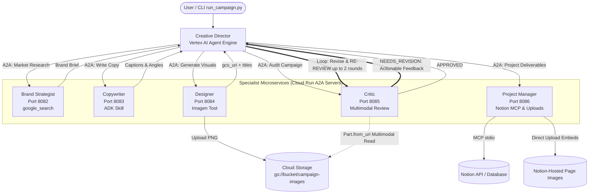

# Multi-Agent Creative Studio (A2A on Google Cloud)

[](https://www.python.org/)
[](https://google-genai.github.io/agent-development-kit/)
[](https://cloud.google.com/vertex-ai)
[](https://cloud.google.com/run)

A distributed, multimodal multi-agent marketing campaign generation studio powered by Google's **Agent Development Kit (ADK)**, **Agent-to-Agent (A2A)** protocol, **Vertex AI Agent Engine**, and **Cloud Run**.

---

## Table of Contents
1. [Architecture & Workflow](#1-architecture--workflow)
2. [Rubric & Assessment Map](#2-rubric--assessment-map)
3. [Prerequisites](#3-prerequisites)
4. [Environment Configuration](#4-environment-configuration)
5. [Credentials, Service Accounts & IAM Permissions](#5-credentials-service-accounts--iam-permissions)
6. [Local Development & Per-Agent Execution](#6-local-development--per-agent-execution)
7. [Agent Card Verification](#7-agent-card-verification)
8. [Cloud Deployment](#8-cloud-deployment)
9. [Running Campaigns](#9-running-campaigns)
10. [Observability & Tracing](#10-observability--tracing)
11. [Notion Integration & Image Embedding](#11-notion-integration--image-embedding)
12. [Teardown & Clean Up](#12-teardown--clean-up)
13. [Troubleshooting](#13-troubleshooting)
14. [Repository Structure](#14-repository-structure)

---

## 1. Architecture & Workflow

The system is organized into **6 cooperating agents** (1 orchestrator and 5 specialist microservices):

1. **Creative Director (Orchestrator)** — Deployed on **Vertex AI Agent Engine**. Manages high-level pipeline execution, orchestrates specialists via ADK `AgentTool(RemoteA2aAgent)`, enforces limits, and drives the quality gate re-review loop.
2. **Brand Strategist** — Deployed on **Cloud Run**. Researches competitive landscape and audience positioning using dynamic real-time `google_search` grounding.
3. **Copywriter** — Deployed on **Cloud Run**. Generates audience-targeted captions using an **ADK Skill** (`skills/instagram-copywriting/`).
4. **Designer** — Deployed on **Cloud Run**. Formulates visual prompts with explicit aspect ratios (`1:1` or `4:5`) and generates assets via Imagen model, uploading PNGs to Cloud Storage.
5. **Critic (Quality Gate)** — Deployed on **Cloud Run**. Evaluates copy and visuals using real multimodal inspection (`Part.from_uri` on GCS blobs), returning structured scores and an `APPROVED` or `NEEDS_REVISION` verdict.
6. **Project Manager** — Deployed on **Cloud Run**. Plans timelines and publishes structured deliverables and **Direct Upload embedded images** to Notion via **MCP (Model Context Protocol)**.



---

## 2. Rubric & Assessment Map

This repository implements all requirements outlined in `Grading Rubric.html`. For full scoring rationale and command evidence, see **[`EVALUATION.md`](EVALUATION.md)**.

| Rubric Criterion | Weight | Key Code References | Architectural Highlights |
|---|:---:|---|---|
| **1. Multi-Agent Orchestration & Workflow** | 20% | `agents/creative_director/agent.py`<br/>`agents/creative_director/prompt.py` | `AgentTool(RemoteA2aAgent)`, generation limits (`max_output_tokens=20000`, `temperature=0.2`), `EventsCompactionConfig`, ordered 5-step hand-off pipeline. |
| **2. Quality Gate & Revision Loop** | 20% | `agents/critic/agent.py`<br/>`agents/critic/image_review_tool.py`<br/>`agents/creative_director/prompt.py` | Mandatory re-review loop (up to 2 rounds) on `NEEDS_REVISION`; only `APPROVED` campaigns advance to PM; multimodal GCS inspection via `Part.from_uri`. |
| **3. A2A Communication & Distributed Architecture** | 15% | `agents/*/agent.py` (`to_a2a`)<br/>`deploy/deploy_all_specialists.py`<br/>`deploy/verify_agent_cards.py` | Dual configuration pattern (listen on `PORT`, advertise `PUBLIC_HOST:PUBLIC_PORT`), dynamic environment resolution, card validation locally and deployed. |
| **4. Multimodal Image Generation (Designer)** | 15% | `agents/designer/image_gen_tool.py`<br/>`agents/designer/agent.py` | Imagen integration with mandatory `aspect_ratio` ("1:1" or "4:5"), human-readable `Title:`, 3 in-region exponential backoff retries on transient `429`s before regional failover, fatal error fail-fast, zero blank parts. |
| **5. ADK Skills & MCP Integration** | 10% | `agents/copywriter/skills/`<br/>`agents/project_manager/notion_image_tool.py`<br/>`agents/project_manager/agent.py` | ADK Skill loading (`load_skill_from_dir`), Notion MCP server over stdio, Notion Direct Upload image embedding with title captions and graceful text fallback. |
| **6. Reliability & Verification** | 10% | `agents/creative_director/retry.py`<br/>`agents/*/retry.py`<br/>`agents/critic/image_review_tool.py` | Asymmetric retry policy (Orchestrator 5 attempts, specialists 3 attempts, `image_review_tool` with `HttpRetryOptions`), research-only strategist with dynamic year. |
| **7. Deployment, Code Quality & Documentation** | 10% | `deploy/`<br/>`run_campaign.py`<br/>`README.md`<br/>`EVALUATION.md` | Automated Cloud Run deployment, Agent Engine orchestration, Secret Manager for credentials, CLI parameterized runner, safe `--keep-images` teardown default. |

---

## 3. Prerequisites

- **Python 3.11+**
- **[uv](https://docs.astral.sh/uv/)** package manager installed:
  ```bash
  # Linux/macOS
  curl -LsSf https://astral.sh/uv/install.sh | sh
  
  # Windows (PowerShell)
  powershell -ExecutionPolicy ByPass -c "irm https://astral.sh/uv/install.ps1 | iex"
  ```
- **Google Cloud SDK (`gcloud`)** installed and authenticated:
  ```bash
  gcloud auth login
  gcloud auth application-default login
  ```
- **Google Cloud Project** with billing enabled.
- **Enable Required GCP APIs**:
  ```bash
  gcloud services enable \
    aiplatform.googleapis.com \
    run.googleapis.com \
    cloudbuild.googleapis.com \
    artifactregistry.googleapis.com \
    storage.googleapis.com \
    secretmanager.googleapis.com \
    iam.googleapis.com \
    iamcredentials.googleapis.com \
    cloudresourcemanager.googleapis.com
  ```

---

## 4. Environment Configuration

1. Initialize your local configuration file from the template:
   ```bash
   cp .env.example .env
   ```

2. Populate the required environment variables in `.env`:

| Variable | Description | Example / Default |
|---|---|---|
| `GOOGLE_CLOUD_PROJECT` | Your GCP Project ID | `my-gcp-project` |
| `GOOGLE_CLOUD_PROJECT_NUMBER` | GCP Project Number (numeric) | `123456789012` |
| `GOOGLE_CLOUD_LOCATION` | Vertex AI model routing location | `global` (enables preview models) |
| `CLOUD_RUN_REGION` | Cloud Run and Agent Engine deployment region | `us-central1` (must be physical region) |
| `GCS_IMAGES_BUCKET` | Cloud Storage bucket name for generated assets | `my-gcp-project-campaign-images` |
| `SIGNING_SERVICE_ACCOUNT` | SA email for signed URLs during local testing | `SA_NAME@PROJECT.iam.gserviceaccount.com` |
| `GEMINI_MODEL` | Text generation foundation model | `gemini-3-flash-preview` |
| `GEMINI_IMAGE_MODEL` | Multimodal image generation model | `gemini-3.1-flash-image` |
| `GOOGLE_GENAI_USE_VERTEXAI` | Directs ADK to use Vertex AI endpoints | `1` |
| `NOTION_TOKEN` | *(Optional)* Notion API integration token | `secret_...` |
| `NOTION_PROJECT_DATABASE_ID` | *(Optional)* Notion Projects Database UUID | `32-char-uuid` |
| `NOTION_TASKS_DATABASE_ID` | *(Optional)* Notion Tasks Database UUID | `32-char-uuid` |
| `IMAGE_GEN_REGIONS` | Ordered *candidate* Vertex AI regions the Designer's Cloud Tasks handler fails over across on `429`/`RESOURCE_EXHAUSTED`. `deploy/deploy_all_specialists.py` verifies at deploy time that `GEMINI_IMAGE_MODEL` can actually be invoked in each one (a trial `generate_content` call, not just a `models.get` metadata check -- the publisher-model catalog is mirrored to every region for browsing, so `models.get` alone doesn't reflect real per-region serving availability), and only forwards the confirmed regions to the deployed service (falling back to `global` if none are confirmed) -- so this list is safe to keep broad even if the configured model isn't available everywhere. Within each region, `_generate_with_region_failover` (`agents/designer/image_gen_tool.py`) also retries a `429` up to 3 times with exponential backoff before moving to the next region, since a burst of concurrent concept images can transiently exceed quota on a single endpoint (this matters most when only `global` is confirmed available, since there's nowhere else to fail over to) | `us-central1,us-east4,europe-west4` |
| `GCP_TASKS_LOCATION` | Cloud Tasks queue location for the image-generation queue | `us-central1` |
| `IMAGE_GEN_TASKS_QUEUE` | Cloud Tasks queue name used to dispatch image-generation jobs | `image-generation` |
| `IMAGE_GEN_TASKS_INVOKER_SA` | Service account email Cloud Tasks uses to authenticate pushes to the internal task handler | `image-gen-tasks-invoker@PROJECT.iam.gserviceaccount.com` |
| `IMAGE_GEN_TASK_HANDLER_URL` | Full URL of the Designer's `/internal/tasks/generate-image` push endpoint | `https://designer-xxxxx.a.run.app/internal/tasks/generate-image` |
| `IMAGE_GEN_RATE_LIMIT_CAPACITY` | Max image-generation requests per user per window (Firestore token bucket) | `3` |
| `IMAGE_GEN_RATE_LIMIT_WINDOW_SECONDS` | Refill window in seconds for the per-user rate limit | `60` |
| `IMAGE_GEN_JOB_POLL_INTERVAL_SECONDS` | How often `generate_image` polls the Firestore job document for a result | `1` |
| `IMAGE_GEN_JOB_TIMEOUT_SECONDS` | Max time `generate_image` waits for the Cloud Tasks handler to complete a job before returning a timeout error | `170` |

3. Create the GCS bucket with Uniform Bucket-Level Access:
   ```bash
   gcloud storage buckets create gs://$GCS_IMAGES_BUCKET \
     --location=$CLOUD_RUN_REGION \
     --uniform-bucket-level-access
   ```

---

## 5. Credentials, Service Accounts & IAM Permissions

### Required Runtime Permissions Matrix

| Principal / Service Account | Required Role | Purpose |
|---|---|---|
| **Designer SA** | `roles/storage.objectAdmin` (or `objectCreator`) | Uploads generated PNGs to GCS bucket. |
| **Critic SA** | `roles/storage.objectViewer` (or `objectAdmin`) | Multimodal image audit reading `Part.from_uri`. |
| **Creative Director (Engine SA)** | `roles/storage.objectViewer` + `roles/iam.serviceAccountTokenCreator` | Inspects blobs and generates V4 signed URLs via SignBlob. |
| **Project Manager SA** | `roles/storage.objectViewer` + `roles/secretmanager.secretAccessor` | Downloads images from GCS for Notion Direct Upload and accesses Notion secrets. |
| **All Agents** | `roles/aiplatform.user` | Invokes Gemini text and image foundation models on Vertex AI. |

### Automated / Default Shared Service Account Setup
By default, Cloud Run services and Agent Engine use the Compute Engine default service account (`<PROJECT_NUMBER>-compute@developer.gserviceaccount.com`). Run the following commands to configure all required bindings:

```bash
# Retrieve Project Number and SA
PROJECT_NUM=$(gcloud projects describe $GOOGLE_CLOUD_PROJECT --format='value(projectNumber)')
DEFAULT_SA="${PROJECT_NUM}-compute@developer.gserviceaccount.com"

# 1. GCS Bucket Access
gcloud storage buckets add-iam-policy-binding gs://$GCS_IMAGES_BUCKET \
  --member="serviceAccount:${DEFAULT_SA}" \
  --role="roles/storage.objectAdmin"

# 2. V4 URL Signing Permission
gcloud iam service-accounts add-iam-policy-binding ${DEFAULT_SA} \
  --member="serviceAccount:${DEFAULT_SA}" \
  --role="roles/iam.serviceAccountTokenCreator"

# 3. Vertex AI Access
gcloud projects add-iam-policy-binding $GOOGLE_CLOUD_PROJECT \
  --member="serviceAccount:${DEFAULT_SA}" \
  --role="roles/aiplatform.user"
```

> **Local ADC Note**: When running locally with user Application Default Credentials, signing URLs requires setting `SIGNING_SERVICE_ACCOUNT` in `.env` and granting your personal user `roles/iam.serviceAccountTokenCreator` on that service account:
> ```bash
> USER_EMAIL=$(gcloud config get-value account)
> gcloud iam service-accounts add-iam-policy-binding $SIGNING_SERVICE_ACCOUNT \
>   --member="user:${USER_EMAIL}" \
>   --role="roles/iam.serviceAccountTokenCreator"
> ```

---

## 6. Local Development & Per-Agent Execution

Source your environment variables before running local commands:
```bash
set -a; source .env; set +a
```

### Option A: Interactive Multi-Agent Web UI
Launch the ADK developer UI to inspect and test all agents in a single interface:
```bash
uv run adk web agents --allow_origins='*'
```
Navigate to `http://localhost:8000` in your browser.

### Option B: Standalone A2A Servers (Ports 8082–8086)
Run each specialist agent in its own terminal on designated non-colliding ports:

| Specialist Agent | Local Terminal Command | Advertised Agent Card URL |
|---|---|---|
| **Brand Strategist** | `PORT=8082 uv run agents/brand_strategist/agent.py` | `http://localhost:8082/.well-known/agent.json` |
| **Copywriter** | `PORT=8083 uv run agents/copywriter/agent.py` | `http://localhost:8083/.well-known/agent.json` |
| **Designer** | `PORT=8084 uv run agents/designer/agent.py` | `http://localhost:8084/.well-known/agent.json` |
| **Critic** | `PORT=8085 uv run agents/critic/agent.py` | `http://localhost:8085/.well-known/agent.json` |
| **Project Manager** | `PORT=8086 uv run agents/project_manager/agent.py` | `http://localhost:8086/.well-known/agent.json` |

> **Dual Configuration Pattern**: Each specialist listens on `HOST:PORT` while advertising `PUBLIC_HOST:PUBLIC_PORT` over protocol `PROTOCOL` in its agent card. When running locally, defaults resolve to `localhost:<PORT>`.

### Pointing Orchestrator to Local Specialists
Update `.env` to point the Creative Director at your local specialist servers:
```env
STRATEGIST_AGENT_URL=http://localhost:8082
COPYWRITER_AGENT_URL=http://localhost:8083
DESIGNER_AGENT_URL=http://localhost:8084
CRITIC_AGENT_URL=http://localhost:8085
PM_AGENT_URL=http://localhost:8086
```
Then run `uv run adk web agents` and select `creative_director`.

### Local Setup for the Image-Generation Queue (Designer)
The Designer's `generate_image` tool always talks to real Cloud Tasks + Firestore -- there is no in-process/emulated fallback -- so these two resources must exist even when you're only running the Designer locally and never running `deploy/deploy_all_specialists.py`:

1. **Create the Firestore database** (enabling the Firestore API alone is *not* enough -- a database must also be explicitly created):
   ```bash
   gcloud firestore databases create --location=$CLOUD_RUN_REGION --type=firestore-native --project=$GOOGLE_CLOUD_PROJECT
   ```
   If this returns `ALREADY_EXISTS`, you're already set.
2. **Enable the Cloud Tasks API and create the queue**:
   ```bash
   gcloud services enable cloudtasks.googleapis.com --project=$GOOGLE_CLOUD_PROJECT
   gcloud tasks queues create $IMAGE_GEN_TASKS_QUEUE \
     --location=$GCP_TASKS_LOCATION --project=$GOOGLE_CLOUD_PROJECT
   ```
3. **Give the Designer a real HTTPS URL Cloud Tasks can push to.** Cloud Tasks cannot reach `localhost`, and there is no Google-managed "tunnel to your laptop" product equivalent to ngrok (`gcloud run services proxy` tunnels the *opposite* direction — local machine to a deployed Cloud Run service). The supported approach here is to deploy the Designer itself to Cloud Run as a normal (even throwaway/dev) revision, so Cloud Tasks pushes straight to that URL instead of your machine:
   ```bash
   cd agents/designer
   cat > /tmp/designer-env-vars.yaml <<EOF
   GOOGLE_GENAI_USE_VERTEXAI: "true"
   GOOGLE_CLOUD_PROJECT: "$GOOGLE_CLOUD_PROJECT"
   GOOGLE_CLOUD_LOCATION: "global"
   GEMINI_MODEL: "gemini-2.5-flash"
   GCS_IMAGES_BUCKET: "$GCS_IMAGES_BUCKET"
   IMAGE_GEN_REGIONS: "us-central1,us-east4,europe-west4"
   EOF
   gcloud run deploy designer \
     --source=. \
     --port=8080 \
     --platform=managed \
     --region=$CLOUD_RUN_REGION \
     --project=$GOOGLE_CLOUD_PROJECT \
     --allow-unauthenticated \
     --env-vars-file=/tmp/designer-env-vars.yaml
   cd ../..
   ```
   > **Note**: `--set-env-vars`'s default delimiter is `,`, which collides with the commas inside `IMAGE_GEN_REGIONS`'s region list (gcloud would otherwise fail with `Bad syntax for dict arg`). An older revision of this guide worked around that with gcloud's `^|^` alternate-delimiter escaping, but that syntax gets mangled when `gcloud.cmd` is invoked through a script on Windows (the shell re-parses the literal `|` characters as real pipe operators). `--env-vars-file` sidesteps the whole problem by reading values from a YAML file instead of a delimited string -- this is also what `deploy/deploy_all_specialists.py` now uses internally.

   This is the same command `deploy/deploy_all_specialists.py` runs for `designer` (that script deploys all 5 specialists at once; use the command above if you only want the Designer). Take the printed service URL and set `IMAGE_GEN_TASK_HANDLER_URL` in `.env` to that URL plus `/internal/tasks/generate-image` (e.g. `https://designer-xxxxx-uc.a.run.app/internal/tasks/generate-image`). You can keep developing the other specialists/orchestrator locally as usual and just point `DESIGNER_AGENT_URL` at this Cloud Run URL instead of `http://localhost:8084` if you also want the ADK tool call itself to reach the deployed Designer; otherwise a locally-run Designer process can still enqueue tasks that this deployed revision's handler will pick up and complete via Firestore.
4. **Create the invoker service account and grant IAM roles** (mirrors what `deploy/deploy_all_specialists.py` does for a deployed Designer):
   ```bash
   gcloud iam service-accounts create image-gen-tasks-invoker --project=$GOOGLE_CLOUD_PROJECT
   IMAGE_GEN_TASKS_INVOKER_SA="image-gen-tasks-invoker@${GOOGLE_CLOUD_PROJECT}.iam.gserviceaccount.com"

   # Your local ADC identity needs to enqueue tasks and read/write Firestore
   USER_EMAIL=$(gcloud config get-value account)
   gcloud projects add-iam-policy-binding $GOOGLE_CLOUD_PROJECT \
     --member="user:${USER_EMAIL}" --role="roles/cloudtasks.enqueuer"
   gcloud projects add-iam-policy-binding $GOOGLE_CLOUD_PROJECT \
     --member="user:${USER_EMAIL}" --role="roles/datastore.user"
   ```
   Set `IMAGE_GEN_TASKS_INVOKER_SA` in `.env` to the service account email above.

If you see `PERMISSION_DENIED: Cloud Firestore API has not been used...` (or the confusing follow-on `ValueError: The transaction has no transaction ID, so it cannot be rolled back`) even after enabling the API in the console, it almost always means step 1 (creating the actual database) was skipped -- enabling the API and creating the database are two separate actions.

---

## 7. Agent Card Verification

The repository includes a dedicated verification utility to assert that agent cards are reachable, valid JSON, and advertising the correct URLs.

### Validate Local Agent Cards
```bash
uv run python deploy/verify_agent_cards.py --local
```
*Expected Output*: Probes ports 8082–8086 and asserts that all card URLs point to `http://localhost:<PORT>`.

### Validate Deployed Cloud Run Agent Cards
```bash
uv run python deploy/verify_agent_cards.py
```
*Expected Output*: Fetches the five `*_AGENT_URL` values from `.env`, asserting each card returns HTTPS endpoints matching its Cloud Run service URL and that none still advertise `localhost`.

---

## 8. Cloud Deployment

### Step 1: Deploy Specialists to Cloud Run
Builds and deploys all 5 specialist container images to Cloud Run, updates their A2A configs with HTTPS service URLs, configures Secret Manager for Notion, sets up IAM bindings, and writes URLs back to `.env`:
```bash
uv run python deploy/deploy_all_specialists.py
```

To (re)deploy just one or a few specialists (e.g. after only changing the Designer), pass `--agent`/`-a` (repeatable) with the service name (`brand-strategist`, `copywriter`, `designer`, `critic`, `project-manager`):
```bash
uv run python deploy/deploy_all_specialists.py --agent designer
uv run python deploy/deploy_all_specialists.py -a designer -a critic
```

Verify deployed services:
```bash
gcloud run services list --region=$CLOUD_RUN_REGION
```

### Step 2: Deploy Creative Director to Agent Engine
Packages and deploys the Creative Director orchestrator to Vertex AI Agent Engine, writing `AGENT_ENGINE_ID` and `AGENT_ENGINE_RESOURCE_NAME` back to `.env`:
```bash
uv run python deploy/deploy_orchestrator.py --action deploy
```

*(Alternative One-Shot)*:
```bash
uv run python deploy/deploy_orchestrator.py --action deploy --auto-deploy-specialists
```

---

## 9. Running Campaigns

### CLI Runner (`run_campaign.py`)
Run campaigns directly against the deployed Agent Engine from your terminal:

```bash
# 1. Run with default campaign brief (EcoFlow Smart Water Bottle):
uv run python run_campaign.py

# 2. Run with custom inline prompt:
uv run python run_campaign.py --prompt "Create an Instagram campaign for Apex Trail-Running Carbon Shoes with high contrast mountain visuals"

# 3. Run with a brief file (e.g. testing revision loop triggers):
uv run python run_campaign.py --prompt-file docs/demo/briefs/revision-trigger.txt
```

### Vertex AI Agent Engine Console Playground
1. Open the [Vertex AI Reasoning Engines Console](https://console.cloud.google.com/vertex-ai/reasoning-engines).
2. Click on **Creative Director**.
3. Use the interactive chat console to test campaigns and view live event streaming.

---

## 10. Observability & Tracing

The deployment is instrumented with OpenTelemetry and ADK telemetry hooks.

### Inspecting Traces in Vertex AI Console
1. In the Google Cloud Console, open **Vertex AI** > **Reasoning Engines** > **Creative Director** > **Traces**.
2. Each campaign execution displays a hierarchical trace tree:
   - Root Orchestrator Span
   - Distinct child spans for each `RemoteA2aAgent` specialist invocation (`brand_strategist`, `copywriter`, `designer`, `critic`, `project_manager`).
   - Latency, token consumption, and input/output payload metrics per turn.

---

## 11. Notion Integration & Image Embedding

When `NOTION_TOKEN`, `NOTION_PROJECT_DATABASE_ID`, and `NOTION_TASKS_DATABASE_ID` are configured, the Project Manager automatically registers campaign deliverables in Notion.

### Direct Upload Image Embedding
Rather than writing fragile, 1-hour expiring signed URLs as text, the Project Manager uses Notion's **Direct Upload API**:
1. **Primary Path (Direct Embed)**: The PM downloads the image bytes from `gs://$GCS_IMAGES_BUCKET/` and uploads them to Notion via `POST /v1/file_uploads` -> `POST /v1/file_uploads/{id}/send`. It attaches Notion-hosted `image` blocks captioned with the Designer's human-readable titles.
2. **Fallback Path (External URL)**: Notion fetches the signed URL via `mode="external_url"` and hosts the asset internally.
3. **Safety Fallback (Titled Link)**: Creates titled paragraph links (e.g. `[Post 1 — Sunrise Trail Run](url)`) — never exposing raw signature blobs.

---

## 12. Teardown & Clean Up

To delete all deployed Cloud Run services, staging buckets, Secret Manager secrets, and the Agent Engine instance:

```bash
# Default: deletes infrastructure but PRESERVES the campaign images bucket (evidence retention)
bash deploy/teardown_gcp.sh

# Explicitly delete all resources INCLUDING the campaign images bucket
bash deploy/teardown_gcp.sh --delete-images
```

Verify removal:
```bash
gcloud run services list --region=$CLOUD_RUN_REGION
gcloud storage buckets list --project=$GOOGLE_CLOUD_PROJECT
```

---

## 13. Troubleshooting

| Issue / Error | Cause | Solution |
|---|---|---|
| **Agent Card advertises `localhost` after deployment** | `--update-env-vars` failed during specialist deployment | Run `uv run python deploy/deploy_all_specialists.py` again or manually run `gcloud run services update <SERVICE> --update-env-vars=PUBLIC_HOST=<HOST>,PUBLIC_PORT=443,PROTOCOL=https`. |
| **Designer GCS 403 Forbidden** | Service account lacks bucket write permissions | Run `gcloud storage buckets add-iam-policy-binding gs://$GCS_IMAGES_BUCKET --member=serviceAccount:<SA> --role=roles/storage.objectAdmin`. |
| **Critic returns `NOT_REVIEWED` / read error** | Critic SA cannot read GCS bucket | Ensure Critic SA has `roles/storage.objectViewer` or `roles/storage.objectAdmin` on the bucket. |
| **Unsigned or broken image links** | User ADC or SA missing TokenCreator role | Ensure signing SA has `roles/iam.serviceAccountTokenCreator` granted on itself and local user has it on the SA. |
| **`reasoningEngines/None` error in `run_campaign.py`** | `AGENT_ENGINE_ID` missing in `.env` | Deploy orchestrator first via `uv run python deploy/deploy_orchestrator.py --action deploy`. |
| **`generate_image` fails with `PERMISSION_DENIED: Cloud Firestore API has not been used...` even after enabling the API, or a follow-on `ValueError: The transaction has no transaction ID, so it cannot be rolled back`** | No Firestore *database* has been created for the project -- enabling the API alone doesn't create one; the rollback `ValueError` is Firestore's client masking that original error | Run `gcloud firestore databases create --location=$CLOUD_RUN_REGION --type=firestore-native --project=$GOOGLE_CLOUD_PROJECT`, then retry (see "Local Setup for the Image-Generation Queue" above). |
| **`gcloud run deploy designer` fails with `ERROR: (gcloud.run.deploy) argument --set-env-vars: Bad syntax for dict arg: [us-east4]`** | `IMAGE_GEN_REGIONS`'s comma-separated region list collides with `--set-env-vars`'s default comma delimiter between `KEY=VALUE` pairs | Use `--env-vars-file=<path-to-yaml>` as shown in "Local Setup for the Image-Generation Queue" instead of `--set-env-vars`, or run `deploy/deploy_all_specialists.py`, which already does this. |
| **All deploys fail with `'GOOGLE_CLOUD_PROJECT' is not recognized as an internal or external command, operable program or batch file` (Windows only)** | An older version of `deploy/deploy_all_specialists.py` built `--set-env-vars` with a literal `^|^`-delimited string; since `gcloud` is `gcloud.cmd` on Windows, spawning it via subprocess routes the argument list back through `cmd.exe`, which reinterprets the literal `\|` characters as real pipe operators and splits the command in two | Pull the latest `deploy/deploy_all_specialists.py`, which now writes env vars to a temporary YAML file and passes `--env-vars-file=...` instead, avoiding shell/batch re-parsing entirely. |
| **`404 NOT_FOUND. Publisher model .../locations/us-central1/publishers/google/models/<model> was not found` still happens in prod after a full deploy** | An earlier version of the deploy-time region check verified availability with a `models.get` metadata call, but Vertex AI's publisher-model catalog is mirrored to every region for browsing -- `models.get` can succeed in a region even though the model can't actually be invoked (`generate_content`) there, so a bad region like `us-central1` still slipped into `IMAGE_GEN_REGIONS` | Pull the latest `deploy/deploy_all_specialists.py`: `_verify_image_gen_regions` now probes each region with a real trial `generate_content` call (the same call the Designer makes at runtime) instead of `models.get`, so only regions that can truly serve `GEMINI_IMAGE_MODEL` are kept (falling back to `global` if none are confirmed). Redeploy after pulling this fix. |
| **One or two concept images in a 3-image campaign briefly fail with `429 RESOURCE_EXHAUSTED` and the orchestrator visibly retries the Designer call before succeeding** | Generating 3 concept images at once can burst past the project's per-minute Vertex AI quota on a single endpoint, especially once `IMAGE_GEN_REGIONS` has fallen back to just `global` (no other region to fail over to). Cloud Run logs show `Image generation failed for <concept>: 429 RESOURCE_EXHAUSTED`; the task handler still reports the job as "complete" (with a `status: "error"` result) so Cloud Tasks itself won't retry it -- the retry seen is the ADK agent's own tool-call retry | `agents/designer/image_gen_tool.py`'s `_generate_with_region_failover` now retries a `429` in-region up to 3 times with exponential backoff (4s/8s/16s) before failing over/giving up, so a transient quota burst is usually absorbed silently. If it still surfaces often, request a Vertex AI quota increase for `generate_content` requests on the model/region, or spread concept generation out over time. |

---

## 14. Repository Structure

```
.
├── agents/
│   ├── creative_director/       # Orchestrator agent (Agent Engine)
│   │   ├── agent.py             # AgentTool + RemoteA2aAgent registration & limits
│   │   ├── prompt.py            # Quality gate & re-review loop instructions
│   │   ├── retry.py             # Orchestrator retry policy (5 attempts)
│   │   └── get_image_links_tool.py # V4 GCS URL signing tool with titles
│   ├── brand_strategist/        # Brand Strategist specialist (Cloud Run)
│   │   ├── agent.py             # Research-only agent with google_search
│   │   └── Dockerfile
│   ├── copywriter/              # Copywriter specialist (Cloud Run)
│   │   ├── agent.py             # ADK Skill loading (skills/instagram-copywriting)
│   │   └── skills/              # Domain skill with SKILL.md, formulas, examples
│   ├── designer/                # Visual Designer specialist (Cloud Run)
│   │   ├── agent.py             # Aspect-ratio enforced prompt & titles
│   │   └── image_gen_tool.py    # Imagen generation tool with retry & error classification
│   ├── critic/                  # Critic & Quality Gate specialist (Cloud Run)
│   │   ├── agent.py             # 1-10 scoring rubric and APPROVED/NEEDS_REVISION
│   │   └── image_review_tool.py # Multimodal GCS inspection with retry options
│   └── project_manager/         # Project Manager specialist (Cloud Run)
│       ├── agent.py             # Notion MCP integration & graceful fallback
│       └── notion_image_tool.py # Direct Upload Notion image embedding
├── deploy/
│   ├── deploy_all_specialists.py # Cloud Run deployment & IAM permissions
│   ├── deploy_orchestrator.py    # Agent Engine deployment
│   ├── verify_agent_cards.py     # Local & deployed agent card verification
│   ├── env_utils.py              # Environment variable helpers
│   └── teardown_gcp.sh           # Resource teardown with image retention
├── docs/
│   └── demo/
│       └── briefs/              # Reusable campaign briefs (clean & revision trigger)
├── EVALUATION.md                # Rubric self-assessment & evaluation evidence
├── run_campaign.py              # CLI campaign execution runner
├── pyproject.toml               # Project dependencies and packaging
├── uv.lock                      # Dependency lockfile
└── README.md                    # Root project documentation
```

> **Note on `gradio-ui/`**: The `gradio-ui` directory contains an experimental, local-only interface prototype and is not part of the graded multi-agent production deployment.
