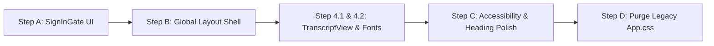

# Aaditva Campaign Builder — UI Improvement Plan & Status Audit

## Executive Summary

This document serves as the single source of truth for the UI/UX architecture and implementation progress of the **Aaditva Campaign Builder** frontend (`web/` directory). 

The target stack is a modern, lightweight, utility-first React Single Page Application (SPA) powered by **Bun**, **Vite**, **Tailwind CSS v4**, and design tokens adhering to **shadcn/ui** patterns.

---

## 1. Tech Stack & Architecture Overview

| Layer | Target Specification | Current Status | Notes |
| :--- | :--- | :---: | :--- |
| **Runtime / Package Manager** | Bun exclusively (`bun install`, `bun run`) | ✅ Done | `package.json` scripts and `bun.lock` configured. |
| **Build Tooling** | Vite + React + TypeScript | ✅ Done | `vite.config.ts` configured with `@tailwindcss/vite`. |
| **Styling Engine** | Tailwind CSS (v4) utility classes | ✅ Done | Utility-first styling across primary routes and components. |
| **Theming & Design Tokens** | CSS Custom Properties (`:root` and `.dark`) | ✅ Done | Semantic color tokens defined in `src/index.css`. |
| **Typography** | Inter Font Stack | 🟡 Partial | Defined in `index.css`; Google Fonts `<link>` pending in `index.html`. |
| **Layout & Shell** | Global persistent Navbar & responsive layout | ⏳ Pending | Routes currently manage separate layouts independently. |
| **Legacy Stylesheet** | Deprecate & remove `App.css` | ⏳ Pending | `App.css` still present with 154 lines of legacy rules. |

---

## 2. Component & Feature Status Matrix

| Component / Asset | File Path | Status | Summary of Current State & Audit Findings |
| :--- | :--- | :---: | :--- |
| **Theming Tokens** | `src/index.css` | ✅ Done | Full semantic token palette (`--primary`, `--background`, `--card`, `--muted`, `--destructive`, `--ring`, etc.) with dark mode support. |
| **Tailwind Config** | `tailwind.config.mjs`, `tailwind.json` | ✅ Done | Token integration, border-radius variables, and Inter font family configured. |
| **Home Route** | `src/routes/HomeRoute.tsx` | ✅ Done | Clean card container, styled prompt textarea, animated spinner on submit button, and error alerts. *Minor cleanup: redundant `<h2>` wrapper.* |
| **Recent Campaigns** | `src/components/RecentCampaigns.tsx` | ✅ Done | Responsive 2-column card grid, colored status dots (`complete`, `running`, `failed`), animated skeleton loaders, and empty state SVG. |
| **Campaign Route** | `src/routes/CampaignRoute.tsx` | ✅ Done | Sticky top header with back navigation, animated loading ring, reconnecting status banner, and empty state graphic. |
| **Status Banner** | `src/components/StatusBanner.tsx` | ✅ Done | Semantic color treatments (`emerald-500`, `destructive`, `yellow-500`), icon indicators, and focus-visible rings on resume action. |
| **Step Card** | `src/components/StepCard.tsx` | ✅ Done | Bordered card styling, blue tool call badges, collapsible emerald tool result `<details>` accordion, purple transfer badges, and responsive image grid. |
| **Transcript View** | `src/components/TranscriptView.tsx` | 🟡 Partial | Uses legacy `className="transcript"` container from `App.css` rather than native Tailwind flex utilities (`flex flex-col gap-4`). |
| **Google Fonts Link** | `index.html` | 🟡 Partial | Missing `<link rel="stylesheet">` preconnect and stylesheet link for the Inter font family. |
| **Auth Gate** | `src/auth/SignInGate.tsx` | ⏳ Pending | Uses legacy `className="centered-page"` and unstyled raw buttons from `App.css`. Needs modern card-based Tailwind makeover. |
| **Global Layout Shell** | `src/App.tsx` | ⏳ Pending | No shared persistent navigation/header component; `HomeRoute` (`max-w-md`) and `CampaignRoute` have divergent max-widths. |
| **Accessibility (ARIA)** | Multiple Components | ⏳ Pending | Interactive badges and images lack explicit `aria-label` and `aria-describedby` attributes for screen reader compatibility. |
| **Legacy `App.css`** | `src/App.css` | ⏳ Pending | Contains 154 lines of legacy CSS rules pending purge once `SignInGate` and `TranscriptView` are migrated. |
| **Deploy Configuration** | `firebase.json`, `package.json` | ✅ Done | Configured to serve `dist/` directory built via `bun run build`. |

---

## 3. Completed Milestones (✅ Done)

### 3.1 Build & Tooling Setup with Bun
- Configured Bun as the package manager for `web/`.
- Configured Vite with `@tailwindcss/vite` plugin and modern TypeScript compilation.
- Production build verified with `bun run build` outputting optimized bundles to `dist/`.

### 3.2 Design Token & Theming Layer (`src/index.css`)
- Implemented CSS Custom Property token architecture adhering to shadcn/ui patterns.
- Provided complete light and dark theme variable mappings (`--background`, `--foreground`, `--card`, `--primary`, `--muted`, `--accent`, `--destructive`, `--border`, `--input`, `--ring`).
- Base reset and utility layers configured cleanly.

### 3.3 Core Routes & Live Feed
- **`HomeRoute.tsx`**: Styled prompt submission form with responsive margins, focus rings, subtle borders, animated loading indicator, and semantic error banners.
- **`CampaignRoute.tsx`**: Structured with sticky header, back navigation link, status indicators, and live transcript feed.
- **`RecentCampaigns.tsx`**: Replaced simple unstyled list with responsive card grid, hover transitions, colored status dots, and skeleton loading states.
- **`StatusBanner.tsx`**: Semantic visual feedback for campaign lifecycle states (`starting`, `running`, `complete`, `failed`, `stalled`) with accessible resume button.
- **`StepCard.tsx`**: Enhanced step execution cards with distinct badges for tool calls (blue), tool results with accordion disclosure (emerald), agent handoffs (purple), and hoverable output image tiles.

---

## 4. Partially Completed Items (🟡 Partial)

### 4.1 `TranscriptView.tsx` Container Styling
- **Current Issue**: The component still relies on the legacy `.transcript` class defined in `App.css`.
- **Target Fix**: Replace with Tailwind utility classes:
  ```tsx
  <div className="flex flex-col gap-4 max-w-4xl mx-auto w-full pb-12">
    {steps.map(...)}
  </div>
  ```

### 4.2 Font Loading in `index.html`
- **Current Issue**: `src/index.css` configures `font-family: 'Inter', sans-serif`, but `index.html` does not load the Inter font from Google Fonts.
- **Target Fix**: Add preconnect and font stylesheet link tags to `<head>` in `index.html`:
  ```html
  <link rel="preconnect" href="https://fonts.googleapis.com" />
  <link rel="preconnect" href="https://fonts.gstatic.com" crossorigin />
  <link href="https://fonts.googleapis.com/css2?family=Inter:wght@400;500;600;700&display=swap" rel="stylesheet" />
  ```

---

## 5. Pending Backlog & Implementation Roadmap (⏳ Pending)

### Step A: Auth Gate Redesign (`src/auth/SignInGate.tsx`)
- **Current State**: Uses legacy unstyled classes (`centered-page`, `login-box`, plain `<button>`).
- **Implementation Plan**:
  - Convert to a centered card UI using Tailwind utilities (`min-h-screen flex items-center justify-center bg-muted/40 p-4`).
  - Style the sign-in card with `bg-card border rounded-xl shadow-lg p-6 max-w-sm w-full`.
  - Use primary button styling for Google/OAuth sign-in with clear hover/focus states and an optional Google SVG icon.

### Step B: Global Layout Component (`src/components/Layout.tsx` & `App.tsx`)
- **Current State**: Each route manages its own layout, leading to inconsistent container widths (`HomeRoute` is `max-w-md` while `CampaignRoute` is unconstrained) and no persistent branding.
- **Implementation Plan**:
  - Create `src/components/Layout.tsx` containing:
    - Persistent top navigation header (`sticky top-0 z-50 border-b bg-background/95 backdrop-blur`).
    - App title/branding ("Aaditva Campaign Builder") with link to `/`.
    - User status pill (user email/avatar and a styled "Sign out" button).
    - Responsive content container (`max-w-5xl mx-auto px-4 py-6`).
  - Wrap routes inside `<Layout>` in `App.tsx`.

### Step C: Accessibility & Heading Refinement
- **Screen Reader Support (ARIA)**:
  - Add `aria-label` attributes to tool call chips, transfer chips, and interactive disclosure summaries in `StepCard.tsx`.
  - Add descriptive `alt` and `aria-describedby` attributes to generated image figures.
- **Heading Deduplication**:
  - In `HomeRoute.tsx`, remove redundant `<h2>Recent campaigns</h2>` wrapper preceding the `<RecentCampaigns />` component (which already renders its own header).
- **Focus Rings**:
  - Standardize `focus-visible:outline-none focus-visible:ring-2 focus-visible:ring-primary focus-visible:ring-offset-2` across all interactive buttons, inputs, and links.

### Step D: Legacy CSS Purge & Deprecation (`src/App.css`)
- **Current State**: `src/App.css` contains 154 lines of legacy CSS (`.transcript`, `.step-card`, `.tool-call`, `.chip`, `.centered-page`, etc.).
- **Implementation Plan**:
  - Once Steps A and 4.1 are completed, remove all unused CSS rules from `src/App.css` (or delete `App.css` and remove its import from `App.tsx`).

---

## 6. Recommended Execution Order for Future Sprints



1. **Sprint 1 (Auth & Layout Shell)**: Migrate `SignInGate.tsx` to Tailwind, create `Layout.tsx`, and wrap routes in `App.tsx`.
2. **Sprint 2 (Component Cleanup & Assets)**: Migrate `TranscriptView.tsx` container to Tailwind flex, add Inter font links in `index.html`.
3. **Sprint 3 (Polish & Purge)**: Add ARIA accessibility attributes, clean duplicate headings in `HomeRoute.tsx`, and delete obsolete legacy rules in `App.css`.
